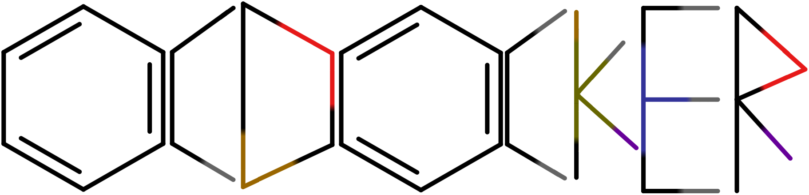

[](https://codecov.io/gh/Arturossi/OCDocker)


[](https://doi.org/10.5281/zenodo.21330172)



OCDocker
========

OCDocker is a Python toolkit and CLI for molecular docking, virtual screening,
pose clustering, rescoring, and OCScore model development. It is designed to run
as a command-line tool, Python API, or scheduler-friendly workflow component.

What it provides:

- Docking workflows for AutoDock Vina, Smina, Gnina, and PLANTS.
- Pipeline stages for preparation, docking, collection, RMSD clustering,
  rescoring, and export.
- Database support for PostgreSQL, MySQL, and SQLite.
- OCScore training, ablation, cross-validation, SHAP, plotting, and scoring
  utilities.
- Reproducibility helpers, environment diagnostics, and Docker/Singularity
  wrappers.

Documentation
-------------

- Manual: [MANUAL.md](MANUAL.md)
- Sphinx docs: [docs/source/index.rst](docs/source/index.rst)
- Installation details: [docs/source/installation.rst](docs/source/installation.rst)
- Optional dependencies: [docs/source/optional_dependencies.rst](docs/source/optional_dependencies.rst)
- Database setup: [docs/source/database_setup.md](docs/source/database_setup.md)
- External tools: [docs/source/external_tools.md](docs/source/external_tools.md)
- Containers: [docs/source/container_usage.md](docs/source/container_usage.md)
- OCScore replication: [OCSCORE_REPLICATION.md](OCSCORE_REPLICATION.md)
- OCScore production protocol: [docs/ocscore-production-protocol.md](docs/ocscore-production-protocol.md)
- Error handling: [docs/ERROR_HANDLING.md](docs/ERROR_HANDLING.md)

Installation
------------

OCDocker is easiest to run inside a conda or mamba environment.

```bash
mamba create -n ocdocker python=3.11 -y
conda activate ocdocker
pip install ocdocker
```

For development from source:

```bash
git clone https://github.com/Arturossi/OCDocker.git
cd OCDocker
mamba create -n ocdocker python=3.11 -y
conda activate ocdocker
./scripts/vendor_oddt.sh
pip install -e ".[all,dev]"
```

`scripts/vendor_oddt.sh` pulls in [our ODDT fork](https://github.com/Arturossi/oddt), which carries fixes on top of
upstream ODDT that OCDocker's rescoring depends on. It has to run before `pip install -e` because the `oddt`
package is bundled as source (`[tool.setuptools.packages.find]` picks up the local `oddt/` directory it creates),
not installed as a normal dependency -- PyPI rejects uploads whose metadata references a git dependency, so a
plain `pip install ocdocker` gets the fork the same way, just vendored in at release-build time instead of by hand.
Skipping this step leaves `import oddt` resolving to whatever (if any) vanilla `oddt` package happens to already be
on your `PYTHONPATH`, which does not have the fixes this project relies on.

Minimal system packages for Ubuntu/Debian:

```bash
sudo apt-get install openbabel libopenbabel-dev swig cmake g++
```

Feature-specific extras:

```bash
pip install "ocdocker[docking]"   # docking workflows
pip install "ocdocker[db]"        # PostgreSQL/MySQL storage
pip install "ocdocker[ml]"        # OCScore training and scoring
pip install "ocdocker[analysis]"  # plots, statistics, SHAP helpers
pip install "ocdocker[workflow]"  # Snakemake integration
pip install "ocdocker[all]"       # all runtime stacks
```

Quick Start
-----------

Use SQLite for local tests and quick experiments:

```bash
export OCDOCKER_DB_BACKEND=sqlite
ocdocker doctor
```

Run a single docking engine:

```bash
ocdocker vs \
  --engine vina \
  --receptor path/to/receptor.pdb \
  --ligand path/to/ligand.sdf \
  --box path/to/box.pdb \
  --timeout 600
```

Run the full docking pipeline:

```bash
ocdocker pipeline \
  --receptor path/to/receptor.pdb \
  --ligand path/to/ligand.sdf \
  --box path/to/box.pdb \
  --engines vina,smina,plants \
  --outdir runs/example
```

Run scheduler-friendly pipeline stages:

```bash
ocdocker pipeline prepare --help
ocdocker pipeline dock --help
ocdocker pipeline collect --help
ocdocker pipeline cluster --help
ocdocker pipeline rescore --help
ocdocker pipeline export --help
```

OCScore
-------

OCScore workflows are available under `ocdocker ocscore`.

```bash
ocdocker ocscore reduce --help
ocdocker ocscore train --help
ocdocker ocscore score --help
```

For the full reproducible protocol, including reduction, training, ablations,
statistics, plots, and SHAP analysis, use:

- [OCSCORE_REPLICATION.md](OCSCORE_REPLICATION.md)
- [docs/ocscore-production-protocol.md](docs/ocscore-production-protocol.md)
- [examples/18_run_full_pipeline.sh](examples/18_run_full_pipeline.sh)

Configuration
-------------

Create a starter config:

```bash
ocdocker init-config --conf OCDocker.cfg
```

Common environment variables:

- `OCDOCKER_CONFIG`: path to `OCDocker.cfg` or `OCDocker.yml`.
- `OCDOCKER_DB_BACKEND`: `postgresql`, `mysql`, or `sqlite`.
- `OCDOCKER_SQLITE_PATH`: custom SQLite database path.
- `OCDOCKER_TIMEOUT`: default external-tool timeout in seconds.
- `OCDOCKER_THREADS`: scheduler-provided worker count.
- `OCDOCKER_TMP_DIR`: job-local temporary directory.

For server databases, see [docs/source/database_setup.md](docs/source/database_setup.md).

Containers
-----------

Docker and Singularity helpers live under `containers/`.

Docker wrapper:

```bash
containers/docker/install_docker.sh --install-ocd
export OCDOCKER_DB_PASS='<db_password>'
ocd doctor
```

Use MySQL instead of the default PostgreSQL service:

```bash
export OCDOCKER_DB_BACKEND=mysql
export OCDOCKER_DB_PASS='<db_password>'
export MYSQL_ROOT_PASSWORD='<root_password>'
ocd doctor
```

More details: [docs/source/container_usage.md](docs/source/container_usage.md).

Diagnostics and Reproducibility
-------------------------------

Check the environment:

```bash
ocdocker doctor --conf OCDocker.cfg
```

Generate a reproducibility manifest:

```bash
ocdocker manifest --conf OCDocker.cfg --output reproducibility_manifest.json
```

Testing
-------

```bash
pytest -q
pytest --cov=OCDocker --cov-report=term-missing
```

External docking binaries are not required for most unit tests. End-to-end
docking runs require the configured tools to be available on the system or in the
container.

License
-------

OCDocker is released under the [BSD 3-Clause License](LICENSE). Copyright is held by
**Federal University of Rio de Janeiro (UFRJ)**, **Artur Duque Rossi**, and
**Pedro Henrique Monteiro Torres** only (see [NOTICE](NOTICE)). You may use,
modify, and redistribute the software for any purpose, including commercial
work, provided you include the BSD license notice. Please credit UFRJ and the
copyright holders in publications. Community contributors are acknowledged in
[COLLABORATORS.md](COLLABORATORS.md).

Community
---------

- Code of Conduct: [CODE_OF_CONDUCT.md](CODE_OF_CONDUCT.md)
- Contributing: [CONTRIBUTING.md](CONTRIBUTING.md)
- Security: [SECURITY.md](SECURITY.md)
- Collaborators: [COLLABORATORS.md](COLLABORATORS.md)
