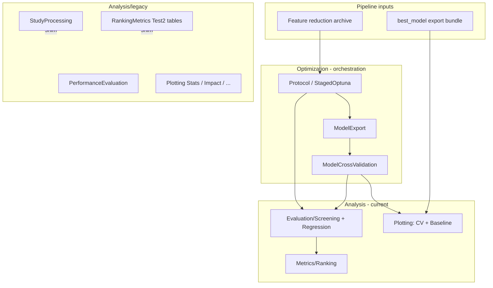

# refactor: OCScore Analysis layer for staged pipeline

## Summary

Reorganize `OCDocker/OCScore/Analysis` so the **current staged OCScore pipeline** (feature reduction → staged Optuna → export / CV / baselines) owns a small, explicit evaluation and plotting surface, while older study-centric and Test2-style analysis code moves under `Analysis/legacy/` with compatibility shims. Update `obsidian/` agent and architecture notes so protocol, session, and planning guidance match the new layout.

## Problem Frame

The staged pipeline added in May 2026 (`Protocol.py`, `StagedOptuna.py`, `ModelExport.py`, `ModelCrossValidation.py`, examples 16–19) already depends on a **subset** of Analysis—primarily `Metrics/Ranking.py` and new plotting helpers—but most of `Analysis/` still reflects **legacy Optuna study workflows** (combined RMSE+AUC study parsing, Test2 bootstrap tables, exploratory notebooks-style modules).

That split is implicit today: new code imports `Metrics.Ranking` directly while legacy example 11 and SHAP CLI still use `StudyProcessing`, `PerformanceEvaluation`, and `RankingMetrics.py`. Without a formal boundary, future work will keep extending the wrong modules, duplicate metric logic (e.g. screening evaluation living partly in `StagedOptuna.evaluate_screening_metrics`), and leave agent docs in `obsidian/` describing an outdated mental model.

## Requirements

- R1. **Legacy namespace:** Older Analysis modules are moved under `OCDocker/OCScore/Analysis/legacy/` with documented scope, mirroring `Optimization/legacy/`.
- R2. **Compatibility:** Historical import paths (`Analysis.RankingMetrics`, `Analysis.StudyProcessing`, etc.) continue to work via thin re-export shims at the old locations for at least one release cycle.
- R3. **Pipeline evaluation API:** Screening and regression evaluation used by `StagedOptuna`, `ModelCrossValidation`, and example 19 live under a dedicated current Analysis module—not embedded only in Optimization.
- R4. **Pipeline plotting:** Plotting for cross-validation artifacts, baseline comparison CSVs (example 19), and export summaries is grouped under `Analysis/Plotting/` with clear entry points (extend `CrossValidationPlots`; add baseline comparison plots).
- R5. **Canonical metrics:** `Metrics/Ranking.py` remains the single implementation for BEDROC, EF, NDCG, orient_scores, and groupwise aggregation; legacy `RankingMetrics.py` does not receive new features.
- R6. **Optimization imports:** `StagedOptuna`, `ModelCrossValidation`, and `ModelExport` import evaluation from Analysis current modules only (no duplicate metric implementations in Optimization).
- R7. **Examples:** Examples 17–19 and `18` plot/CV subcommands document and use the new Analysis entry points.
- R8. **Obsidian alignment:** `obsidian/agents.md`, architecture notes, and a new ADR describe Analysis current vs legacy, staged pipeline artifact paths, and where agent plans/brainstorms live.
- R9. **Tests:** Existing tests pass; new tests assert legacy shims, pipeline evaluation parity, and plotting smoke coverage.

## Key Technical Decisions

- **KTD1 — Mirror Optimization legacy pattern:** Use `Analysis/legacy/` plus top-level shim modules rather than deleting old paths. Rationale: example 11, SHAP CLI, and external notebooks may still import historical paths; same approach already works for `Optimization/legacy/`.
- **KTD2 — Extract `evaluate_screening_metrics` to Analysis:** Move from `StagedOptuna.py` to `Analysis/Evaluation/Screening.py` (or `Analysis/Metrics/Screening.py`); `StagedOptuna` re-exports or imports it. Rationale: R3/R6; keeps Optimization orchestration separate from metric definitions.
- **KTD3 — Classify modules by consumer, not age:** “Current” = consumed by staged protocol, export bundle, CV, or examples 16–19. “Legacy” = Optuna study DB parsing, Test2 tables, combined RMSE+AUC selection, exploratory-only plotting. Rationale: avoids moving `Metrics/Ranking` or SHAP if still needed at top level.
- **KTD4 — SHAP stays top-level initially:** `Analysis/SHAP/` remains importable from current namespace; document as optional/heavy-deps. Adapter for exported-model bundles is deferred. Rationale: CLI `shap` command and tests depend on it; migration risk out of scope for first pass.
- **KTD5 — Obsidian plans stay in `obsidian/plans/`:** This plan lives in `docs/plans/` per ce-plan convention; after implementation, promote durable decisions to `obsidian/Decisions/` and update `obsidian/Architecture/`. Rationale: matches `obsidian/agents.md` rules (agent artifacts vs published docs).
- **KTD6 — No change to docking `OCDockerPipeline`:** Snakemake sibling project is out of scope; “new pipeline” means in-repo OCScore 16→17→18→19 chain. Rationale: user confirmed target is work added recently in this repo.

---

## High-Level Technical Design

### Component topology



### Artifact flow (evaluation & plots)

| Stage | Artifacts | Analysis consumer |
|-------|-----------|-------------------|
| Feature reduction (ex. 16) | `reduced_dataset.csv`, `selected_features.json` | None (metadata only) |
| Staged Optuna (ex. 17) | `protocol_log.json`, studies, checkpoints | `Evaluation/Screening` via stages |
| Export (best_model) | `retrain_config.json`, `split_indices.npz` | Regression + screening eval |
| CV (ex. 18) | `cross_validation/*.csv`, `figures/` | `Plotting/CrossValidationPlots` |
| Baseline (ex. 19) | `dudez_sf_baseline_comparison.csv` | `Plotting/BaselineComparisonPlots` (new) |

---

## Scope Boundaries

**In scope**

- Analysis package reorganization and shims
- Evaluation extraction from `StagedOptuna`
- Pipeline plotting (CV + baseline comparison)
- Tests and example import updates
- Obsidian architecture + agent doc updates

**Out of scope**

- Rewriting SHAP for exported models
- Changing staged Optuna search space or training logic
- OCDockerPipeline / Snakemake integration
- Moving `docs/plans/` history into `obsidian/plans/` (only new ADR + architecture notes)

### Deferred to Follow-Up Work

- Unified `ocdocker ocscore plot` CLI wrapping example 18/19 plot helpers
- Deprecation removal of top-level legacy shims (after explicit maintainer sign-off)
- `docs/solutions/` entry documenting Analysis migration

---

## System-Wide Impact

- **Examples 11, 12:** Continue to work via legacy shims; no behavior change required in first pass.
- **CLI SHAP:** Unchanged import path if SHAP remains top-level.
- **Tests:** ~15 Analysis-related test modules; some imports updated to prefer current paths while shims keep old paths green.
- **Agents:** `obsidian/agents.md` must list new “read first” architecture note for OCScore pipeline evaluation.

---

## Risks & Dependencies

| Risk | Mitigation |
|------|------------|
| Circular imports Analysis ↔ Optimization | Evaluation module imports only `Metrics.Ranking`; Optimization imports Evaluation, never reverse |
| Silent metric drift after moving `evaluate_screening_metrics` | Characterization test: same inputs → same metric dict before/after move |
| Large diff from file moves | Move-only commits per unit; shims in separate commit |
| Duplicate Ranking APIs | Legacy `RankingMetrics.py` frozen; docstring points to `Metrics.Ranking` |

**Dependencies:** Staged protocol and export bundle format stable (May 2026 baseline). No new pip dependencies.

---

## Implementation Units

### U1. Analysis inventory and classification

**Goal:** Produce an authoritative module map (current vs legacy) before moves.

**Requirements:** R1, R5

**Files:**

- `obsidian/Architecture/OCScore Analysis Map.md` (new)
- `OCDocker/OCScore/Analysis/legacy/__init__.py` (stub)

**Approach:** For each `Analysis/*.py` and subpackage, record: importers (rg), pipeline relevance, and target location. Proposed classification:

| Module | Disposition |
|--------|-------------|
| `Metrics/Ranking.py`, `Metrics/Bootstrap.py` | **Current** |
| `Plotting/CrossValidationPlots.py`, `Plotting/Core.py` | **Current** |
| `Plotting/MetricsPlots.py` | **Current** (ROC/PR curves for eval reports) |
| `RankingMetrics.py` | **Legacy** (Test2 bootstrap tables) |
| `StudyProcessing.py` | **Legacy** (RMSE+AUC study views) |
| `PerformanceEvaluation.py`, `StatTests.py`, `Correlation.py`, `Impact.py`, `NNUtils.py` | **Legacy** |
| `Plotting/Stats.py`, `Plotting/ImpactPlots.py`, `Plotting/Colouring.py` | **Legacy** (used by legacy perf eval) |
| `FeatureImportance.py` | **Legacy** (superseded by SHAP package for new work) |
| `SHAP/` | **Current** (optional deps), documented separately |

**Test scenarios:**

- Test expectation: none — documentation-only unit; verify map committed under `obsidian/Architecture/`.

**Verification:** Map reviewed against import graph from `tests/` and `examples/`.

---

### U2. Create `Analysis/legacy/` and compatibility shims

**Goal:** Move legacy modules without breaking imports.

**Requirements:** R1, R2

**Dependencies:** U1

**Files:**

- `OCDocker/OCScore/Analysis/legacy/` (moved modules)
- `OCDocker/OCScore/Analysis/RankingMetrics.py` (shim re-export)
- `OCDocker/OCScore/Analysis/StudyProcessing.py` (shim)
- `OCDocker/OCScore/Analysis/PerformanceEvaluation.py` (shim)
- Similar shims for other moved top-level modules
- `OCDocker/OCScore/Analysis/legacy/__init__.py` with `LEGACY_ANALYSIS_MODULES` list
- `tests/ocscore/test_analysis_legacy_namespace.py` (new)

**Approach:** Git-move files into `legacy/` preserving history where possible. Each former top-level file becomes:

```python
# Compatibility shim — implementation moved to Analysis.legacy.*
from OCDocker.OCScore.Analysis.legacy.RankingMetrics import *  # noqa: F403
```

Update internal legacy imports to package-relative paths.

**Patterns to follow:** `OCDocker/OCScore/Optimization/legacy/__init__.py`

**Test scenarios:**

- Import `OCDocker.OCScore.Analysis.RankingMetrics` and call one public function — succeeds.
- Import `OCDocker.OCScore.Analysis.legacy` — `LEGACY_ANALYSIS_MODULES` lists moved modules.
- `StagedOptuna` is not importable from `Analysis.legacy` namespace (mirrors optimization test).

**Verification:** `pytest tests/ocscore/test_analysis_legacy_namespace.py tests/ocscore/test_ocscore_study_processing.py -q`

---

### U3. Pipeline evaluation module (screening + regression)

**Goal:** Centralize metric evaluation for the staged pipeline outside Optimization.

**Requirements:** R3, R5, R6

**Dependencies:** U2 (avoid move conflicts)

**Files:**

- `OCDocker/OCScore/Analysis/Evaluation/__init__.py` (new)
- `OCDocker/OCScore/Analysis/Evaluation/Screening.py` (new — hosts `evaluate_screening_metrics`)
- `OCDocker/OCScore/Analysis/Evaluation/Regression.py` (new — PDBbind RMSE/MAE helpers if not already shared)
- `OCDocker/OCScore/Optimization/StagedOptuna.py` (import from Evaluation; thin re-export for backward compat)
- `OCDocker/OCScore/Optimization/ModelCrossValidation.py` (update imports)
- `tests/ocscore/test_screening_evaluation.py` (new or extend `test_ocscore_screening_metrics.py`)

**Approach:** Move `evaluate_screening_metrics` and private helpers (`_screening_metric_functions`, group aggregation) from `StagedOptuna.py` into `Evaluation/Screening.py`. Keep `StagedOptuna.evaluate_screening_metrics` as deprecated alias wrapping the new function for one cycle.

Extract any PDBbind-only metric helpers similarly into `Evaluation/Regression.py` if they are duplicated.

**Patterns to follow:** `Analysis/Metrics/Ranking.py` for low-level metric primitives

**Test scenarios:**

- Same synthetic labels/scores/groups → metric dict equal before and after move (characterization).
- `higher_is_better=False` negates docking scores correctly.
- Grouped BEDROC returns `n_groups_used` when only subset of receptors valid.

**Verification:** `pytest tests/ocscore/test_ocscore_screening_metrics.py tests/ocscore/test_model_cross_validation.py -q`

---

### U4. Pipeline plotting (CV + baseline comparison)

**Goal:** Complete plotting surface for pipeline artifacts; wire example 19.

**Requirements:** R4, R7

**Dependencies:** U3

**Files:**

- `OCDocker/OCScore/Analysis/Plotting/CrossValidationPlots.py` (extend if needed)
- `OCDocker/OCScore/Analysis/Plotting/BaselineComparisonPlots.py` (new)
- `examples/18_ocscore_exported_model_tools.py` (already has `plot` — verify paths)
- `examples/19_ocscore_dudez_sf_baseline_comparison.py` (add optional `--figures-dir` or document separate plot command)
- `tests/ocscore/test_baseline_comparison_plots.py` (new)
- `tests/ocscore/test_cross_validation_plots.py` (existing)

**Approach:** `BaselineComparisonPlots` reads `dudez_sf_baseline_comparison.csv`:

- Bar chart: test split, objective metric (BEDROC), OCScore vs top-N SFs
- Optional heatmap: metric × scorer for validation/test

Add `save_baseline_comparison_figures(csv_path, figures_dir, metrics=..., split='test')`.

Consider `plot` subcommand on example 19 or shared helper imported by 18.

**Patterns to follow:** `CrossValidationPlots.save_cross_validation_figures`

**Test scenarios:**

- Synthetic baseline CSV with 2 scorers × 2 splits → PNG files created.
- Missing test split rows → clear error.

**Verification:** `pytest tests/ocscore/test_baseline_comparison_plots.py tests/ocscore/test_cross_validation_plots.py -q`

---

### U5. Update `Analysis/__init__.py` public surface

**Goal:** Document and export current pipeline APIs explicitly.

**Requirements:** R3, R4, R5

**Dependencies:** U3, U4

**Files:**

- `OCDocker/OCScore/Analysis/__init__.py`
- `OCDocker/OCScore/Analysis/Evaluation/__init__.py`
- `OCDocker/OCScore/Analysis/Plotting/__init__.py`

**Approach:** Export:

- `evaluate_screening_metrics` (from Evaluation)
- `save_cross_validation_figures`, `save_baseline_comparison_figures`
- `RankingMetrics` alias → `Metrics.Ranking` (already partially done)

Keep optional SHAP imports guarded with try/except.

**Test scenarios:**

- `from OCDocker.OCScore.Analysis import evaluate_screening_metrics` works.
- SHAP missing deps does not break `import OCDocker.OCScore.Analysis`.

**Verification:** `pytest tests/ocscore/test_ocscore_analysis_core.py -q`

---

### U6. Obsidian agent and architecture updates

**Goal:** Agent protocol and “brain” docs match the new Analysis layout and pipeline artifacts.

**Requirements:** R8

**Dependencies:** U1–U5 (content stable enough to document)

**Files:**

- `obsidian/agents.md` (add OCScore pipeline read order)
- `obsidian/Architecture/OCScore Analysis Map.md` (from U1, finalize)
- `obsidian/Architecture/OCScore Staged Pipeline.md` (new — 16→17→18→19, artifact table)
- `obsidian/Decisions/ADR-0003-Analysis-Legacy-And-Pipeline-Evaluation.md` (new)
- `obsidian/Sessions/` (session log when implementation completes)
- `obsidian/00_Index.md` (link new notes)

**Approach:** Document:

- Where legacy Analysis code lives and when agents may touch it
- Canonical paths for evaluation and plotting
- Start-of-session reads for OCScore pipeline tasks

Do **not** duplicate full API docs—link to Sphinx `docs/source/` where public.

**Test scenarios:**

- Test expectation: none — manual review that links resolve in Obsidian.

**Verification:** Maintainer review; links from `agents.md` to new architecture notes.

---

### U7. Example and README alignment

**Goal:** Examples demonstrate current Analysis imports only.

**Requirements:** R7

**Dependencies:** U3–U5

**Files:**

- `examples/README.md`
- `examples/17_ocscore_staged_optuna_from_reduction.py`
- `examples/18_ocscore_exported_model_tools.py`
- `examples/19_ocscore_dudez_sf_baseline_comparison.py`

**Approach:** Update docstrings with artifact paths and plot commands. Example 19: add plot usage mirroring 18.

**Test scenarios:**

- Existing example smoke tests still pass (`tests/examples/`).

**Verification:** `pytest tests/examples/ -q` (subset if full suite slow)

---

### U8. Regression gate and changelog

**Goal:** Land migration safely with visible release notes.

**Requirements:** R9

**Dependencies:** U2–U7

**Files:**

- `docs/source/changelog.rst` (additive migration note)
- `tests/ocscore/` (full subset run)

**Approach:** Changelog entry: Analysis legacy namespace, moved `evaluate_screening_metrics`, shim deprecation timeline.

**Test scenarios:**

- Full `pytest tests/ocscore -q` passes.
- Grep ensures no new imports of `Analysis.StudyProcessing` from Optimization modules.

**Verification:** CI-equivalent local pytest ocscore + examples tests.

---

## Open Questions

- **OQ1 (implementation-time):** Should example 19 gain a built-in `--plot` flag or remain a separate `18 … plot` invocation on a converted CSV? Default in U4: add plot helper + document; optional flag if trivial.
- **OQ2 (deferred):** When to remove top-level shims—track in ADR-0003 as “TBD after one release”.

---

## Sources & Research

- `obsidian/Sessions/2026-05-27-ocscore-staged-optuna-protocol.md` — staged protocol rules and verification
- `OCDocker/OCScore/Optimization/legacy/__init__.py` — legacy namespace pattern
- `OCDocker/OCScore/Optimization/StagedOptuna.py` — `evaluate_screening_metrics` (to move)
- `OCDocker/OCScore/Analysis/Metrics/Ranking.py` — canonical ranking primitives
- Examples 16–19 and recent CV/plotting work (May 2026)
- Repo research: no `docs/solutions/`; Obsidian is agent knowledge base per `obsidian/agents.md`
