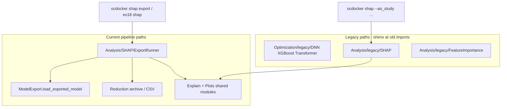

# refactor: SHAP port and Optimization legacy consolidation

## Summary

Physically relocate legacy **Optimization** optimizers (`DNN`, `XGBoost`, `Transformer`, `future/`) and legacy **SHAP** workflows into their respective `legacy/` namespaces with top-level shims, then add a **new SHAP entry point** that explains exported `best_model/` bundles from the staged pipeline (examples 16→18). This plan includes a **breakage impact report** for joint review before implementation.

**Prerequisite (partially done):** Analysis screening metrics and partial Analysis legacy (`RankingMetrics`, `StudyProcessing`) from `2026-05-29-001`.

---

## Problem Frame

The staged OCScore pipeline exports `best_model/` bundles (`ModelExport`) with `MultiTaskModel`-family architectures, saved splits, and `selected_features.json`. Current SHAP (`Analysis/SHAP/`) only supports the **pre-staged** workflow: four legacy Optuna studies (AO/NN/seed/mask), `Utils.Data.load_data(optimization_type="NN")`, and `DNNOptimizer.NeuralNet` reconstruction.

Similarly, `Optimization/legacy/__init__.py` **documents** legacy modules but `DNN.py`, `XGBoost.py`, and `Transformer.py` still live at the package root—same pattern as Analysis before the recent partial move.

Without physical consolidation and a pipeline-native SHAP path, agents and users cannot interpret models trained via examples 17–18, and legacy code remains easy to extend by mistake.

---

## Breakage Impact Report

Use this section to decide what to accept, shim, or defer. Severity assumes **physical moves with compatibility shims** unless noted.

### Legend

| Severity | Meaning |
|----------|---------|
| **None (shimmed)** | Breaks only if shims are omitted; historical import path keeps working |
| **Behavioral** | Import works but workflow is wrong/incompatible with new pipeline artifacts |
| **Hard break** | Fails without new adapter code even with shims |
| **Doc/CI** | Sphinx or test path references need updating |

---

### A. Optimization physical move (`DNN.py`, `XGBoost.py`, `Transformer.py`, `future/` → `Optimization/legacy/`)

| Consumer | Import / surface | Severity if moved **without** shim | With shim | Notes |
|----------|------------------|-------------------------------------|-----------|-------|
| `examples/11_python_api_train_model_from_db.py` | `Optimization.XGBoost` | Hard break | None | Entire example is legacy training; stays on legacy path intentionally |
| `Optimization/future/DNN.py` | `import Optimization.DNN` | Hard break | None | Internal fallback import; update to `legacy.DNN` or rely on shim |
| `tests/ocscore/test_ocscore_optimization_runtime.py` | Loads by filesystem path `Optimization/DNN.py` | Hard break | Doc/CI | Test loads module by **path**—must update path to `legacy/DNN.py` |
| `tests/ocscore/test_ocscore_transformer_optimization_extended.py` | String ref `Optimization.Transformer` | Doc/CI | Doc/CI | Update expected module string |
| `tests/ocscore/test_ocscore_future_dnn_optimizer.py` | Monkeypatches `Optimization.DNN` | Doc/CI | None if shim re-exports | |
| `tests/ocscore/test_ocscore_staged_optuna_protocol.py` | Asserts `LEGACY_OPTUNA_MODULES` list | Doc/CI | Doc/CI | Update list to `Optimization.legacy.*` paths after move |
| `docs/source/OCDocker.OCScore.Optimization.rst` | Autodoc paths | Doc/CI | Doc/CI | Point to legacy modules or add `legacy` subpackage page |
| `Optimization/__init__.py` docstring | Lists DNN/XGBoost at root | Doc/CI | Doc/CI | Update module list |
| **Staged pipeline** (`StagedOptuna`, `ModelExport`, ex. 17–19) | Does not import root optimizers | None | None | **Not affected** |

**Risk if shims are forgotten:** Example 11 and any external notebook using `Optimization.XGBoost` / `DNN` / `Transformer` breaks at import time.

**Risk even with shims:** None for imports. Legacy training behavior unchanged.

---

### B. SHAP package move (`Analysis/SHAP/` → `Analysis/legacy/SHAP/`)

| Consumer | Import / surface | Severity if moved **without** shim | With shim | Notes |
|----------|------------------|-------------------------------------|-----------|-------|
| `OCDocker/CLI/__init__.py` `cmd_shap` | `Analysis.SHAP.Cli.main` | Hard break | None | CLI passthrough keeps working via shim |
| `Analysis/__init__.py` | `from .SHAP import ...` | Hard break | None | Optional: re-export legacy + new APIs from top-level SHAP |
| `tests/ocscore/test_ocscore_shap_integration.py` | Imports all `Analysis.SHAP.*` submodules | Hard break | None | 15+ tests; shim must preserve submodule layout |
| `tests/ocscore/test_ocscore_analysis_package_init.py` | Mocks `Analysis.SHAP` module | Doc/CI | None | |
| **Legacy SHAP runtime** | 4 Optuna studies + `base_models/{NN}_{id}` | Behavioral | Behavioral | Still works **only** for old study layout; not for `best_model/` exports |
| **New pipeline users** | Expect SHAP on export bundle | Hard break today | Hard break until U3 | **No current code path**—this is the gap to fill |

**Legacy SHAP hard dependencies (move together):**

| Module | Depends on | Breaks if |
|--------|------------|-----------|
| `SHAP/Model.py` | `DNNOptimizer.NeuralNet` | DNNOptimizer API changes |
| `SHAP/Data.py` | `Utils.Data.load_data`, `optimization_type="NN"` | Export bundle layout not supported |
| `SHAP/Studies.py` | 4 named Optuna studies | Staged protocol uses different study names/storage |
| `SHAP/Runner.py` | Above chain | Cannot run on `best_model/` without new adapter |

---

### C. `FeatureImportance.py` move to `Analysis/legacy/`

| Consumer | Severity without shim | With shim |
|----------|----------------------|-----------|
| `tests/ocscore/test_ocscore_analysis_core.py` | Hard break | None |
| `Analysis/__init__.py` | Not exported today | None |
| Sphinx `Analysis.FeatureImportance.rst` | Doc/CI | Doc/CI |

Low risk; Test2-style helper library, no CLI entry.

---

### D. New pipeline SHAP (not yet implemented — **nothing breaks until old path removed**)

| Capability | Current state | After port |
|------------|---------------|------------|
| Load model from `best_model/best_model.pt` + `retrain_config.json` | `ModelExport.load_exported_model` exists | Reuse for SHAP |
| Feature matrix from reduction archive | Examples 18–19 pattern | Required input |
| Splits for background/eval | `split_indices.npz` or CV holdout | Must define policy (val vs test) |
| Explainer target | Legacy: `NeuralNet` single output | New: `PDBbindRegressionModel` or `DUDEzScreeningModel` logits |
| Task selection | N/A | PDBbind regression vs DUDEz screening explainer may differ |

**Known hard breaks without new code:**

- `ocdocker shap --ao_study ...` flags **cannot** explain staged exports as-is (wrong study model, wrong data loader).
- `SHAP/Model.build_neural_net` builds `NeuralNet`, not `MultiTaskModel` / staged architectures.
- DeepExplainer may fail on complex multi-head models until forward wrapper exposes a **scalar output** (logit or affinity).

---

### E. Downstream packages **not** moved (still legacy-adjacent)

These stay outside `Optimization/legacy/` but remain on the legacy training path:

| Package | Used by | Impact of this plan |
|---------|---------|---------------------|
| `OCDocker/OCScore/DNN/DNNOptimizer.py` | SHAP legacy, example 11, Workers | **No move** in this plan; SHAP legacy still depends on it |
| `OCDocker/OCScore/Utils/StudyParser.py` | StudyProcessing, legacy analysis | Listed in `LEGACY_OPTUNA_MODULES`; no physical move |
| `OCDocker/OCScore/Utils/Data.py` | Legacy SHAP data load | Needs **new** loader for export bundle, not move |

Moving only `Optimization/*.py` does **not** break Workers or DNNOptimizer tests.

---

### F. Summary matrix — what breaks **today vs after plan**

| Workflow | Today | After legacy moves + shims | After new SHAP port |
|----------|-------|----------------------------|---------------------|
| Example 11 legacy XGB/NN training | Works | Works | Works |
| `ocdocker shap` (4-study CLI) | Works | Works (via legacy SHAP) | Works (legacy); new flags for export SHAP |
| Example 17–18 export + inference | Works | Works | Works |
| SHAP on export bundle | **Does not exist** | **Still missing** | **Works** (target) |
| Staged Optuna tests | Some pre-existing failures on branch | Unchanged by moves if shims correct | Unchanged |
| Sphinx Optimization docs | Works | Needs path update | Needs SHAP export docs |

---

## Requirements

- R1. Move `Optimization/DNN.py`, `XGBoost.py`, `Transformer.py`, and `Optimization/future/` under `Optimization/legacy/` with top-level shims.
- R2. Update `LEGACY_OPTUNA_MODULES` to canonical `Optimization.legacy.*` paths; keep deprecated aliases in list or document one release of dual paths.
- R3. Move `Analysis/SHAP/` and `Analysis/FeatureImportance.py` under `Analysis/legacy/` with shims preserving submodule imports.
- R4. Add **pipeline SHAP** that accepts `--export-dir` (best_model), reduction archive or CSV, split choice, task (`pdbbind` | `dudez`), and writes the same artifact types as legacy (npy, csv, png).
- R5. Reuse `Explain.py` and `Plots.py` where possible; do not duplicate explainer/plot logic.
- R6. Wire new SHAP through `examples/18` subcommand and/or `ocdocker shap export` (minimal new surface).
- R7. Legacy CLI (`ocdocker shap` with study args) continues to work unchanged via legacy namespace.
- R8. Tests: legacy SHAP suite stays green; add export-bundle SHAP smoke test with mocked explainer.
- R9. Update Sphinx and `obsidian/agents.md` with current vs legacy SHAP/Optimization boundaries.

---

## Key Technical Decisions

- KTD1 — **Shim-first moves:** Physical relocation always paired with top-level re-export shims (same pattern as `Analysis/RankingMetrics.py`). Rationale: breakage report shows many consumers; shims reduce blast radius.
- KTD2 — **Split SHAP packages:** `Analysis/legacy/SHAP/` = 4-study workflow; `Analysis/SHAP/` = thin current API (`run_export_shap_analysis`, re-exports of shared Explain/Plots). Rationale: avoids breaking `from Analysis.SHAP import compute_shap_values` for shared helpers.
- KTD3 — **Export SHAP loads via ModelExport:** No new checkpoint format; use `load_exported_model` + reduced dataframe filtering. Rationale: matches examples 18–19.
- KTD4 — **Forward wrapper for explainer:** Pipeline SHAP wraps model forward to explain one scalar output (PDBbind affinity or DUDEz logit). Rationale: DeepExplainer requires single-output forward; multi-head models need explicit slice.
- KTD5 — **Do not move DNNOptimizer in this pass:** Workers, example 11, and legacy SHAP depend on it at historical paths. Rationale: scope control; Optimization/legacy move is sufficient for namespace clarity.
- KTD6 — **Tests loading by file path must be updated:** `test_ocscore_optimization_runtime.py` is a special case—shims do not fix path-based imports.

---

## High-Level Technical Design

---

## Scope Boundaries

**In scope:** Physical legacy moves, shims, export-bundle SHAP, tests, Sphinx/agent doc updates.

**Out of scope:** Moving `DNN/DNNOptimizer.py`, refactoring Workers, SHAP for XGBoost/Transformer, automated SHAP in example 17 training loop.

### Deferred to Follow-Up Work

- Remove top-level shims after deprecation window
- Unified `ocdocker ocscore explain` command
- Move `PerformanceEvaluation`, `Impact`, etc. to Analysis/legacy (from plan 001)

---

## Implementation Units

### U1. Optimization legacy physical move + shims

**Goal:** Relocate root optimizers into `Optimization/legacy/` without breaking imports.

**Requirements:** R1, R2

**Files:**

- Move: `OCDocker/OCScore/Optimization/{DNN,XGBoost,Transformer}.py`, `Optimization/future/`
- Create shims at former paths
- Modify: `OCDocker/OCScore/Optimization/legacy/__init__.py`
- Modify: `tests/ocscore/test_ocscore_optimization_runtime.py` (filesystem paths)
- Modify: `tests/ocscore/test_ocscore_staged_optuna_protocol.py` (LEGACY list)
- Modify: `docs/source/OCDocker.OCScore.Optimization.rst`

**Approach:** `git mv` into `legacy/`; shim files re-export module contents; fix internal import in `legacy/future/DNN.py` to prefer `legacy.DNN`.

**Test scenarios:**

- Import `Optimization.DNN`, `XGBoost`, `Transformer` after move — succeeds
- `LEGACY_OPTUNA_MODULES` contains `Optimization.legacy.DNN` paths
- `test_ocscore_optimization_runtime` loads modules from new paths

**Verification:** `pytest tests/ocscore/test_ocscore_optimization_runtime.py tests/ocscore/test_ocscore_staged_optuna_protocol.py::test_legacy_optuna_namespace_is_separated_from_current_protocol -q`

---

### U2. SHAP + FeatureImportance legacy move + shims

**Goal:** Move old SHAP workflow to `Analysis/legacy/SHAP/`; preserve CLI and test imports.

**Requirements:** R3, R7

**Dependencies:** U1 optional (parallel)

**Files:**

- Move: `OCDocker/OCScore/Analysis/SHAP/*` → `legacy/SHAP/`
- Move: `FeatureImportance.py` → `legacy/`
- Create: `Analysis/SHAP/` thin package (stub until U3)
- Create shims: `Analysis/FeatureImportance.py`
- Modify: `Analysis/__init__.py`

**Approach:** Submodule shims (`Analysis/SHAP/Cli.py` → import from `legacy.SHAP.Cli`); keep `Analysis.SHAP` as namespace package.

**Test scenarios:**

- Full `tests/ocscore/test_ocscore_shap_integration.py` passes unchanged import paths
- `cmd_shap` dispatch still resolves `Analysis.SHAP.Cli.main`

**Verification:** `pytest tests/ocscore/test_ocscore_shap_integration.py tests/ocscore/test_ocscore_analysis_package_init.py -q`

---

### U3. Pipeline export SHAP

**Goal:** Explain models from `best_model/` + reduction data.

**Requirements:** R4, R5, R6

**Dependencies:** U2 (shared module location settled)

**Files:**

- Add: `OCDocker/OCScore/Analysis/SHAP/ExportRunner.py` (or extend `Runner.py` with separate entry)
- Modify: `OCDocker/OCScore/Analysis/SHAP/__init__.py` — export `run_export_shap_analysis`
- Modify: `examples/18_ocscore_exported_model_tools.py` — optional `shap` subcommand
- Modify: `OCDocker/CLI/__init__.py` — optional `shap export` subparser OR document example-only entry
- Add: `tests/ocscore/test_export_shap.py`

**Approach:**

1. Load bundle via `ModelExport.load_exported_model(export_dir)`
2. Load dataframe from reduction archive; filter task rows; select `selected_features`
3. Apply saved split indices for background (train/val) and eval (test)
4. Wrap model forward for task-specific scalar output
5. Call existing `compute_shap_values` + plot helpers from shared/legacy Explain & Plots

**Execution note:** Characterization test with tiny synthetic model + fake explainer before wiring real DeepExplainer.

**Test scenarios:**

- Happy path: mocked model + 4-feature matrix → npy + png paths returned
- Missing `split_indices.npz` → clear error
- DUDEz task uses logits with `higher_is_better=True`
- Feature column mismatch vs `selected_features.json` → error

**Verification:** New test file green; manual run on existing `replica_000/dudez/best_model` export optional.

---

### U4. Documentation and agent notes

**Goal:** Document legacy vs current surfaces and CLI entry points.

**Requirements:** R9

**Dependencies:** U1–U3

**Files:**

- `obsidian/agents.md`
- `obsidian/Decisions/ADR-0004-SHAP-And-Optimization-Legacy-Split.md` (new)
- `docs/source/OCDocker.OCScore.Analysis.SHAP.rst` — add export runner
- `docs/source/OCDocker.OCScore.Optimization.rst` — legacy subpackage

**Test expectation:** none — documentation unit.

**Verification:** Agent read order lists SHAP/Optimization legacy vs current.

---

### U5. Breakage verification gate

**Goal:** Confirm breakage report rows are resolved or accepted.

**Requirements:** R8

**Dependencies:** U1–U4

**Files:** `tests/ocscore/` subset; optional `docs/plans/` update to this report with ✅ marks

**Approach:** Run targeted pytest groups from sections A–C of breakage report; file list of any **Behavioral** items still open.

**Verification:** All **None (shimmed)** rows confirmed; **Hard break** rows for export SHAP marked fixed in U3.

---

## Open Questions (for joint evaluation)

1. **CLI shape:** Prefer `ocdocker shap export --export-dir ...` vs only `examples/18 ... shap`? (Plan assumes both minimal—example first, CLI optional.)
2. **Split for SHAP background/eval:** Default validation for background + test for eval, or train/val from export `retrain_config`?
3. **Shim deprecation:** How many releases before removing top-level `Optimization.DNN` shims?
4. **DNNOptimizer:** Accept leaving it outside `Optimization/legacy/` for now? (Recommended yes—see KTD5.)

---

## Risks & Dependencies

| Risk | Mitigation |
|------|------------|
| DeepExplainer fails on staged architecture | Forward wrapper + KernelExplainer fallback flag |
| Large feature matrices OOM during SHAP | Reuse `background_size` / `eval_size` limits from legacy CLI |
| Path-based tests missed in grep | Run full `pytest tests/ocscore -q` before merge |
| Duplicate SHAP logic | Single `Explain.py` / `Plots.py` shared by legacy and export runners |

**Depends on:** `ModelExport` bundle format stable; reduction archive format from example 16.

---

## Sources & Research

- Breakage inventory from repo grep (consumers of `Optimization.*`, `Analysis.SHAP`, `FeatureImportance`)
- `OCDocker/OCScore/Optimization/legacy/__init__.py` — current registry-only legacy pattern
- `tests/ocscore/test_ocscore_shap_integration.py` — legacy SHAP contract
- Prior partial work: `2026-05-29-001` Analysis legacy (RankingMetrics, StudyProcessing, screening metrics in Ranking.py)
