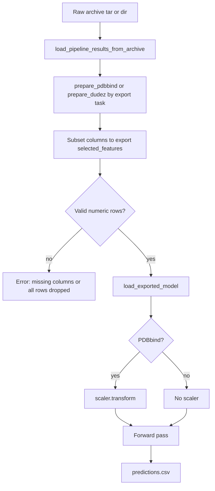
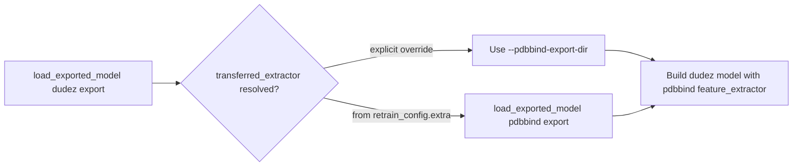

# feat: Portable OCScore inference from raw docking archives

## Summary

Add a portable inference path so users can score **new raw docking pipeline archives** with an exported `best_model/` bundle. The work promotes the example-16 archive loader into library code, adds a public predict API on `ModelExport`, and wires an example-18 `score` subcommand that writes a predictions CSV. Inference uses the **frozen feature list** from the export bundle and the **saved PDBbind scaler** — it does not retrain, refit scalers, or re-run correlation-based feature selection on new cohorts.

---

## Problem Frame

Staged OCScore training produces a `best_model/` export (`best_model.pt`, `architecture.json`, `retrain_config.json`, `feature_metadata.json`, optional `scaler.joblib`, optional `split_indices.npz`). Examples 18–19 already load these bundles for validation, cross-validation, SHAP, and baseline comparison — but they require a **pre-reduced** `reduced_dataset.csv` from feature reduction (example 16).

The gap: a user who receives new raw docking archives (tar.gz or extracted directory with `pipeline_results.csv`) has no library API or CLI to go from archive → OCScore predictions. Scoring helpers (`predict_ocscore_logits` in example 19, private `_predict_*` in `StagedOptuna`) are example-local or training-internal. The example-16 archive loader is not shared.

Portable inference means shipping an **inference kit**: export bundle + documented reduction protocol (for audit/reproducibility) + a command that accepts raw archives and returns scores.

---

## Requirements

- R1. A user with an exported `best_model/` directory and a raw pipeline archive can produce a predictions CSV without retraining or refitting scalers (one archive per invocation; batch orchestration across many archives is out of scope).
- R2. PDBbind regression exports apply the saved `scaler.joblib` via `transform` only; DUDEz screening exports score without a scaler.
- R3. DUDEz transfer exports resolve the linked PDBbind extractor from `retrain_config.extra.pdbbind_best_model_export_dir`, with an explicit CLI override when the saved path is stale.
- R4. Missing selected feature columns fail fast with a clear error listing missing names (same contract as export SHAP / staged training validation).
- R5. Raw archives are accepted as tar.gz **or** extracted directories containing `pipeline_results.csv`.
- R6. Predictions preserve input metadata columns and append model outputs (`ocscore_prediction`; DUDEz also gets `ocscore_probability` from sigmoid of logits).
- R7. The inference kit is documented: required artifacts, optional reduction protocol reference, and example-18 usage.
- R8. Automated tests cover PDBbind scaler application, DUDEz transfer loading, missing-column failure, and end-to-end archive → CSV for synthetic fixtures.

---

## Key Technical Decisions

| ID | Decision | Rationale |
|----|----------|-----------|
| KTD1 | Add `predict_from_export` (and small helpers) to `ModelExport.py`, not a new top-level package | Reuses `load_exported_model`, matches export SHAP boundary; honors “avoid new files unless needed.” |
| KTD2 | **Column subset from export `selected_features`**, not full re-run of `run_feature_reduction_protocol` on new data | Re-running reduction can change the selected set; the frozen model expects training-time columns. `feature_reduction_protocol.json` is audit metadata, not a replay engine in v1. |
| KTD3 | Promote archive loading into `OCDocker/OCScore/Utils/IO.py` | IO module already handles OCScore artifacts; example 16 keeps thin wrappers calling the library. |
| KTD4 | Wire inference through example 18 `score` subcommand | Example 18 is already the export-tools entry point (`validate`, `load`, `cross-validate`, `shap`); avoids a new example script. |
| KTD5 | Task inferred from export bundle (`retrain_config.task`), not from input `dataset` column | New inference archives may lack training split markers; export metadata is authoritative. |
| KTD6 | NaN/Inf in selected features: drop offending rows, log count, fail if zero rows remain | Matches training hygiene without silently propagating NaN through the network. |
| KTD7 | Optional `--pdbbind-export-dir` overrides `retrain_config.extra.pdbbind_best_model_export_dir` | Portable copies of DUDEz bundles often break absolute paths from the training machine. |

---

## High-Level Technical Design

### Inference kit artifacts

| Artifact | Required for scoring | Role |
|----------|---------------------|------|
| `best_model/` export directory | Yes | Weights, architecture, `selected_features`, scaler (PDBbind), transfer config (DUDEz) |
| Raw pipeline archive(s) | Yes | `pipeline_results.csv` wide feature table |
| `feature_reduction_protocol.json` (or `config_used.json`) | No (v1) | Documentation / reproducibility; not replayed at inference time (see KTD2) |
| `reduced_dataset.csv` | No | Not required when scoring from raw archives |

### End-to-end flow



### DUDEz transfer branch



---

## Scope Boundaries

### In scope

- Library archive loader (tar + directory)
- Public predict API on `ModelExport`
- Example 18 `score` subcommand
- Tests and README updates for the inference kit

### Out of scope

- Refitting scaler or feature selection on new data
- Legacy Optuna / four-study model scoring (`Scoring.get_score`, example 15 path)
- Domain-shift detection or calibration
- Full deterministic replay of `feature_reduction_protocol.json` on new cohorts (deferred)
- Batch orchestration across many machines / REST service

### Deferred to Follow-Up Work

- `apply_feature_reduction_protocol()` for deterministic row cleaning + column projection from saved protocol
- Embed `reduction_protocol_path` into `retrain_config.json` at export time (convenience pointer)
- Example 19 refactor to call shared `predict_from_export` instead of local `predict_ocscore_logits`

---

## System-Wide Impact

- **Developers / researchers:** New public API surface on `ModelExport` and `Utils.IO`; example 18 gains a subcommand.
- **Downstream consumers of export bundles:** No breaking changes to bundle layout; additive API only.
- **CI:** New unit tests in `tests/ocscore/`; no workflow changes expected.

---

## Risks and Dependencies

| Risk | Mitigation |
|------|------------|
| New raw archives lack descriptor columns present at training time | Fail with explicit missing-column list (R4); document OCDocker/pipeline version alignment in README |
| DUDEz bundle copied without linked PDBbind export | `--pdbbind-export-dir` override + clear error when path missing |
| Example 16 and library loader drift | Example 16 calls shared IO helper after U1 |
| Multiple `pipeline_results.csv` members in one tar | Fail when count ≠ 1 unless `--archive-member` specified |

**Dependencies:** Plans 001–002 (export SHAP, legacy split) are complete on branch `new_protocol`. This plan builds on `ModelExport.load_exported_model` and `ExportRunner._transform_features` patterns.

---

## Implementation Units

### U1. Shared pipeline archive loader

**Goal:** Promote example-16 archive reading into library code with directory support and explicit member selection.

**Requirements:** R5

**Dependencies:** None

**Files:**
- `OCDocker/OCScore/Utils/IO.py` (add `load_pipeline_results_from_archive`, optional `resolve_archive_source`)
- `examples/16_feature_reduction_pdbbind_dudez.py` (delegate to library)
- `tests/ocscore/test_pipeline_archive_io.py` (new)

**Approach:**
- Move core logic from example 16: open tar or directory, locate `pipeline_results.csv`, load with pandas.
- Accept `member_name: str | None` — when multiple CSV members exist in tar, require explicit member or fail.
- Raise `FileNotFoundError` / `ValueError` with archive path in message (mirror example 16 messages).
- Move `prepare_pdbbind_dataframe` and `prepare_dudez_dataframe` into `IO.py` so example 16 and example 18 share the same prep helpers without cross-example imports.

**Patterns to follow:** Example 16 `load_pipeline_results_from_archive`; example 18 `_load_dataframe_for_export` tar/dir resolution.

**Test scenarios:**
- Happy path: tar containing one `pipeline_results.csv` → DataFrame with expected columns
- Happy path: directory with `pipeline_results.csv` at root
- Edge case: empty CSV → `ValueError`
- Error path: tar without `pipeline_results.csv` → clear error
- Error path: tar with 2+ matching members, no `--archive-member` → fail
- Integration: directory and tar produce identical frames for same fixture

**Verification:** Tests pass; example 16 produces identical results for single-member tar fixtures (multi-member tar behavior intentionally changes to fail-fast unless `--archive-member` is set).

---

### U2. ModelExport predict API

**Goal:** Centralize feature validation, scaler transform, and forward pass for exported bundles.

**Requirements:** R2, R3, R4, R6

**Dependencies:** U1 (for CLI orchestration only; API itself accepts DataFrame)

**Files:**
- `OCDocker/OCScore/Optimization/ModelExport.py`
- `tests/ocscore/test_export_inference.py` (new)

**Approach:**
- Add helpers (names indicative, adjust at implementation):
  - `validate_export_features(df, selected_features) -> None` — missing column check (mirror `ExportRunner._prepare_feature_frames` without split indices)
  - `transform_export_features(df, selected_features, scaler) -> np.ndarray`
  - `predict_from_export(export_dir, dataframe, *, device, pdbbind_export_dir=None) -> pd.DataFrame` — returns metadata + prediction columns
- Task routing inside predict:
  - `pdbbind_regression`: apply scaler, regression head output → `ocscore_prediction`
  - `dudez_screening`: no scaler, logits → `ocscore_prediction`, sigmoid → `ocscore_probability`
- DUDEz transfer: pass `transferred_extractor` from optional `pdbbind_export_dir` into `load_exported_model`
- Row hygiene: drop rows with non-finite values in selected feature columns; log dropped count; fail if none remain
- Preserve all input columns that are not part of `selected_features` in the output (metadata passthrough)
- Use `df[selected_features]` column order explicitly (never implicit column order)

**Technical design (directional):**

```
bundle = load_exported_model(export_dir, device, transferred_extractor=...)
X, row_mask = clean_and_extract(dataframe, bundle.selected_features, bundle.scaler)
outputs = forward(bundle.model, X, task=bundle.retrain_config.task)
return merge_metadata(dataframe[row_mask], outputs)
```

**Patterns to follow:** `ExportRunner._transform_features`; example 19 `predict_ocscore_logits`; `StagedOptuna._predict_regression` / `_predict_screening` task split.

**Execution note:** Start with failing unit tests for PDBbind scaler spy (transform called, fit never called) and missing-column error message.

**Test scenarios:**
- Happy path (PDBbind): synthetic bundle + feature matrix → predictions shape `(n_rows,)`, scaler.transform invoked
- Happy path (DUDEz): synthetic bundle with mocked transfer extractor → logits and probabilities in output
- Edge case: permuted column order in input DataFrame → correct values when selecting by name
- Edge case: one row with NaN in feature column → row dropped, others scored
- Edge case: one row with Inf in feature column → row dropped, others scored
- Error path: all rows non-finite in selected features → `ValueError` (zero rows remain)
- Integration: output preserves input metadata columns (`receptor`, `name`, `kind`) alongside prediction columns
- Error path: missing feature column → `ValueError` listing names
- Error path: DUDEz export, missing pdbbind path and no override → `ValueError`
- Integration: DUDEz with `--pdbbind-export-dir` override loads nested PDBbind bundle (extend `test_ocscore_model_export.py` patterns)

**Verification:** Public functions exported in `ModelExport.__all__`; tests green.

---

### U3. Example 18 `score` subcommand

**Goal:** CLI entry point: raw archive + export dir → predictions CSV.

**Requirements:** R1, R5, R6

**Dependencies:** U1, U2

**Files:**
- `examples/18_ocscore_exported_model_tools.py`
- `tests/examples/test_ocscore_exported_model_tools_score.py` (new, subprocess or argparse-level)

**Approach:**
- Add subparser `score` with arguments:
  - `--export-dir` (required)
  - `--raw-archive` (required; tar or directory)
  - `--output-csv` (required)
  - `--pdbbind-export-dir` (optional; DUDEz transfer override)
  - `--device` (optional, default cpu)
  - `--archive-member` (optional; tar member path)
- Infer task from loaded export; call appropriate prepare helper from U1
- Call `predict_from_export`; write CSV
- Update module docstring with usage example

**Patterns to follow:** Existing example 18 subcommands (`shap`, `cross-validate`); argument style consistent with `--reduction-archive` elsewhere.

**Test scenarios:**
- Happy path: invoke `score` with fixture export + fixture archive → output CSV exists with expected columns
- Error path: missing `--export-dir` → non-zero exit / argparse error
- Integration: output row count matches valid rows in input archive

**Verification:** Example help text documents `score`; smoke test passes in CI.

---

### U4. Inference kit documentation

**Goal:** Document what to ship and how to run portable inference.

**Requirements:** R7

**Dependencies:** U3

**Files:**
- `examples/README.md`
- `obsidian/agents.md` (if present; otherwise skip silently)

**Approach:**
- Add section for example 18 `score` alongside existing export tools
- Document inference kit checklist: `best_model/`, raw archives, optional protocol JSON for audit, DUDEz pdbbind sibling export
- Note KTD2 explicitly: scoring uses export `selected_features`, not re-reduction

**Test expectation:** none — documentation only

**Verification:** README section is accurate against implemented CLI flags.

---

## Acceptance Examples

These examples describe expected user-visible outcomes after implementation.

- **AE1. PDBbind score new archive**
  - **Given:** PDBbind `best_model/` with `scaler.joblib` and a raw tar with `pipeline_results.csv` containing all selected features
  - **When:** User runs example 18 `score`
  - **Then:** `predictions.csv` has one row per valid input row with `ocscore_prediction` and preserved metadata (`receptor`, `name`, etc.)

- **AE2. DUDEz transfer with override**
  - **Given:** DUDEz export whose `retrain_config.extra.pdbbind_best_model_export_dir` points to a missing path, and user supplies `--pdbbind-export-dir`
  - **When:** User runs `score`
  - **Then:** Model loads and predictions are written without error

- **AE3. Missing features fail clearly**
  - **Given:** Raw archive whose wide table is missing a column from `feature_metadata.json`
  - **When:** User runs `score`
  - **Then:** Run fails before forward pass with a message listing missing column names

---

## Open Questions

None blocking — resolved at planning time via KTD2, KTD5, KTD6, KTD7. Execution-time unknowns (exact forward API on `MultiTaskModel`) deferred to implementation discovery in U2.

---

## Sources and Research

- Repo research: `ModelExport.load_exported_model`, `ExportRunner._prepare_feature_frames`, example 16/18/19 data-loading patterns
- Flow analysis: frozen-feature subset vs protocol replay; DUDEz transfer path resolution; NaN row policy
- Prior brainstorm (session): inference-only, raw archives, no scaler refit — not yet written to `docs/brainstorms/`
