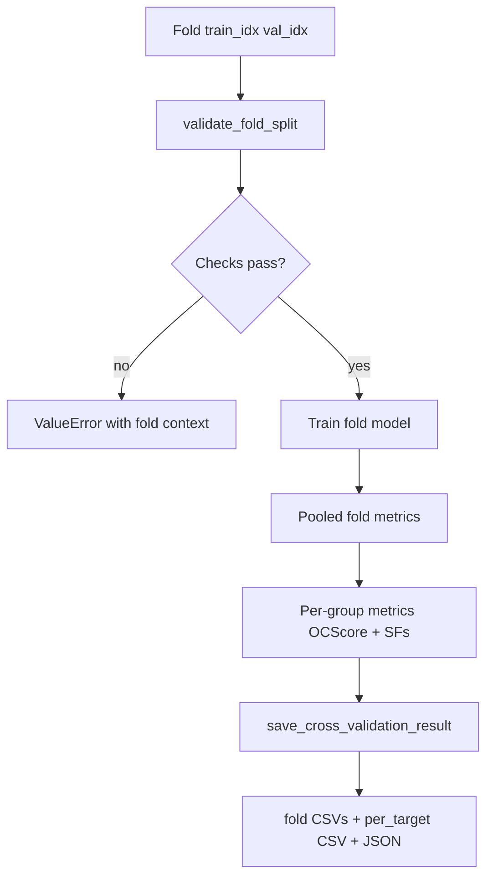

# feat: Cross-validation integrity guards and per-target metrics

## Summary

Harden exported-model cross-validation (`ModelCrossValidation.run_cross_validation_from_export`) with **runtime checks**, **tests**, and **richer artifacts** so fold splits are trustworthy and auditable. Focus is DUDEz **receptor-grouped** CV (the default for screening exports); PDBbind row-K-fold behavior is unchanged unless explicitly extended later.

---

## Problem Frame

Cross-validation already implements receptor-grouped folds for DUDEz and per-fold `StandardScaler` fitting for PDBbind, but guarantees are thin:

- Receptor disjointness is tested only on `iter_receptor_group_kfold_indices`, not on full CV runs.
- Row/entity overlap between train and validation is not diagnosed (duplicate ligand/name/SMILES across splits).
- Scaler train-only fitting is correct in code but not asserted in tests or logs.
- Fold-level pooled metrics exist; **per-receptor** metrics for OCScore and scoring-function baselines are not exported.

This plan closes those gaps without changing the core training loop or export bundle format.

---

## Requirements

- R1. Full CV runs with `strategy=receptor_grouped` assert train and validation receptor sets are disjoint on every fold.
- R2. Full CV runs assert train and validation row index sets are disjoint on every fold (all strategies).
- R3. Optional duplicate-entity diagnostics report ligand/name (and SMILES when present) overlap between train and validation within each fold; default is warn + record in fold diagnostics, not hard-fail.
- R4. PDBbind CV documents and tests that `StandardScaler.fit` / `fit_transform` runs only on training rows per fold (validation uses `transform` only).
- R5. DUDEz CV exports a per-receptor, per-fold metrics table for OCScore and every evaluated scoring-function column.
- R6. New artifacts are written by `save_cross_validation_result` and surfaced in example 18 `cross-validate` JSON summary paths.
- R7. Automated tests cover all requirements above without requiring large real archives.

---

## Key Technical Decisions

| ID | Decision | Rationale |
|----|----------|-----------|
| KTD1 | Add `validate_fold_split(...)` in `ModelCrossValidation.py` and call it inside the fold loop before training | Centralizes integrity checks; same code path for production and tests |
| KTD2 | Receptor disjointness enforced for `receptor_grouped`; row-index disjointness enforced for all strategies | Matches user ask: (1) e2e receptor integrity; (2) no row leakage |
| KTD3 | Duplicate-entity diagnostics are **warn + diagnostics JSON**, not CV failure by default | User marked overlap checks as optional; hard-fail would break valid multi-receptor ligand designs |
| KTD4 | Add `evaluate_screening_metrics_by_group` in `Analysis/Metrics/Ranking.py` | Reuse ranking validity rules from `aggregate_group_metric`; avoid legacy `RankingMetrics` |
| KTD5 | Per-target export shape: long CSV `cross_validation_per_target_metrics.csv` with columns `fold_index`, `group`, `scorer`, `scorer_type`, metric columns | Easy to filter in pandas/R; one file for OCScore + SFs |
| KTD6 | PDBbind per-receptor regression export deferred unless `receptor` column exists on validation fold | User ask centers on screening + SFs; PDBbind already has per-fold regression metrics |

---

## High-Level Technical Design

### Fold validation contract

| Check | When | On failure |
|-------|------|------------|
| `train_idx ∩ val_idx = ∅` | Always | `ValueError` |
| `train_receptors ∩ val_receptors = ∅` | `strategy == receptor_grouped` | `ValueError` |
| Entity overlap train→val | Optional (`CrossValidationConfig.report_entity_overlap`) | Log warning; append to `fold.diagnostics["entity_overlap"]` |

Entity keys tried in order (first present column wins per key type): `name`, `ligand_name`, `smiles` (configurable list on `CrossValidationConfig`).

---

## Scope Boundaries

### In scope

- `ModelCrossValidation.py` validation helpers + fold-loop integration
- `Ranking.py` per-group metric collector
- Extended `CrossValidationFoldResult` / save paths
- Tests in `tests/ocscore/test_model_cross_validation.py`
- Brief note in `examples/README.md` (example 18 CV outputs)

### Out of scope

- Changing default CV strategy for PDBbind to receptor-grouped
- Refitting export-bundle `scaler.joblib` during CV (already per-fold refit for PDBbind)
- Bootstrap CIs per receptor (legacy `RankingMetrics` feature)
- Staged-training `DUDEzSplit` changes (separate code path)

### Deferred to Follow-Up Work

- PDBbind per-receptor regression rows in `per_target` CSV when `receptor` column exists
- Hard-fail CV on entity overlap (`report_entity_overlap="error"` mode)
- Plotting per-target heatmaps in `CrossValidationPlots.py`

---

## Implementation Units

### U1. Fold split validation helpers

**Goal:** Centralize fold integrity checks callable from the CV loop and tests.

**Requirements:** R1, R2, R3

**Dependencies:** None

**Files:**
- `OCDocker/OCScore/Optimization/ModelCrossValidation.py`
- `tests/ocscore/test_model_cross_validation.py`

**Approach:**
- Add `validate_fold_indices(train_idx, val_idx, *, fold_index)` → assert disjoint, non-empty validation when required.
- Add `validate_receptor_group_split(groups, train_idx, val_idx, *, fold_index)` → assert receptor set disjointness.
- Add `diagnose_entity_overlap(dataframe, train_idx, val_idx, entity_columns)` → return dict with overlap counts and example keys (cap list length).
- Extend `CrossValidationConfig` with `report_entity_overlap: bool = True` and `entity_columns: tuple[str, ...] = ("name", "ligand_name", "smiles")`.
- Call validators at start of each fold iteration in `run_cross_validation_from_export` before scaler fit / training.

**Patterns to follow:** `iter_receptor_group_kfold_indices`; `DUDEzSplit` receptor disjointness checks.

**Test scenarios:**
- Happy path: valid receptor-grouped indices pass both validators
- Error path: overlapping train/val row index → `ValueError` names fold_index
- Error path: shared receptor across train/val masks → `ValueError`
- Edge case: entity overlap diagnostic detects shared `name` across splits → diagnostics dict non-empty, no exception when `report_entity_overlap=True`
- Edge case: missing entity columns → diagnostics empty, no error

**Verification:** Unit tests pass; invalid synthetic fold injection fails before model training.

---

### U2. Per-group screening metrics API

**Goal:** Return one row per (group, scorer) for a validation fold.

**Requirements:** R5

**Dependencies:** None (parallel to U1)

**Files:**
- `OCDocker/OCScore/Analysis/Metrics/Ranking.py`
- `tests/ocscore/test_ocscore_rankingmetrics.py` (or new focused test file)

**Approach:**
- Add `evaluate_screening_metrics_by_group(y_true, y_score, groups, *, higher_is_better, metric_names)` returning `pd.DataFrame` with columns: `group`, plus metric columns matching `DUDEZ_CV_METRICS` where computable.
- Reuse inner loop logic from `aggregate_group_metric` (skip invalid groups; same validity rules).
- Add thin wrapper `evaluate_scoring_functions_by_group(dataframe, val_idx, labels, groups, columns)` for SF baselines.

**Patterns to follow:** `aggregate_group_metric`, `evaluate_screening_metrics`.

**Test scenarios:**
- Happy path: two receptors, known labels/scores → two rows, finite BEDROC
- Edge case: receptor with only actives → row omitted or NaN metrics per existing skip rules
- Error path: `groups` length mismatch → `ValueError`

**Verification:** DataFrame row count equals number of valid receptors on synthetic fixture.

---

### U3. Wire per-target metrics and diagnostics into CV loop

**Goal:** Produce per-receptor OCScore and SF metrics each fold; attach overlap diagnostics.

**Requirements:** R3, R5, R6

**Dependencies:** U1, U2

**Files:**
- `OCDocker/OCScore/Optimization/ModelCrossValidation.py`
- `tests/ocscore/test_model_cross_validation.py`

**Approach:**
- Extend `CrossValidationFoldResult` with `per_target_metrics: list[dict[str, Any]]` (or store as DataFrame internally, serialize on save).
- After OCScore forward pass on validation fold, call `evaluate_screening_metrics_by_group` with `val_groups`.
- For each SF column, call `evaluate_scoring_functions_by_group` (same groups/labels).
- Tag rows with `fold_index`, `scorer`, `scorer_type` (`model` | `sf`).
- Merge into fold result; accumulate for export.

**Patterns to follow:** `evaluate_scoring_function_baselines_on_fold`; existing `diagnostics["validation_receptors"]`.

**Test scenarios:**
- Integration: DUDEz grouped CV on synthetic data → each fold result has per-target rows for OCScore and `vina_*` column
- Integration: `validation_receptors` in diagnostics matches groups in per-target table
- Edge case: fold with SF baseline disabled → only OCScore rows present

**Verification:** `len(per_target_metrics) > 0` and receptors match held-out fold groups in integration test.

---

### U4. Train-only scaler guard (PDBbind)

**Goal:** Prove scaler is fit on training data only per fold.

**Requirements:** R4

**Dependencies:** U1 (fold loop structure)

**Files:**
- `OCDocker/OCScore/Optimization/ModelCrossValidation.py`
- `tests/ocscore/test_model_cross_validation.py`

**Approach:**
- Extract scaler application into `_fit_transform_pdbbind_fold(X_all, train_idx, val_idx)` returning `(X_train, X_val, scaler)` for clarity.
- Log at INFO once per fold: `"CV fold {i}: scaler fit on n_train={len(train_idx)} rows, transform on n_val={len(val_idx)} rows"`.
- Test: monkeypatch `StandardScaler.fit` / `fit_transform` to record shapes; run short PDBbind CV; assert fit saw `n_train` rows only; assert `transform` called for val path.

**Execution note:** Write failing scaler-spy test before refactoring scaler lines.

**Test scenarios:**
- Spy: `fit` or `fit_transform` receives training matrix shape `(n_train, n_features)`
- Spy: `transform` called for validation matrix, `fit` not called with validation rows
- Integration: existing `test_run_cross_validation_from_export_pdbbind` still passes

**Verification:** Test fails if scaler is accidentally fit on full dataset.

---

### U5. Save artifacts and example 18 surfacing

**Goal:** Persist per-target CSV and integrity diagnostics in CV output directory.

**Requirements:** R6

**Dependencies:** U3, U4

**Files:**
- `OCDocker/OCScore/Optimization/ModelCrossValidation.py` (`save_cross_validation_result`)
- `examples/18_ocscore_exported_model_tools.py`
- `examples/README.md`

**Approach:**
- Write `cross_validation_per_target_metrics.csv` (concatenate all folds).
- Add `cross_validation_fold_diagnostics.json` or embed extended diagnostics in existing JSON `folds[]` entries (prefer extend JSON + CSV for overlap tables).
- Return new path keys from `save_cross_validation_result` (`per_target_csv`, etc.).
- Print paths in example 18 `cross-validate` command JSON output.

**Test scenarios:**
- Integration: after `save_cross_validation_result`, per-target CSV exists and includes columns `fold_index`, `group`, `scorer`, `BEDROC`
- Happy path: example 18 JSON output includes new artifact path key

**Verification:** Files exist on disk in existing DUDEz CV integration test (extend `test_run_cross_validation_from_export_dudez_receptor_grouped`).

---

### U6. End-to-end CV integrity integration tests

**Goal:** Assert items (1) and (2) on full `run_cross_validation_from_export`, not only index helpers.

**Requirements:** R1, R2

**Dependencies:** U1, U3

**Files:**
- `tests/ocscore/test_model_cross_validation.py`

**Approach:**
- Extend `test_run_cross_validation_from_export_dudez_receptor_grouped`:
  - For each `fold` in `result.fold_results`, recompute receptor sets from stored `train_indices` / `validation_indices` and `groups_all`; assert disjoint.
  - Assert index sets disjoint.
- Add parametrized or separate test that **expects failure** when monkeypatch returns overlapping receptor fold pairs (inject bad fold generator).

**Execution note:** Test-first for the injected-failure case.

**Test scenarios:**
- E2E: successful CV → all folds pass integrity assertions
- E2E: patched fold generator with shared receptor → `ValueError` before training completes
- Regression: `test_iter_receptor_group_kfold_indices_hold_out_whole_receptors` unchanged

**Verification:** Tests green; bad-fold test fails if validation is removed.

---

## Acceptance Examples

- **AE1. Receptor-grouped CV audit**
  - **Given:** DUDEz export and reduced dataframe with four receptors
  - **When:** `cross-validate` with `strategy=receptor_grouped`
  - **Then:** Each fold's train and validation receptor sets are disjoint (enforced at runtime and verified in tests)

- **AE2. Per-target export**
  - **Given:** Completed DUDEz CV with scoring-function baselines enabled
  - **When:** User opens `cross_validation_per_target_metrics.csv`
  - **Then:** Rows exist for each held-out receptor, OCScore, and each SF column, with BEDROC/ROC-AUC columns per fold

- **AE3. Train-only scaler**
  - **Given:** PDBbind export CV run
  - **When:** Tests inspect scaler calls
  - **Then:** Fit uses training indices only; validation never passed to `fit`

---

## Risks and Dependencies

| Risk | Mitigation |
|------|------------|
| Per-target CSV size on large DUDEz sets | Long-format CSV only; document size in README |
| Entity overlap warnings noisy for legitimate duplicates | Cap examples in diagnostics; default warn not fail |
| Metric column explosion (many SFs × receptors × folds) | Same columns as pooled metrics; omit NaN-only rows |

**Dependencies:** Plans 001–003 unrelated; this plan only touches `ModelCrossValidation` and `Ranking`.

---

## Sources and Research

- Prior CV audit in conversation (2026-05-29): gaps on e2e assertions, scaler tests, per-target export
- Existing: `iter_receptor_group_kfold_indices`, `test_iter_receptor_group_kfold_indices_hold_out_whole_receptors`, PDBbind scaler lines 769–771 in `ModelCrossValidation.py`
- `evaluate_screening_metrics` group-mean behavior in `Ranking.py` (no per-group export today)
