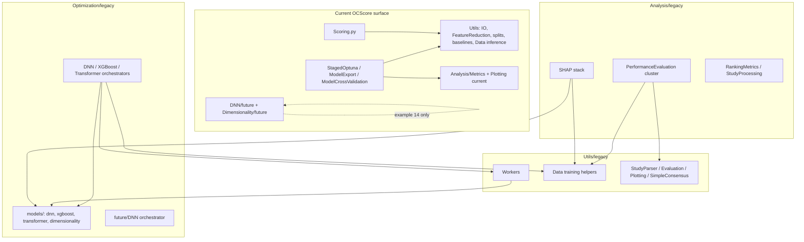

# refactor: Hard-move OCScore legacy optimizers and Utils

## Summary

Physically relocate the pre-staged OCScore optimizer cluster—Transformers, XGBoost, genetic algorithm, PCA, legacy DNN/autoencoder optimizers, and legacy-only Utils/Analysis helpers—into `legacy/` namespaces with **updated imports only**. No compatibility shims, re-export stubs, or historical import paths remain. The staged pipeline (examples 16–19), `Scoring.py`, and experimental `DNN/future/` + `Dimensionality/future/` stay at their current locations.

## Problem Frame

Plans `2026-05-29-001` and `2026-05-29-002` introduced `Analysis/legacy/` and `Optimization/legacy/` but kept **compatibility shims** at historical paths. The codebase still exposes legacy model packages at top level (`Transformer/`, `XGBoost/`, `DNN/DNNOptimizer.py`, `Dimensionality/{PCA,GeneticAlgorithm,AutoencoderOptimizer}.py`) and legacy Utils hubs (`Workers.py`, training-oriented `Data.py` helpers) beside the current staged protocol surface.

That layout makes it easy to extend the wrong modules, duplicates mental models for agents and contributors, and contradicts the desired product boundary: **current OCScore = feature reduction → staged Optuna → export/CV/baselines**; everything else is archival legacy code kept runnable only via explicit `legacy/` imports.

## Requirements

- R1. **Hard move:** Relocated modules exist only under their new `legacy/` paths. Old paths are deleted—not shimmed, not re-exported.
- R2. **Legacy optimizer cluster:** Move Transformer, XGBoost, genetic algorithm, PCA, legacy DNN (`DNN/DNNOptimizer.py`), and legacy autoencoder optimizer (`Dimensionality/AutoencoderOptimizer.py`) under `Optimization/legacy/` (model implementations) while keeping existing orchestrators (`Optimization/legacy/{DNN,XGBoost,Transformer}.py`) co-located.
- R3. **Experimental future stacks stay:** `DNN/future/` and `Dimensionality/future/` remain at current paths; they do not import `Utils.Workers` and serve example 14 independently.
- R4. **Utils split:** `Utils/Data.py` retains only inference and column-order helpers consumed by `Scoring.py`, example 12, and the staged pipeline. Training/optimization data helpers move to `Utils/legacy/Data.py`.
- R5. **Legacy-only Utils:** Move `Workers`, `StudyParser`, `SimpleConsensus`, `Evaluation`, and `Plotting` to `Utils/legacy/`.
- R6. **Legacy-only Analysis:** Move `PerformanceEvaluation` and its exclusive dependencies (`Correlation`, `NNUtils`, `StatTests`, `Impact`, `Plotting/ImpactPlots`) to `Analysis/legacy/`.
- R7. **Coupled dependents:** Code that depends **only** on moved legacy modules moves with them (update imports). Shared modules are split (backup + clean) per R4—not duplicated wholesale.
- R8. **Staged pipeline unaffected:** `StagedOptuna`, `ModelExport`, `ModelCrossValidation`, examples 16–19, and `Scoring.py` continue to work without importing any moved legacy module.
- R9. **Legacy entry points updated:** Example 11, example 14 (future stack only), legacy SHAP, and legacy Optimization orchestrators import from new `legacy/` paths only.
- R10. **Tests and docs:** Tests co-locate with moved modules or update imports; Sphinx autodoc reflects new layout; `LEGACY_*_MODULES` registries list final paths only.
- R11. **No new features:** Pure relocation and import repair—behavior of legacy workflows unchanged aside from import paths.

## Key Technical Decisions

- KTD1 — **No compatibility shims (override 001/002):** Delete old module paths after `git mv`. Callers must import `OCDocker.OCScore.*.legacy.*`. Rationale: user explicitly requested MOVE, not compatibility; shims perpetuate the wrong default import surface.
- KTD2 — **Model code under `Optimization/legacy/models/`:** Relocate `Transformer/`, `XGBoost/`, `DNN/DNNOptimizer.py`, and legacy `Dimensionality/{PCA,GeneticAlgorithm,AutoencoderOptimizer}.py` into subpackages of `Optimization/legacy/models/` (e.g. `models/transformer/`, `models/xgboost/`, `models/dnn/`, `models/dimensionality/`). Rationale: single legacy tree mirrors orchestrators already in `Optimization/legacy/`; avoids empty top-level package shells.
- KTD3 — **Keep `DNN/future/` and `Dimensionality/future/` at top level:** File dates and import graph show these are the experimental AE→DNN embedding path (example 14); they do not use `Utils.Workers`. Rationale: user scope confirmation; distinct from Workers-driven legacy optimizers.
- KTD4 — **`Utils/Data.py` slim inference surface:** Keep `apply_pca`, `norm_data`, `remove_other_columns`, `invert_values_conditionally`, `reorder_columns_to_match_data_order`, `get_column_order`, and private column-order helpers. Move `load_data`, `preprocess_df`, outlier/metrics/chunking/split helpers to `Utils/legacy/Data.py`. Legacy Data imports shared helpers from `Utils.Data` where needed. Rationale: `Scoring.py` and example 12 depend on inference subset only; avoids duplicating normalization/PCA application logic.
- KTD5 — **Remove Analysis `__init__` legacy aliases:** Drop `RankingMetrics` alias to `Metrics.Ranking` and any other legacy re-exports in `Analysis/__init__.py`. Current pipeline imports `Metrics.Ranking` directly. Rationale: aligns with hard-move policy; legacy study metrics live in `Analysis/legacy/RankingMetrics.py`.
- KTD6 — **Example 11 is legacy-only consumer:** Update example 11 imports to `Utils.legacy.*`, `Optimization.legacy.*`, `Analysis.legacy.*`; do not treat example 11 breakage as a blocker for deleting old paths. Rationale: example 11 is the legacy training demo by design.
- KTD7 — **Characterization before Data split:** Add or extend tests locking the inference subset of `Utils/Data.py` before moving training helpers. Rationale: highest regression risk for `Scoring.py` and production inference.

---

## High-Level Technical Design

### Legacy namespace topology



### Move vs split decision matrix

| Module / symbol | Action | New path | Current non-legacy consumers |
|-----------------|--------|----------|------------------------------|
| `Transformer/TransOptimizer.py` | Move | `Optimization/legacy/models/transformer/` | Workers, legacy orchestrator |
| `XGBoost/*` | Move | `Optimization/legacy/models/xgboost/` | Workers, example 11 |
| `DNN/DNNOptimizer.py` | Move | `Optimization/legacy/models/dnn/` | Workers, legacy SHAP, example 11 |
| `Dimensionality/PCA.py`, `GeneticAlgorithm.py`, `AutoencoderOptimizer.py` | Move | `Optimization/legacy/models/dimensionality/` | Workers, PCA tests |
| `DNN/future/*`, `Dimensionality/future/*` | **Keep** | unchanged | example 14, future tests |
| `Utils/Workers.py` and legacy-only Utils | Move | `Utils/legacy/` | legacy orchestrators only |
| `Utils/Data.py` training helpers | Split → move | `Utils/legacy/Data.py` | legacy cluster, SHAP legacy |
| `Utils/Data.py` inference helpers | **Keep** | `Utils/Data.py` | Scoring, example 12 |
| `Analysis/PerformanceEvaluation.py` + deps | Move | `Analysis/legacy/` | example 11, tests |
| Empty top-level dirs after move | Delete | — | — |

### Sequencing

1. Characterize and test inference subset of `Utils/Data.py` (U1).
2. Create target dirs and `git mv` model + Utils + Analysis files (U2–U4).
3. Split `Data.py`; wire legacy imports to shared inference helpers (U5).
4. Update all internal imports; delete empty shells (U6).
5. Relocate/update tests, examples, Sphinx, registries (U7–U8).
6. Full test suite + grep for stale import paths (U9).

---

## Output Structure

Expected layout after implementation (authoritative file lists live in Implementation Units):

```text
OCDocker/OCScore/
  Utils/
    Data.py                         # inference-only
    IO.py, FeatureReduction.py, ...
    legacy/
      Data.py, Workers.py, StudyParser.py, Evaluation.py,
      Plotting.py, SimpleConsensus.py, __init__.py
  Optimization/
    legacy/
      DNN.py, XGBoost.py, Transformer.py, future/DNN.py
      models/
        dnn/DNNOptimizer.py
        xgboost/XGBoostOptimizer.py, OCxgboost.py
        transformer/TransOptimizer.py
        dimensionality/PCA.py, GeneticAlgorithm.py, AutoencoderOptimizer.py
  DNN/future/                       # unchanged
  Dimensionality/future/            # unchanged
  Analysis/
    legacy/
      PerformanceEvaluation.py, Correlation.py, NNUtils.py,
      StatTests.py, Impact.py, ImpactPlots.py, ...
```

---

## Scope Boundaries

### In scope

- Physical moves and import rewrites for modules listed in Requirements.
- Removing compatibility shims introduced by plans 001/002 where they re-export legacy at old paths.
- Test and documentation path updates.
- `LEGACY_OPTUNA_MODULES` / `LEGACY_ANALYSIS_MODULES` registry updates.

### Out of scope

- New SHAP adapter for exported `best_model/` bundles (plan 002 U3—unchanged).
- Refactoring Workers or legacy optimizer algorithms.
- Moving `StagedOptuna` model code (already separate from legacy DNNOptimizer).
- Changing staged protocol behavior or metric definitions.

### Deferred to Follow-Up Work

- Collapsing `Optimization/legacy/future/DNN.py` into the main legacy DNN orchestrator if redundant after moves.
- Archiving or deleting example 11 if legacy training is no longer supported interactively.
- Reorganizing `obsidian/` agent docs beyond a short ADR note pointing to this plan.

---

## System-Wide Impact

| Audience | Impact |
|----------|--------|
| Staged pipeline users (16–19) | None if R8 holds—verify with targeted tests |
| Inference via `Scoring.py` | Low risk—guarded by Data inference characterization tests |
| Legacy training (example 11) | **Breaking** import paths—must update to `legacy/` |
| External notebooks/scripts | **Breaking** any import of old paths—no shims |
| CI / Sphinx | Doc path and test import updates required |
| CLI SHAP | Already under `Analysis/legacy/SHAP/`—update any remaining references to moved `DNNOptimizer` path |

---

## Risks & Dependencies

| Risk | Mitigation |
|------|------------|
| Missed stale import after hard delete | U9: ripgrep gate for old module strings; CI must pass |
| `Data.py` split breaks Scoring | U1 characterization tests before split; U5 imports shared helpers explicitly |
| Circular import after legacy Data split | Legacy Data imports inference helpers from `Utils.Data`; keep `Utils.Data` free of legacy imports |
| Sphinx autodoc broken | Update `docs/source/OCDocker.OCScore.*.rst` in U8 |
| Duplicate `load_data` name (`Utils.IO` vs legacy Data) | Document in module docstrings; no merge in this pass |

**Dependencies:** Plans 001/002 legacy namespaces should exist (already on branch). No new Python packages required.

---

## Implementation Units

### U1. Characterize Utils Data inference surface

**Goal:** Lock the behavioral contract of inference helpers before splitting `Data.py`.

**Requirements:** R4, R7, R8

**Dependencies:** None

**Files:**
- `OCDocker/OCScore/Utils/Data.py`
- `tests/ocscore/test_ocscore_utils_evaluation_data.py`
- `tests/ocscore/test_ocscore_scoring.py` (extend if gaps)

**Approach:** Inventory symbols used by `Scoring.py`, example 12, and staged pipeline (grep). Ensure existing tests cover `apply_pca`, `norm_data`, `reorder_columns_to_match_data_order`, `get_column_order`, `remove_other_columns`, `invert_values_conditionally`. Add focused tests if any inference path lacks coverage.

**Execution note:** Characterization-first—extend tests before U5 removes training helpers from `Utils/Data.py`.

**Patterns to follow:** Existing tests in `test_ocscore_utils_evaluation_data.py`.

**Test scenarios:**
- Happy path: `norm_data` with StandardScaler and MinMaxScaler returns expected shape and optional scaler tuple.
- Happy path: `apply_pca` with sklearn PCA object and with on-disk joblib path transforms columns correctly while preserving skip columns.
- Happy path: `reorder_columns_to_match_data_order` aligns dataframe to reference order from config file and from dataframe input.
- Edge case: `get_column_order(None)` uses config; missing config file raises expected error.
- Integration: Scoring preprocessing path calls inference helpers without importing legacy Data (mock legacy module absent).

**Verification:** Test file passes; explicit list of symbols designated “inference-only” documented in U5 commit message or inline module docstring in `Utils/Data.py`.

---

### U2. Create legacy model tree and move optimizer implementations

**Goal:** Relocate Transformer, XGBoost, legacy DNN, and legacy Dimensionality optimizers under `Optimization/legacy/models/`.

**Requirements:** R1, R2, R3

**Dependencies:** None (can parallel U3 after dirs exist)

**Files:**
- Move from `OCDocker/OCScore/Transformer/` → `OCDocker/OCScore/Optimization/legacy/models/transformer/`
- Move from `OCDocker/OCScore/XGBoost/` → `OCDocker/OCScore/Optimization/legacy/models/xgboost/`
- Move `OCDocker/OCScore/DNN/DNNOptimizer.py` → `OCDocker/OCScore/Optimization/legacy/models/dnn/DNNOptimizer.py`
- Move `OCDocker/OCScore/Dimensionality/{PCA,GeneticAlgorithm,AutoencoderOptimizer}.py` → `OCDocker/OCScore/Optimization/legacy/models/dimensionality/`
- Update `OCDocker/OCScore/DNN/__init__.py`, `OCDocker/OCScore/Dimensionality/__init__.py`
- Delete empty `Transformer/`, `XGBoost/` top-level packages

**Approach:** `git mv` preserving history. Add `__init__.py` files under `models/` subpackages. Update internal imports within moved files (relative to new Utils/legacy paths deferred to U6). Do **not** leave stub files at old paths.

**Patterns to follow:** Existing `Optimization/legacy/` orchestrator layout.

**Test scenarios:**
- Test expectation: none at move time—import fixes validated in U6/U9.

**Verification:** Old paths absent from filesystem; moved files importable at new paths after U6.

---

### U3. Move legacy-only Utils modules

**Goal:** Relocate Workers and legacy Utils helpers to `Utils/legacy/`.

**Requirements:** R1, R5

**Dependencies:** U2 (Workers imports model optimizers from new paths—can finalize imports in U6)

**Files:**
- Move `OCDocker/OCScore/Utils/{Workers,StudyParser,SimpleConsensus,Evaluation,Plotting}.py` → `OCDocker/OCScore/Utils/legacy/`
- Create `OCDocker/OCScore/Utils/legacy/__init__.py`
- Update `OCDocker/OCScore/Utils/__init__.py` module list

**Approach:** Hard move; update Workers to import from `Optimization/legacy/models/*` instead of top-level packages.

**Test scenarios:**
- Test expectation: none at move time—Workers tests updated in U7.

**Verification:** No `Utils/Workers.py` at old path; grep shows zero imports of `OCDocker.OCScore.Utils.legacy.Workers` outside legacy namespace (post U6).

---

### U4. Move Analysis PerformanceEvaluation cluster

**Goal:** Relocate legacy performance evaluation and exclusive dependencies to `Analysis/legacy/`.

**Requirements:** R1, R6

**Dependencies:** U3 (PerformanceEvaluation imports Utils legacy modules)

**Files:**
- Move `OCDocker/OCScore/Analysis/PerformanceEvaluation.py` → `Analysis/legacy/`
- Move `OCDocker/OCScore/Analysis/{Correlation,NNUtils,StatTests,Impact}.py` → `Analysis/legacy/`
- Move `OCDocker/OCScore/Analysis/Plotting/ImpactPlots.py` → `Analysis/legacy/ImpactPlots.py` (or `Analysis/legacy/Plotting/ImpactPlots.py`)
- Update `OCDocker/OCScore/Analysis/__init__.py`, `Analysis/legacy/__init__.py`

**Approach:** Move files together; fix internal cross-imports within legacy cluster. Remove legacy module names from top-level Analysis docstring.

**Test scenarios:**
- Test expectation: none at move time—tests relocated in U7.

**Verification:** Example 11 updated to `Analysis.legacy.PerformanceEvaluation`; old top-level paths deleted.

---

### U5. Split Utils Data (backup + clean)

**Goal:** Separate training/optimization data pipeline from inference helpers.

**Requirements:** R4, R7, R8

**Dependencies:** U1, U3

**Files:**
- `OCDocker/OCScore/Utils/Data.py` (slim)
- `OCDocker/OCScore/Utils/legacy/Data.py` (new, from moved content)
- `tests/ocscore/test_ocscore_utils_evaluation_data.py` (split or tag legacy vs current)
- `tests/ocscore/test_ocscore_scoring.py`

**Approach:** Copy training helpers to `Utils/legacy/Data.py`; delete them from `Utils/Data.py`. Legacy Data imports shared inference functions from `Utils.Data` (e.g. `get_column_order`, `norm_data`) rather than duplicating. Ensure `Utils/Data.py` has **no** import of `Utils.legacy`.

**Technical design (directional):**

```text
Utils/Data.py          → inference + column order (used by Scoring, ex. 12)
Utils/legacy/Data.py   → load_data, preprocess_df, outlier/metrics/chunking/split
                         imports shared helpers from Utils.Data
```

**Patterns to follow:** KTD4 symbol lists in this plan.

**Test scenarios:**
- Happy path: legacy `preprocess_df` still produces dudez/pdbbind split given fixture CSV (existing tests, updated import path).
- Happy path: legacy `load_data` optimization_type branches still work (existing tests, updated import path).
- Happy path: slim `Utils.Data.apply_pca` unchanged behavior (U1 tests still pass).
- Error path: legacy `load_data` missing file raises same exception type as before move.
- Integration: `Scoring.py` imports only `OCDocker.OCScore.Utils.Data`—no accidental legacy import (static grep + smoke test).

**Verification:** U1 tests green; legacy data tests green at new import path; `Scoring` smoke tests green.

---

### U6. Rewire all imports and delete empty shells

**Goal:** Update every consumer to new paths; remove shims from prior refactors.

**Requirements:** R1, R9, R10

**Dependencies:** U2, U3, U4, U5

**Files:**
- `OCDocker/OCScore/Optimization/legacy/{DNN,XGBoost,Transformer}.py`
- `OCDocker/OCScore/Optimization/legacy/future/DNN.py`
- `OCDocker/OCScore/Analysis/legacy/SHAP/Model.py`, `SHAP/Data.py`
- `examples/11_python_api_train_model_from_db.py`
- Update `OCDocker/OCScore/Optimization/legacy/__init__.py` docstring (remove “historical import paths” compatibility language)
- Any remaining shim files at historical paths from plans 001/002

**Approach:** Systematic grep for old import strings (`Utils.Workers`, `DNN.DNNOptimizer`, `Dimensionality.PCA`, `Optimization.DNN` at non-legacy paths, etc.). Update to `legacy` paths. Delete empty directories and any re-export stubs. Update `LEGACY_OPTUNA_MODULES` to list only post-move paths (include `Utils.legacy.Workers`, `Optimization.legacy.models.dnn.DNNOptimizer`, etc.).

**Patterns to follow:** KTD1—no re-export files left behind.

**Test scenarios:**
- Integration: `import OCDocker.OCScore.Optimization.legacy.DNN` succeeds.
- Integration: `import OCDocker.OCScore.Utils.legacy.Workers` **fails** (ModuleNotFoundError)—confirms hard move.
- Integration: legacy SHAP Model imports `NeuralNet` from new dnn path.

**Verification:** Grep gate in U9 passes; example 11 runs with updated imports (manual or CI optional job).

---

### U7. Relocate and update tests

**Goal:** Test suite reflects new module locations; no tests import deleted paths.

**Requirements:** R10, R11

**Dependencies:** U6

**Files:**
- `tests/ocscore/test_ocscore_workers_*.py`
- `tests/ocscore/test_ocscore_dnn_optimizer.py`
- `tests/ocscore/test_ocscore_autoencoder_optimizer.py`
- `tests/ocscore/test_ocscore_dimensionality_pca.py`
- `tests/ocscore/test_ocscore_transformer_optimization_extended.py`
- `tests/ocscore/test_ocscore_optimization_runtime.py`
- `tests/ocscore/test_ocscore_performance_evaluation.py`
- `tests/ocscore/test_ocscore_staged_optuna_protocol.py` (registry assertions)
- `tests/ocscore/test_ocscore_shap_integration.py`
- `tests/ocscore/test_ocscore_utils_plotting.py`
- `tests/ocscore/test_ocscore_study_parser.py`
- `tests/ocscore/test_ocscore_simple_consensus.py`
- `tests/ocscore/test_ocscore_utils_evaluation_data.py` (legacy import split)

**Approach:** Update imports and filesystem path loads (e.g. optimization runtime test loading by path). Keep `test_ocscore_dnn_future*.py` and `test_ocscore_autoencoder_future.py` on **future** paths unchanged.

**Test scenarios:**
- Happy path: full `pytest tests/ocscore/` passes.
- Happy path: staged protocol tests assert updated `LEGACY_OPTUNA_MODULES` contents.

**Verification:** CI-equivalent local pytest run clean.

---

### U8. Update documentation and package metadata

**Goal:** Sphinx and package docstrings match hard-move layout.

**Requirements:** R10

**Dependencies:** U6

**Files:**
- `docs/source/OCDocker.OCScore.Utils*.rst`
- `docs/source/OCDocker.OCScore.DNN*.rst`
- `docs/source/OCDocker.OCScore.Dimensionality*.rst`
- `docs/source/OCDocker.OCScore.Transformer*.rst`
- `docs/source/OCDocker.OCScore.XGBoost*.rst`
- `docs/source/OCDocker.OCScore.Optimization*.rst`
- `docs/source/OCDocker.OCScore.Analysis*.rst`
- `examples/README.md` (note legacy import paths for example 11)

**Approach:** Point autodoc at legacy paths; add `Utils/legacy` and `Optimization/legacy/models` index pages if needed. Remove autodoc entries for deleted top-level packages.

**Test scenarios:**
- Test expectation: none — doc build smoke optional.

**Verification:** `docs/source` grep finds no references to deleted top-level optimizer packages without `legacy` segment.

---

### U9. Verification gate and stale-path audit

**Goal:** Prove hard move completeness and staged pipeline safety.

**Requirements:** R1, R8, R10, R11

**Dependencies:** U7, U8

**Files:** Repository-wide grep; examples 16–19 smoke paths.

**Approach:** Run ripgrep for forbidden patterns:

- `OCDocker.OCScore.Utils.legacy.Workers`
- `OCDocker.OCScore.Utils.legacy.StudyParser` (non-legacy)
- `OCDocker.OCScore.Optimization.legacy.models.dnn.DNNOptimizer`
- `OCDocker.OCScore.Transformer.`
- `OCDocker.OCScore.XGBoost.`
- `OCDocker.OCScore.Optimization.legacy.models.dimensionality.PCA` / `GeneticAlgorithm` / `AutoencoderOptimizer` (non-future)
- Shim comments referencing "compatibility" re-exports at old Optimization root

Allow listed exceptions: `DNN.future` and explicit `legacy` segments (`Dimensionality.future` moved to `Dimensionality.legacy`).

**Test scenarios:**
- Happy path: `pytest tests/ocscore/` full pass.
- Happy path: import staged modules (`StagedOptuna`, `ModelCrossValidation`, `DescriptorAggregateBaselines`) without legacy deps.
- Integration: example 19 unit tests pass (baseline comparison unaffected).

**Verification:** Grep gate clean; pytest green; plan R1–R11 checklist signed off in PR description.

---

## Open Questions

- None blocking. **Resolved:** Keep `DNN/future/` and `Dimensionality/future/` at top level; move Workers-driven legacy DNN (`DNNOptimizer.py`) only.

---

## Sources & Research

- Prior partial legacy moves: `docs/plans/2026-05-29-001`, `docs/plans/2026-05-29-002` (shim policy superseded by KTD1).
- Import graph survey: `Scoring.py` (inference Data helpers), `Workers.py` (hub for legacy optimizers), examples 11 vs 14 vs 16–19.
- User scope: hard MOVE, full legacy cluster except independent future DNN/AE stacks.
