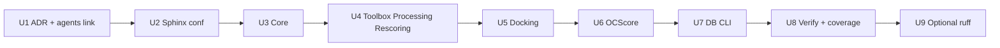

# refactor: Standardize NumPy docstrings for Sphinx autodoc

## Summary

Codify and roll out a single NumPy-style docstring convention across ~82 non-legacy Python modules so Sphinx autodoc (Napoleon + autodoc) renders complete, consistent API reference pages. `Ligand.py` and `Receptor.py` are the canonical reference; legacy, future, and `Docking/Future/` code is out of scope.

---

## Problem Frame

Public API documentation is built from in-source docstrings via Sphinx (`docs/source/conf.py`, Napoleon, `undoc-members: False`). Practice is uneven: some modules match the Ligand/Receptor pattern (class `"""`, method `'''`, full `Parameters`/`Returns`/`Raises`), while others use one-liners, omit sections, or put class docs in triple-single quotes (notably OCScore dataclasses). ADR-0002 already assumes NumPy-style sections for public OCScore APIs, but no repo-wide ADR defines quote style, section rules, or rollout order.

Without a written standard and phased execution, autodoc silently omits undocumented members and readers see inconsistent API pages.

---

## Requirements

- R1. **Canonical pattern:** Class docstrings use triple-double quotes (`"""`); method and function docstrings use triple-single quotes (`'''`), matching `OCDocker/Ligand.py` and `OCDocker/Receptor.py`.
- R2. **NumPy sections:** Include `Parameters`, `Returns`, and `Raises` only when applicable—never empty placeholder sections.
- R3. **Class content:** Every public class docstring has a one-line summary plus a blank line, then optional narrative, then `Parameters` for constructor-meaningful arguments and `Attributes` when the class exposes significant instance state beyond `__init__` parameters (follow `Receptor` where relevant).
- R4. **Method/function content:** Public methods and module-level functions document all parameters, return values, and raised exceptions that are part of the contract.
- R5. **Module docstrings:** Keep the existing file skeleton (`# Description`, module `'''`, `# License`, section markers); fix incorrect prose only (e.g. Receptor module text still says "ligand").
- R6. **Scope boundary:** Do not modify `**/legacy/**`, `**/future/**`, or `OCDocker/Docking/Future/**` (~62 files).
- R7. **Sphinx alignment:** After each phase, `make -C docs html` succeeds with no new autodoc import failures.
- R8. **Convention record:** Add an Obsidian ADR (not under `docs/`) as the durable style reference; link from `obsidian/agents.md` or Sphinx Documentation Map as appropriate.
- R9. **Public API only:** Do not document leading-underscore helpers unless promoted to public API; keep `napoleon_include_private_with_doc = False`.
- R10. **No narrative doc rewrites:** User-facing `.rst` guides change only when autodoc reveals missing modules or broken toctree entries—not a prose rewrite pass.

---

## Key Technical Decisions

- KTD1 — **Ligand/Receptor as sole reference:** Quote split and section layout come from domain classes, not from OCScore dataclass outliers. Dataclass and `@dataclass` classes adopt `"""` for class docs; fields documented via `Parameters` on the class (same as Ligand constructor params on the class docstring).
- KTD2 — **Phased rollout by package:** Core → Toolbox/Processing/Rescoring → Docking → OCScore (non-legacy) → DB/CLI. Each phase is independently mergeable and ends with a docs build check. Rationale: ~82 files, low behavioral risk, easier review than one mega-diff.
- KTD3 — **Type hints + docstrings:** Signatures keep type hints; docstrings describe semantics in NumPy form (no duplication of types unless clarifying unions or string sentinel meanings). Matches `autodoc_typehints = "description"`.
- KTD4 — **Obsidian for policy, Sphinx for public API:** Style ADR lives in `obsidian/Decisions/` per project brain rules; do not add a parallel style guide under `docs/`.
- KTD5 — **Optional lint deferred to final unit:** Introduce `ruff` pydocstyle rules only after conventions are codified and a representative phase lands—avoids fighting the linter on 82 files at once.
- KTD6 — **Napoleon Google parser off:** Set `napoleon_google_docstring = False` in `docs/source/conf.py` once NumPy rollout is underway so mixed-style drift is visible in review. NumPy remains enabled.

---

## High-Level Technical Design

### Docstring shape (authoritative)

```text
MODULE
  # Description banner
  ''' module summary + Usage: import example '''

CLASS (public)
  """ One-line summary.

  Extended narrative (optional).

  Parameters
  ----------
  ...

  Attributes
  ----------
  ...   # when instance state matters for API consumers

  """

METHOD / FUNCTION (public)
  ''' One-line summary.

  Parameters
  ----------
  ...

  Returns
  -------
  ...

  Raises
  ------
  ...
  '''
```

### Rollout phases



### Sphinx consumption path

Autodoc reads live modules → Napoleon parses NumPy sections → HTML API pages under Furo. Undocumented public members are **omitted** (`undoc-members: False`), so docstring completeness directly controls API surface visibility.

---

## Scope Boundaries

### In scope

- All `OCDocker/**/*.py` except legacy/future/Docking-Future paths (~82 files).
- Obsidian ADR and maintainer cross-links.
- Minimal `docs/source/conf.py` tuning (KTD6).
- Sphinx build verification per phase.

### Out of scope

- Legacy, future, and `Docking/Future/` modules (scheduled removal).
- Rewriting installation, manual, or examples `.rst` prose.
- Translating Obsidian notes into Sphinx.
- Documenting private (`_` prefix) helpers.
- Changing runtime behavior (docstrings only).

### Deferred to Follow-Up Work

- Enabling strict pydocstyle/ruff D-rules repo-wide (U9 optional unit).
- Adding `Examples` / `Notes` sections to every public API (use selectively for non-obvious APIs during rollout, not as a blanket requirement).
- Pruning or hiding legacy `.rst` API pages that still automodule legacy packages (separate cleanup when legacy code is deleted).
- `intersphinx` mapping for RDKit/BioPython (nice-to-have for cross-links).

---

## Suggested Improvements (non-blocking)

These improve Sphinx output beyond the minimum pattern; apply opportunistically during each phase:

1. **`Attributes` on domain classes** — Ligand/Receptor-style descriptor-heavy classes benefit more than thin wrappers.
2. **`Notes` for non-obvious defaults** — e.g. embedding attempts, sanitize flags, config fallbacks.
3. **`See Also` cross-references** — sparingly, where modules delegate to Toolbox helpers.
4. **Sphinx coverage baseline** — run `sphinx-build -b coverage` once before/after to quantify undocumented public objects; track in session log.
5. **Fix known copy-paste bugs** — Receptor module docstring ("ligand" → "receptor") in U3.
6. **Constants module** — `OCDocker/Toolbox/Constants.py` uses `"""` on constants; document as exception in ADR (values are not classes/methods) or normalize to `#` comments if autodoc noise is unwanted.

---

## Implementation Units

### U1. Docstring convention ADR (Obsidian)

**Goal:** Single authoritative style record for humans and agents.

**Requirements:** R8, R1–R5

**Dependencies:** None

**Files:**
- `obsidian/Decisions/ADR-0005-Numpy-Docstring-Convention-For-Sphinx.md` (create)
- `obsidian/Decisions/README.md` (link if index needed)
- `obsidian/agents.md` or `obsidian/Documentation/Sphinx Documentation Map.md` (one-line pointer to ADR)

**Approach:** Capture quote rules, section rules, module skeleton, dataclass handling, Constants exception, public-vs-private policy, and worked Ligand/Receptor excerpts. Reference ADR-0002 for prior NumPy section expectation.

**Patterns to follow:** `obsidian/Decisions/ADR-0004-SHAP-And-Optimization-Legacy-Split.md`, `obsidian/Decisions/README.md` naming.

**Test scenarios:**
- Test expectation: none — documentation policy artifact only.

**Verification:** ADR exists, status accepted, linked from maintainer docs; no code behavior change.

---

### U2. Sphinx configuration hardening

**Goal:** Align Napoleon settings with the NumPy-only convention.

**Requirements:** R7, KTD6

**Dependencies:** U1

**Files:**
- `docs/source/conf.py`

**Approach:** Set `napoleon_google_docstring = False`. Add a brief comment pointing to ADR-0005. Confirm existing options remain: `napoleon_include_init_with_doc = True`, `undoc-members: False`, `autodoc_typehints = "description"`.

**Test scenarios:**
- Happy path: `make -C docs html` completes after conf change.
- Regression: API pages for Ligand/Receptor still render Parameters tables.

**Verification:** Clean docs build; no Napoleon parse regressions on reference modules.

---

### U3. Phase 1 — Core domain modules

**Goal:** Normalize the highest-visibility API entry points.

**Requirements:** R1–R5, R7, R9

**Dependencies:** U1, U2

**Files:**
- `OCDocker/Ligand.py` (gap-fill only; already reference)
- `OCDocker/Receptor.py` (fix module docstring + align any under-documented methods)
- `OCDocker/Error.py`
- `OCDocker/Initialise.py`
- `OCDocker/Config.py`
- `OCDocker/_version.py` (minimal module doc; align banner if needed)

**Approach:** Audit every public class/method/function. Upgrade one-liners to full NumPy sections. Add `Attributes` on Receptor where instance descriptors mirror Ligand. Config dataclasses: class `"""` with `Parameters` per field.

**Execution note:** Use Ligand/Receptor as diff template; avoid reformatting unrelated code.

**Patterns to follow:** `OCDocker/Ligand.py`, `OCDocker/Receptor.py`, `docs/ERROR_HANDLING.md` examples.

**Test scenarios:**
- Happy path: Sphinx autodoc pages for Ligand, Receptor, Config list documented public members.
- Edge case: Config dataclass with defaults — optional params marked `, optional` and `by default ...`.
- Error path: Error helpers that raise — `Raises` section documents exception types.
- Integration: `make -C docs html` after U3 changes.

**Verification:** No undocumented public members on core modules that appear in existing `.rst` automodule directives; docs build green.

---

### U4. Phase 2 — Toolbox, Processing, Rescoring

**Goal:** Standardize shared utilities and pipeline helpers.

**Requirements:** R1–R7, R9

**Dependencies:** U3

**Files:**
- `OCDocker/Toolbox/*.py` (all non-legacy modules)
- `OCDocker/Processing/**/*.py` (excluding any future paths — none in Processing today)
- `OCDocker/Rescoring/*.py`

**Approach:** Prioritize modules referenced from Sphinx `.rst` pages (Downloading, Preparation, Conversion, Running, etc.). For thin private helpers (`_safe_*`), leave undocumented per R9.

**Patterns to follow:** Toolbox modules with existing full NumPy docs (e.g. Preparation, Conversion).

**Test scenarios:**
- Happy path: Public functions in Toolbox/Preparation.py have Parameters + Returns.
- Edge case: Functions returning `(code, data)` tuples document both elements in Returns.
- Error path: Functions calling `ocerror.Error.*` document failure modes in Raises or Returns when error codes are returned instead of raised.
- Integration: Docs build; spot-check Toolbox automodule pages.

**Verification:** Phase completes with green `make -C docs html`.

---

### U5. Phase 3 — Docking and rescoring runners

**Goal:** Bring docking wrapper classes to reference depth.

**Requirements:** R1–R7, R9

**Dependencies:** U4

**Files:**
- `OCDocker/Docking/Vina.py`
- `OCDocker/Docking/Smina.py`
- `OCDocker/Docking/Gnina.py`
- `OCDocker/Docking/PLANTS.py`
- `OCDocker/Docking/BaseVinaLike.py`

**Approach:** Replace one-line class docs ("Vina object with methods for easy run") with summary + Parameters for construction/config + method-level NumPy docs for run/prepare/public workflow methods.

**Patterns to follow:** Ligand class depth; existing method docstrings in same files where already NumPy-complete.

**Test scenarios:**
- Happy path: Each docking class docstring documents constructor/config Parameters.
- Happy path: Primary `run`/`dock` public methods document Returns (paths, scores, status).
- Edge case: Optional GPU/CUDA paths noted in Parameters or Notes without behavior change.
- Integration: `OCDocker.Docking` autodoc page renders expanded class sections.

**Verification:** Docs build; docking API pages show Parameters for main classes.

---

### U6. Phase 4 — OCScore (current pipeline, non-legacy)

**Goal:** Unify OCScore dataclass and protocol modules to the class `"""` / method `'''` split.

**Requirements:** R1–R7, R9; aligns with ADR-0002 expectations

**Dependencies:** U5

**Files:**
- `OCDocker/OCScore/Optimization/Protocol.py`
- `OCDocker/OCScore/Optimization/StagedOptuna.py`
- `OCDocker/OCScore/Optimization/ModelExport.py`
- `OCDocker/OCScore/Optimization/ModelCrossValidation.py`
- `OCDocker/OCScore/Optimization/OptunaSearchSpace.py`
- `OCDocker/OCScore/Optimization/OptunaStorage.py`
- `OCDocker/OCScore/Utils/FeatureReduction.py`
- `OCDocker/OCScore/Utils/Data.py`
- `OCDocker/OCScore/Utils/*.py` (non-legacy)
- `OCDocker/OCScore/Analysis/**/*.py` (non-legacy)
- `OCDocker/OCScore/Scoring.py`

**Approach:** Convert dataclass class docstrings from `'''` to `"""`. Fill gaps in `Calibration.py`, ranking/metrics modules, and module-level helpers. StagedOptuna: document public protocol classes; leave dense private plateau helpers minimally documented unless they are public.

**Patterns to follow:** `OCDocker/OCScore/Optimization/ModelCrossValidation.py` (already close), `FeatureReduction.py`.

**Test scenarios:**
- Happy path: `CrossValidationConfig` and similar dataclasses use `"""` with Parameters per field.
- Happy path: `run_feature_reduction_protocol` retains complete Parameters/Returns/Raises.
- Edge case: Optional protocol flags documented with defaults.
- Error path: StagedOptuna validation failures documented in Raises where exceptions propagate.
- Integration: OCScore automodule tree builds without import errors.

**Verification:** OCScore API `.rst` pages show expanded member list vs pre-refactor baseline (manual or coverage diff).

---

### U7. Phase 5 — DB and CLI

**Goal:** Document persistence models and CLI entry points exposed in Sphinx.

**Requirements:** R1–R7, R9

**Dependencies:** U6

**Files:**
- `OCDocker/DB/**/*.py` (non-legacy)
- `OCDocker/CLI/__init__.py`
- Package `__init__.py` files in scope only where automodule expects module docstrings

**Approach:** SQLAlchemy models: class `"""` with Attributes for columns/relationships where useful; avoid documenting SQLAlchemy inherited internals (already suppressed). CLI: document public functions used by console entry points.

**Patterns to follow:** `OCDocker/DB/Models/Base.py` existing patterns; keep `inherited-members: False` in mind.

**Test scenarios:**
- Happy path: DB model classes have summary + Attributes for user-facing columns.
- Edge case: `__init__.py` module docstrings remain brief Usage-style only.
- Integration: `OCDocker.DB` and CLI docs pages build cleanly.

**Verification:** Docs build green; no new SQLAlchemy noise in autodoc output.

---

### U8. Verification and coverage baseline

**Goal:** Prove Sphinx health and measure documentation completeness.

**Requirements:** R7

**Dependencies:** U7

**Files:**
- `obsidian/Sessions/` (session log entry with before/after coverage note — optional)
- No production code changes unless coverage run exposes broken automodule imports

**Approach:** Run `make -C docs html` and `sphinx-build -b coverage docs/source docs/build/coverage`. Record undocumented public object count delta. Fix any automodule/import issues discovered (e.g. stale `.rst` pointing at moved legacy paths) without expanding scope to legacy code.

**Test scenarios:**
- Happy path: HTML build exit 0.
- Happy path: Coverage report generated; fewer undocumented public objects than pre-refactor baseline (qualitative goal).
- Error path: Import failure in autodoc — fix shim or exclude broken legacy `.rst` reference in a minimal follow-up commit within U8 only.

**Verification:** CI docs workflow (`.github/workflows/docs.yml`) would pass locally.

---

### U9. Optional — Ruff docstring lint (follow-up)

**Goal:** Prevent regression after manual rollout.

**Requirements:** Deferred enforcement

**Dependencies:** U8

**Files:**
- `pyproject.toml` (ruff section)
- `.pre-commit-config.yaml`
- Optionally `obsidian/Decisions/ADR-0005-*` amendment

**Approach:** Add ruff with selected pydocstyle rules (e.g. D100 module, D101 public class, D103 public function) scoped to `OCDocker/` with legacy/future excludes. Start as warn-only or pre-commit optional until noise is zero.

**Test scenarios:**
- Happy path: Ruff passes on `OCDocker/Ligand.py`.
- Edge case: Legacy paths excluded from lint target.

**Verification:** Pre-commit hook runs; no false positives on license blocks or module banners.

---

## Risks & Dependencies

| Risk | Mitigation |
|------|------------|
| Large diff fatigue | Phased PRs by U3–U7; doc-only changes |
| Autodoc import failures on mocked deps | Existing `conf.py` shims; run build each phase |
| Inconsistent reviewer standards | ADR-0005 + Ligand/Receptor excerpts |
| Dataclass field drift vs Parameters | Document fields in class docstring; match dataclass field order |
| Legacy `.rst` still automodules legacy code | U8 only fixes import breakages; full RST prune deferred |

**Dependencies:** Sphinx 7+/8+, existing docs CI, Obsidian brain for ADR storage.

---

## System-Wide Impact

- **API reference readers:** Richer Furo pages; undocumented members remain hidden until documented.
- **Contributors:** Clear ADR; new code must follow pattern in PR review.
- **Agents:** `obsidian/agents.md` pointer reduces rediscovery of Ligand/Receptor convention.
- **No runtime impact:** Docstring-only refactor.

---

## Open Questions

None blocking — scope confirmed with defaults: dataclass classes use `"""`, public API only, phased by package, optional ruff in U9.

---

## Sources & Research

- Canonical examples: `OCDocker/Ligand.py`, `OCDocker/Receptor.py`
- Sphinx: `docs/source/conf.py`, `obsidian/Documentation/Sphinx Documentation Map.md`
- Prior NumPy expectation: `obsidian/Decisions/ADR-0002-Feature-Reduction-API-Surface-And-Rewiring.md`
- Error doc examples: `docs/ERROR_HANDLING.md`
- Maintainer workflow: `obsidian/Workflows/Documentation Maintenance Workflow.md`
- Scale: ~82 in-scope / ~62 out-of-scope Python files under `OCDocker/`
- No `docs/solutions/` learnings; no pydocstyle/ruff enforcement today
