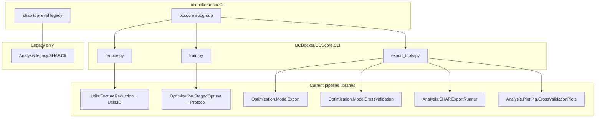

# feat: Rewire CLI ML commands for staged OCScore pipeline

## Summary

Introduce a unified `ocdocker ocscore` command group that exposes the current staged OCScore pipeline (feature reduction → staged Optuna → export/CV/SHAP/inference) as first-class CLI subcommands, extracted from examples 14–16. Export-bundle SHAP under `ocdocker ocscore shap`. Top-level `ocdocker shap` and `shap-legacy` removed — legacy four-study SHAP is library-only. Examples remain runnable thin wrappers over the shared CLI modules.

### Post-implementation (2026-05-29)

- Removed top-level `ocdocker shap` and `ocdocker ocscore shap-legacy`.
- Removed misleading `parents=[parent]` on `ocscore` so `--conf` / `--multiprocess` do not appear on ML subcommands.
- Legacy four-study SHAP: `python -m OCDocker.OCScore.Analysis.legacy.SHAP.Cli` or `Analysis.legacy.SHAP.Cli.main`.
- **Still deferred:** `ocdocker ocscore compare` (example 17), `ocdocker ocscore infer-csv` (example 13 legacy scoring layout).

---

## Problem Frame

After the OCScore legacy hard-move (plan 005) and export tooling work (plans 001–004), the **current pipeline** is fully implemented in library code and example scripts 14–17, but the **only ML command on `ocdocker` today is `shap`**, which delegates to `Analysis.legacy.SHAP.Cli` and targets pre-staged four-study Optuna artifacts (see ADR-0004).

Users and agents discover `ocdocker shap` in `usage.rst` and `MANUAL.md`, yet staged exports require `examples/16_ocscore_exported_model_tools.py shap` and `ExportRunner`. Training and feature reduction have **no CLI surface** at all — only standalone example scripts. This split causes wrong-tool usage, poor discoverability, and duplicated argparse logic between examples and the main CLI.

The product boundary is settled: **current OCScore = reduce → staged Optuna → export tools**; legacy training/SHAP lives under explicit `legacy/` imports and `examples/legacy/`. The CLI should mirror that boundary.

---

## Requirements

- R1. `ocdocker ocscore --help` lists subcommands for the full staged pipeline: `reduce`, `train`, and export-tool operations (`validate`, `load`, `retrain`, `cross-validate`, `plot`, `shap`, `score`).
- R2. Each subcommand accepts the **same flags and behavior** as the corresponding example script (14, 15, 16) — no silent semantic drift.
- R3. Export-bundle SHAP and scoring use **current** modules (`ExportRunner`, `ModelExport.predict_from_export`); they do **not** call legacy SHAP or legacy optimizers.
- R4. `ocdocker shap` continues to work for the legacy four-study workflow via `Analysis.legacy.SHAP.Cli` (ADR-0004).
- R5. Help text and user-facing docs explicitly direct staged-export users to `ocdocker ocscore shap`, not `ocdocker shap`.
- R6. Missing ML optional dependencies (`torch`, `optuna`, etc.) surface the existing `pip install "ocdocker[ml]"` hint via `_suggest_extra_for_missing_module`.
- R7. Examples 14–16 delegate to shared CLI modules so flag definitions exist in one place.
- R8. Automated CLI tests cover dispatch wiring and at least one smoke path per major subcommand group (reduce parser, train parser, export `score`/`shap`, legacy `shap` delegation).
- R9. Sphinx and `usage.rst` document the new command group and the staged workflow 14→15→16 as CLI equivalents.

---

## Key Technical Decisions

| ID | Decision | Rationale |
|----|----------|-----------|
| KTD1 | Add `OCDocker/OCScore/CLI/` package with one module per stage (`reduce.py`, `train.py`, `export_tools.py`) plus `__init__.py` aggregator | Keeps OCScore CLI colocated with pipeline code; avoids further bloating `OCDocker/CLI/__init__.py` (~3500 lines). Main CLI registers a thin `ocscore` subparser that imports this package lazily. |
| KTD2 | **Full pipeline in v1** (user-confirmed): `reduce`, `train`, and all example-16 subcommands | Matches user scope selection; examples already define stable flag surfaces. |
| KTD3 | Examples 14–16 become thin wrappers: `sys.exit(module.main())` after path bootstrap only | Single source of truth for argparse; examples stay discoverable for copy-paste workflows. |
| KTD4 | `ocdocker shap` unchanged at top level; no rename in v1 | Avoids breaking existing scripts; ADR-0004 already documents behavioral split. Add epilog on both `ocdocker shap --help` and `ocdocker ocscore shap --help` cross-linking. |
| KTD5 | `ocscore reduce` calls `run_feature_reduction_protocol` and archive loaders per ADR-0002 — **not** `Utils.legacy.Data.load_data` | Preserves missing-value semantics and descriptor-block rules from ADR-0001/0002. |
| KTD6 | `ocscore score` enforces frozen `selected_features` from export metadata (plan 003 KTD2); no feature reduction replay on new archives | Inference kit contract already implemented in library; CLI must not add auto-reduction. |
| KTD7 | Lazy-import OCScore CLI modules inside `cmd_ocscore` handlers | Keeps `ocdocker vs` / `pipeline` usable without `[ml]` extra installed. |
| KTD8 | Defer `ocscore compare` (example 17 baselines) and CSV legacy inference (example 13 / `Scoring.get_score`) to follow-up | Out of full-pipeline CLI scope; example 13 uses pre-export artifact layout. |
| KTD9 | Optional `--conf` on `ocscore` subcommands only where examples already load OCDocker config (inference-related paths); reduce/train do not require full docking bootstrap unless a subcommand needs it | Matches example behavior; avoid forcing DB/docking init for pure ML runs. |

---

## High-Level Technical Design

### Command topology

### Staged user journey (CLI equivalents)

| Stage | Example | CLI |
|-------|---------|-----|
| Feature reduction | `examples/14_…py` | `ocdocker ocscore reduce …` |
| Staged Optuna | `examples/15_…py` | `ocdocker ocscore train …` |
| Validate export | `examples/16_…py validate` | `ocdocker ocscore validate …` |
| Cross-validate | `… cross-validate` | `ocdocker ocscore cross-validate …` |
| Plot CV | `… plot` | `ocdocker ocscore plot …` |
| Export SHAP | `… shap` | `ocdocker ocscore shap …` |
| Score raw archives | `… score` | `ocdocker ocscore score …` |
| Legacy four-study SHAP | — | `ocdocker shap …` (unchanged) |

### Registration pattern in main CLI

Add `OCDocker/CLI/ocscore.py` with:

- `register_ocscore_subparser(subparsers) -> None` — adds `ocscore` parser with nested subparsers
- `cmd_ocscore(args) -> int` — dispatches to `args.func(args)` on the nested namespace

`build_parser()` in `OCDocker/CLI/__init__.py` calls `register_ocscore_subparser(sub)` and updates top-level help epilog to list `ocscore`.

---

## Scope Boundaries

### In scope

- Shared OCScore CLI package extracted from examples 14–16
- `ocdocker ocscore` subcommand group with full reduce/train/export surface
- Legacy `ocdocker shap` preserved with clarified help/docs
- Example script refactor to shared modules
- CLI tests and documentation updates

### Deferred to follow-up work

- `ocdocker ocscore compare` wrapping example 17 (DUDEz SF baseline comparison)
- `ocdocker ocscore infer-csv` for example 13 legacy `Scoring.get_score` path
- Renaming top-level `shap` → `shap legacy` (breaking change; needs deprecation window)
- Broader `OCDocker/CLI/__init__.py` modularization beyond `ocscore.py` registration shim
- `docs/plans/` historical path updates (example renumbering 14–17)

### Non-goals

- Wiring CLI to `Optimization.legacy.*`, `Utils.legacy.Data`, or legacy training examples
- Auto-running feature reduction inside `train` or `score`
- New SHAP or export artifact formats

---

## System-Wide Impact

| Surface | Impact |
|---------|--------|
| End users | Single discoverable ML entry point; reduced confusion between legacy and staged SHAP |
| Examples 14–16 | Behavior unchanged; implementation delegates to shared CLI |
| Packaging | No new extras; existing `[ml]` extra remains the gate for torch/optuna |
| Docs / Sphinx | `usage.rst`, `MANUAL.md`, new `docs/source/cli_ocscore.rst` (or section in usage) |
| Agents (`obsidian/agents.md`) | Update canonical command list from example-only to `ocdocker ocscore …` |
| CI | New tests under `tests/cli/`; no change to docking CLI test matrix |

---

## Risks and Dependencies

| Risk | Mitigation |
|------|------------|
| Argparse drift between CLI and examples during extraction | U1 defines shared builders; examples call same `main()` |
| `CLI/__init__.py` merge conflicts | Keep OCScore logic out of monolith except registration |
| Heavy ML imports slow `ocdocker --help` | Lazy import inside `cmd_ocscore` and subcommand handlers |
| Users run `ocdocker shap` on export bundles | R5 cross-links in help + docs; consider runtime warning if export-dir-like flags detected (optional, defer) |
| Long-running train/reduce jobs block terminal | Same as examples today; document `--output-dir` logging; no new daemon mode |

**Dependencies:** Plans 003 (portable inference), 004 (CV integrity), and legacy move 005 are **completed** — library APIs this plan delegates to already exist.

---

## Implementation Units

### U1. OCScore CLI package scaffold

**Goal:** Create the shared CLI package and main-CLI registration shim without changing user-visible behavior yet.

**Requirements:** R1 (structure), R6, R7 (foundation)

**Dependencies:** None

**Files:**
- Create `OCDocker/OCScore/CLI/__init__.py` — exports `register_subparsers`, shared `main` dispatch helper
- Create `OCDocker/CLI/ocscore.py` — `register_ocscore_subparser`, `cmd_ocscore`
- Modify `OCDocker/CLI/__init__.py` — register `ocscore`, update top-level description/epilog

**Approach:** Nested argparse: `ocdocker ocscore` → subparsers for `reduce`, `train`, `validate`, … Pattern mirrors example 16 `_build_parser`. Use lazy imports in each handler module.

**Patterns to follow:** Example 16 `_build_parser` / `set_defaults(func=…)` dispatch; existing `_suggest_extra_for_missing_module` for ML deps.

**Test scenarios:**
- Happy path: `build_parser().parse_args(["ocscore", "--help"])` succeeds without importing torch
- Happy path: `register_ocscore_subparser` adds `ocscore` to subcommand choices
- Error path: invoking a handler without `[ml]` installed prints optional-dependency hint (mock import failure)

**Verification:** Parser builds; `ocdocker ocscore --help` lists placeholder or wired subcommand names.

---

### U2. Extract and wire `ocscore reduce`

**Goal:** Move example 14 argparse and `main()` into `OCDocker/OCScore/CLI/reduce.py` and register as `ocdocker ocscore reduce`.

**Requirements:** R1, R2, R5, R7

**Dependencies:** U1

**Files:**
- Create `OCDocker/OCScore/CLI/reduce.py`
- Modify `examples/14_feature_reduction_pdbbind_dudez.py` — delegate to `reduce.main`
- Modify `OCDocker/OCScore/CLI/__init__.py` — register reduce subparser

**Approach:** Lift `_build_parser`, argument handlers, and `main()` from example 14. Handler calls `run_feature_reduction_protocol` with the same archive/IO helpers as today. Preserve `--pdbbind-archive`, `--dudez-archive`, `--output-dir`, `--n-jobs`, `--verbose`, etc.

**Patterns to follow:** `OCDocker.OCScore.Utils.FeatureReduction`, `Utils.IO` archive loaders (ADR-0002).

**Test scenarios:**
- Happy path: parser accepts required archive flags; `main(["--help"])` exits 0
- Happy path: smoke test with existing feature-reduction fixtures (if present in `tests/ocscore/test_ocscore_feature_reduction.py`) invoked via CLI module `main` with mocked protocol run
- Edge case: missing archive path → non-zero exit with clear error (same as example)
- Integration: example 14 test or new test asserts example script and CLI module share parser prog/flags

**Verification:** `ocdocker ocscore reduce --help` matches example 14; example 14 still runs via shared module.

---

### U3. Extract and wire `ocscore train`

**Goal:** Move example 15 staged Optuna CLI into `OCDocker/OCScore/CLI/train.py` and register as `ocdocker ocscore train`.

**Requirements:** R1, R2, R7

**Dependencies:** U1

**Files:**
- Create `OCDocker/OCScore/CLI/train.py`
- Modify `examples/15_ocscore_staged_optuna_from_reduction.py` — delegate to `train.main`
- Register in `OCDocker/OCScore/CLI/__init__.py`

**Approach:** Lift example 15 argparse and orchestration (`ReplicatedStagedProtocol`, reduction archive extraction, replica/trial flags). Keep long-running behavior identical — no new progress UI in v1.

**Patterns to follow:** `OCDocker.OCScore.Optimization.StagedOptuna`, `Optimization.Protocol`.

**Test scenarios:**
- Happy path: parser includes `--reduction-archive`, `--output-dir`, `--replicas`, `--pdbbind-trials`, `--dudez-trials`, kind column flags
- Happy path: extend `tests/examples/test_ocscore_staged_optuna_from_reduction_example.py` to also smoke-test CLI module parser (or duplicate minimal `--help` test)
- Edge case: invalid/missing reduction archive → same error as example (mock filesystem)
- Error path: missing optuna → ML extra hint

**Verification:** `ocdocker ocscore train --help` parity with example 15; existing example smoke test still passes.

---

### U4. Extract and wire export-tool subcommands

**Goal:** Move example 16 multi-subcommand CLI into `OCDocker/OCScore/CLI/export_tools.py` and register `validate`, `load`, `retrain`, `cross-validate`, `plot`, `shap`, `score`.

**Requirements:** R1–R3, R6–R8

**Dependencies:** U1

**Files:**
- Create `OCDocker/OCScore/CLI/export_tools.py`
- Modify `examples/16_ocscore_exported_model_tools.py` — delegate to `export_tools.main`
- Register subparsers in `OCDocker/OCScore/CLI/__init__.py`

**Approach:** Move `_shared_export_parser`, `_build_parser`, `_cmd_*` handlers unchanged in behavior. `shap` → `ExportRunner.run_export_shap_analysis`; `score` → `ModelExport.predict_from_export` + IO archive loading (plan 003).

**Patterns to follow:** Example 16 structure; `tests/examples/test_ocscore_exported_model_tools_score.py`; `tests/ocscore/test_export_shap.py`.

**Test scenarios:**
- Happy path: `score` subparser smoke (extend existing example score test to hit CLI module)
- Happy path: `shap` subparser `--help` lists `--export-dir`, `--reduction-archive`
- Happy path: `validate` on synthetic export fixture returns JSON (mock or tmp_path bundle)
- Happy path: `cross-validate` parser accepts `--n-folds`, `--epochs`
- Error path: `score` with missing columns in raw archive → fail-fast message (reuse plan 003 test patterns)
- Integration: `cross-validate` does not import legacy SHAP

**Verification:** All seven subcommands reachable from `ocdocker ocscore`; example 16 tests green.

---

### U5. Legacy SHAP UX and main CLI help

**Goal:** Clarify legacy vs pipeline SHAP without breaking `ocdocker shap`.

**Requirements:** R4, R5

**Dependencies:** U1, U4

**Files:**
- Modify `OCDocker/CLI/__init__.py` — `p_shap` description/epilog pointing to `ocdocker ocscore shap` for export bundles
- Modify `OCDocker/OCScore/CLI/export_tools.py` — shap subparser epilog noting legacy alternative
- Modify `docs/source/OCDocker.OCScore.Analysis.SHAP.ExportRunner.rst` — reference `ocdocker ocscore shap` alongside example 16

**Approach:** Documentation-first in v1; optional future deprecation banner on legacy shap. Remove `# pragma: no cover` from `cmd_shap` once tested (U6).

**Test scenarios:**
- Happy path: `ocdocker shap --help` output contains staged SHAP pointer string
- Happy path: legacy delegation test still passes (mock `legacy.SHAP.Cli.main`)

**Verification:** Help text review; legacy SHAP integration tests unchanged.

---

### U6. CLI tests and coverage

**Goal:** Add integration tests for new wiring; cover legacy shap delegation.

**Requirements:** R8

**Dependencies:** U2, U3, U4, U5

**Files:**
- Create `tests/cli/test_cli_ocscore.py`
- Create or extend `tests/cli/test_cli_shap_legacy.py`
- Modify `OCDocker/CLI/__init__.py` — remove `pragma: no cover` from `cmd_shap` after tests land

**Approach:** Use `build_parser()` and `parse_args` without running full Optuna/training. Mock heavy handlers where example tests already mock library calls. Follow `tests/cli/test_cli_core_branches.py` style.

**Test scenarios:**
- Happy path: parse `ocscore reduce --help`, `ocscore train --help`, `ocscore score --help`
- Happy path: `cmd_ocscore` dispatches to mocked handler via `args.func`
- Happy path: `cmd_shap` builds argv list for legacy Cli.main (mock)
- Error path: ML import failure returns exit code 1 with hint text

**Verification:** `pytest tests/cli/ -q` green; no untested `cmd_ocscore` / `cmd_shap` paths.

---

### U7. Documentation and agent guide

**Goal:** Document staged pipeline CLI in user-facing docs and Obsidian agent guide.

**Requirements:** R9

**Dependencies:** U2–U5

**Files:**
- Modify `docs/source/usage.rst` — add `ocscore` section with reduce/train/score/shap examples; mark legacy `shap`
- Modify `MANUAL.md` and `docs/source/manual.rst` — same
- Modify `docs/source/examples/ocscore_pipeline.rst` — CLI equivalents for stages 14–16
- Create `docs/source/cli_ocscore.rst` (optional dedicated page) and add to Sphinx toctree if created
- Modify `examples/README.md` — note CLI equivalents per example
- Modify `obsidian/agents.md` — canonical commands use `ocdocker ocscore …`; fix example numbering to 14–17

**Approach:** Show one end-to-end bash snippet: `pipeline` → `ocscore reduce` → `ocscore train` → `ocscore score`. Cross-link ADR-0004.

**Test scenarios:**
- Test expectation: none — documentation-only unit; manual review against implemented flags

**Verification:** Sphinx build succeeds; usage examples match parser `--help` strings.

---

## Open Questions

- **Q1 (deferred to implementation):** Should `ocscore train` auto-bootstrap OCDocker env when `--conf` is passed, or remain env-agnostic like example 15? **Default:** match example 15 (no full docking bootstrap unless already required by code path).
- **Q2 (deferred):** Emit a runtime warning when legacy `ocdocker shap` is invoked with paths suggesting a `best_model/` export? **Default:** no warning in v1; help text only.

---

## Sources and Research

- ADR-0004 — legacy vs export SHAP split; example 16 as primary export SHAP entry today
- ADR-0002 — feature reduction API; no silent `IO.load_data`
- Plan 003 — frozen features for `score`; audit-only reduction protocol
- Plan 002 — deferred `ocdocker ocscore explain`; export SHAP via ExportRunner
- Plan 005 — hard legacy namespaces; staged pipeline must not import legacy optimizers
- Current CLI: `OCDocker/CLI/__init__.py` — only `shap` ML command
- Examples 14–16 — authoritative flag surfaces to extract
- User scope confirmation: **full pipeline** (`reduce` + `train` + export tools)
