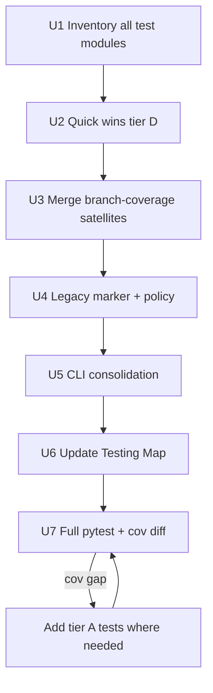

# refactor: Test suite triage — remove useless tests, protect fruitful coverage

## Summary

Audit ~1,170 tests across 148 modules, classify each file/test against a explicit **fruitfulness rubric**, then delete or merge low-value coverage-padding tests while preserving staged OCScore pipeline, security, split-integrity, and integration coverage. Outcome: a smaller suite that fails meaningfully and documents what we intentionally keep (including legacy).

## Problem Frame

The suite grew organically alongside refactors (OCScore legacy split, CLI decomposition, backwards-compat shim removal). Patterns that inflate count without protecting behavior are now common:

- **Coverage-padding files** (`*branch_coverage*`, `*edge_cases*`, `test_coverage_batch_regression.py`) split from sibling modules to chase `%` rather than invariants
- **Package-surface tests** (`__all__ == []`, optional-import fallbacks, delegation wrappers) that break when refactors intentionally change exports
- **Heavy mock forests** (especially legacy optimizers/workers) that assert stub wiring, not user-visible outcomes
- **Duplicate siblings** (e.g. `test_io.py` vs `test_io_edge_cases.py`) testing the same helpers twice

Meanwhile, **high-value** areas are under-documented as “do not delete”: staged Optuna protocol, export/inference round-trips, DUDEz/PDBbind split guards, deserialization security, CLI parser contracts, and docking integration with `test_files/`.

Recent compat-shim cleanup (Analysis re-exports, CLI `__init__` re-exports, `test_ocscore_analysis_package_init.py`) shows the cost of tests that lock obsolete surfaces. A systematic triage prevents recurrence.

**Grounding:** `obsidian/Architecture/Testing Map.md`, `obsidian/agents.md`, ADR-0004 (legacy not pipeline), CI `--cov-fail-under=75` in `.github/workflows/type-check.yml`.

---

## Requirements

| ID | Requirement |
|----|-------------|
| R1 | Every test module is classified (Keep / Merge / Gate / Delete) with recorded rationale |
| R2 | Staged OCScore pipeline tests remain green and are explicitly protected |
| R3 | Security tests (IO deserialization, path traversal, legacy StatTests unsafe pickle) are never deleted without replacement |
| R4 | Legacy OCScore tests are either kept with clear policy or gated — not silently deleted in bulk |
| R5 | CI coverage gate (75%) stays green after triage, or gate/threshold is consciously adjusted with justification |
| R6 | `obsidian/Architecture/Testing Map.md` updated with triage rubric and “protected suites” list |
| R7 | No new tests whose sole assertion is `__all__`, re-export parity, or monkeypatched delegation unless product contract requires it |

---

## Key Technical Decisions

### KTD1 — Fruitfulness rubric (4 tiers)

| Tier | Label | Criteria | Action |
|------|-------|----------|--------|
| A | **Protect** | Asserts user-visible behavior, security invariant, protocol contract, or regression with real fixture I/O | Keep; tag in inventory |
| B | **Consolidate** | Valid behavior but duplicated, split only for coverage file size, or tests same helper as sibling | Merge into primary module; delete satellite file |
| C | **Gate** | Still useful for legacy/archival code but not staged pipeline; expensive or stub-heavy | Keep under `@pytest.mark.legacy` (new marker); optional CI skip except nightly |
| D | **Remove** | Package surface, deleted compat shim, delegation-only, empty `__all__`, import-without-behavior | Delete; no replacement |

**Fruit test:** “If implementation changes correctly but differently, would this test fail for a good reason?” If no → tier D.

### KTD2 — Legacy tests: gate, don’t mass-delete

~150 tests in `tests/ocscore/legacy/` and `tests/core/legacy/` support archived namespaces (ADR-0004). **Default: tier C**, not D. Deletion only when the underlying module is removed from the repo.

### KTD3 — Branch-coverage satellites: merge-first

Docking `test_*_branch_coverage.py` (6 files, ~45 tests) and similar files are **candidates for tier B**, not automatic D. For each file: move unique branch assertions into the primary engine test module; delete satellite when diff shows zero unique paths.

Exception: keep satellite only if merged file exceeds maintainability (~600 lines) **and** satellite has ≥5 unique non-delegation tests.

### KTD4 — CI scope unchanged initially

Default CI continues `pytest --cov-fail-under=75` on full suite. After triage pass 1, if count drops materially, run coverage diff to ensure removed tests weren’t the only coverage for critical modules (`Initialise`, `Scoring`, `StagedOptuna`).

Optional follow-up (deferred): `-m "not legacy"` fast job — not in scope for first implementation pass.

### KTD5 — Inventory before deletion

Use a markdown inventory (`docs/plans/artifacts/2026-05-29-test-inventory.md`, generated during U1) as the audit trail. Each row: file path, test count, tier, action, notes. No file deleted until inventoried.

---

## High-Level Technical Design

**Protected suites (never tier D without explicit replacement):**

- `tests/ocscore/test_ocscore_staged_optuna_protocol.py`
- `tests/ocscore/test_ocscore_replicated_protocol.py`
- `tests/ocscore/test_model_cross_validation.py`
- `tests/ocscore/test_export_inference.py`
- `tests/ocscore/test_export_shap.py`
- `tests/ocscore/test_pipeline_archive_io.py`
- `tests/ocscore/test_dudez_split.py`
- `tests/ocscore/test_pdbbind_split.py`
- `tests/ocscore/test_ocscore_feature_reduction.py`
- `tests/ocscore/test_ocscore_io_security.py`
- `tests/toolbox/test_security_path_traversal.py`
- `tests/examples/test_ocscore_*`
- `tests/integration/test_integration_docking_workflow.py`

---

## Scope Boundaries

### In scope

- Classification inventory for all `tests/**/*.py`
- Delete/merge tier B/D candidates listed in U2–U3
- Register `@pytest.mark.legacy` in `pytest.ini`; apply to legacy modules
- Update `obsidian/Architecture/Testing Map.md`
- Remove tests invalidated by recent compat cleanup (already deleted: `test_ocscore_analysis_package_init.py`)

### Deferred to Follow-Up Work

- Split CI into fast (`-m "not legacy"`) vs full nightly jobs
- Lowering or restructuring the 75% coverage gate
- Rewriting `tests/rescoring/test_oddt_utilities.py` (42 tests, high mock density) — audit only in U1, refactor later
- Property-based/fuzz tests for scoring metrics

### Out of scope

- Deleting `OCDocker/OCScore/**/legacy/` implementation code
- Adding broad new integration tests (only backfill where triage removes unique coverage)
- Sphinx / docstring test changes

---

## Implementation Units

### U1. Generate test inventory and rubric spreadsheet

**Goal:** Single source of truth for triage decisions before any deletion.

**Requirements:** R1

**Dependencies:** None

**Files:**
- Create: `docs/plans/artifacts/2026-05-29-test-inventory.md`
- Read: all `tests/**/*.py` (~148 modules)

**Approach:**
- Script or structured manual pass: for each module record test count, primary target module under test, docstring intent (“branch coverage”, “smoke”, etc.), suggested tier (A–D), proposed action
- Flag **confirmed tier D candidates** from audit:
  - `tests/processing/test_postprocessing_init.py` — `__all__ == []`
  - `tests/ocscore/legacy/test_legacy_optimization_runtime.py::test_ocscore_package_inits_expose_empty_all`
  - `tests/ocscore/legacy/test_legacy_shap_integration.py::test_shap_module_init_exports`
  - `tests/toolbox/test_reproducibility.py::test_generate_reproducibility_manifest_delegates_to_cli` — tests indirection, not manifest content
  - `tests/db/test_db_package_init.py` — optional import fallback only
- Flag **confirmed tier B merges**:
  - `tests/toolbox/test_io_edge_cases.py` → `tests/toolbox/test_io.py`
  - `tests/ocscore/legacy/test_legacy_workers_smoke.py` + `test_legacy_workers_extended.py` — dedupe stub boilerplate

**Test scenarios:** N/A (documentation unit)

**Verification:** Inventory covers 100% of test modules; each tier D/B candidate has one-line rationale

---

### U2. Remove tier D quick wins

**Goal:** Delete tests that assert no durable contract.

**Requirements:** R1, R7

**Dependencies:** U1

**Files:**
- Delete or gut: `tests/processing/test_postprocessing_init.py`
- Modify: `tests/ocscore/legacy/test_legacy_optimization_runtime.py` — remove empty-`__all__` test(s)
- Modify: `tests/ocscore/legacy/test_legacy_shap_integration.py` — remove `__all__` export test
- Modify: `tests/toolbox/test_reproducibility.py` — replace delegation test with manifest schema/content assertion (tier A) OR delete if `tests/cli/test_cli_manifest.py` already covers payload shape
- Modify: `tests/db/test_db_package_init.py` — delete or replace with behavior test if any public DB helper exists

**Approach:** One commit per subsystem; run targeted pytest after each

**Test scenarios:**
- After deleting `test_postprocessing_init.py`: `pytest tests/processing/ -q` passes; postprocessing behavior still covered by `test_postprocessing_digest.py`
- Reproducibility: if kept, `test_write_reproducibility_manifest_writes_json` asserts schema keys (`schema_version`, `ocdocker`) — already tier A

**Verification:** Tier D list from U1 is empty or explicitly deferred with comment

---

### U3. Consolidate branch-coverage and edge-case satellites

**Goal:** Reduce file sprawl; keep unique branch assertions.

**Requirements:** R1, R5

**Dependencies:** U2

**Files (audit each, merge then delete when empty):**
- `tests/docking/test_vina_branch_coverage.py` → `tests/docking/test_vina.py`
- `tests/docking/test_smina_branch_coverage.py` → `tests/docking/test_smina.py`
- `tests/docking/test_plants_branch_coverage.py` → `tests/docking/test_plants.py`
- `tests/docking/test_gnina_branch_coverage.py` → `tests/docking/test_gnina_rescore.py`
- `tests/docking/test_basevinalike_branch_coverage.py` → `tests/docking/test_vinalike_parsing_edge_cases.py` or `test_vina.py`
- `tests/processing/test_preparation_branch_coverage.py` → `tests/processing/test_preparation_strategy.py`
- `tests/toolbox/test_io_edge_cases.py` → `tests/toolbox/test_io.py`
- Review: `tests/integration/test_coverage_batch_regression.py` — split tests into natural subsystem files or delete tests whose branches are already covered elsewhere

**Approach:**
- For each satellite file: list tests; mark `delegate_to_strategy` / identical error-path duplicates as drop; move remainder
- Re-order `@pytest.mark.order` only when necessary (global sort in `conftest.py`)

**Test scenarios:**
- **Happy path:** merged engine tests still pass with `OCDOCKER_FORCE_EXTERNAL_TESTS=1` when tools available
- **Edge case:** at least one unique branch from each deleted satellite file exists in merged target (document in inventory row)
- **Error path:** delegation tests removed only when primary file already asserts same exception/return code

**Verification:** Satellite file deleted OR inventory documents ≥5 unique tests reason to keep; `pytest tests/docking tests/processing tests/toolbox -q` green

---

### U4. Legacy test policy — marker and documentation

**Goal:** Make legacy tests opt-in for local runs without deleting archival coverage.

**Requirements:** R4, R6

**Dependencies:** U1

**Files:**
- Modify: `pytest.ini` — register `legacy` marker
- Modify: all `tests/ocscore/legacy/test_*.py`, `tests/core/legacy/test_*.py` — add `@pytest.mark.legacy` at module level (pytest marker registration)
- Modify: `obsidian/Architecture/Testing Map.md` — legacy section + `pytest -m legacy` command

**Approach:**
- Do **not** delete legacy tests in this unit unless U1 reclassified specific module as tier D (module removed from codebase)
- Document: legacy tests validate archived study-centric paths; staged pipeline tests in `tests/ocscore/` (non-legacy) are the product gate

**Test scenarios:**
- `pytest -q` (default) still collects legacy tests (marker is informational only in pass 1)
- `pytest -m legacy -q` runs only legacy modules
- `pytest -m "not legacy" -q` excludes legacy — use locally to measure “product suite” size

**Verification:** Marker registered; legacy modules tagged; Testing Map explains policy

---

### U5. CLI test consolidation (post-compat cleanup)

**Goal:** Align CLI tests with decomposed modules; remove tests that only served re-export shims.

**Requirements:** R2, R7

**Dependencies:** U2 (compat already removed in prior work)

**Files:**
- Review: `tests/cli/test_cli_core_branches.py` (25 tests) — split or trim tests that duplicate `test_cli_utilities.py` / `test_cli_utils_edge_cases.py`
- Review: `tests/cli/test_cli_parse_vs.py` — keep (parser contract, tier A)
- Review: `tests/cli/test_cli_ocscore.py` — keep (staged CLI wiring, tier A)
- Already deleted: `tests/ocscore/test_ocscore_analysis_package_init.py`

**Approach:**
- Merge overlapping `_preparse_global_args` / `_require_file` tests into one module
- Keep doctor/manifest/pipeline_db_mapping tests — they assert JSON report shape and DB column mapping (tier A)

**Test scenarios:**
- `pytest tests/cli/ -q` passes
- `ocdocker ocscore reduce --help` smoke remains covered by parser tests

**Verification:** CLI test count reduced or documented as justified; no tests import from `OCDocker.CLI.__init__` for symbols that no longer exist there

---

### U6. Update Testing Map and contributor guidance

**Goal:** Encode triage outcome so future tests aren’t useless by default.

**Requirements:** R6, R7

**Dependencies:** U1–U5

**Files:**
- Modify: `obsidian/Architecture/Testing Map.md`
- Modify: `CONTRIBUTING.md` — add 5-line “what makes a good test” + link to Testing Map

**Approach:** Add sections: Fruitfulness Rubric (KTD1), Protected Suites, Legacy Marker, Anti-patterns (package `__all__`, delegation-only)

**Verification:** Map reflects post-triage commands and policies

---

### U7. Full verification and coverage diff

**Goal:** Prove triage didn’t hollow out protection.

**Requirements:** R2, R5

**Dependencies:** U2–U6

**Files:** None (verification only)

**Approach:**
1. `pytest -q` full suite
2. `pytest --cov=OCDocker --cov-report=term-missing --cov-fail-under=75` (match CI)
3. Compare coverage report to pre-triage baseline; if modules drop >5% line coverage, add tier A test or revert specific deletion

**Test scenarios:**
- Full suite green
- Coverage ≥75%
- Protected suite list (HTD) all still present on disk

**Verification:** CI-equivalent commands pass; inventory marked complete

---

## Risks and Dependencies

| Risk | Mitigation |
|------|------------|
| Deleting only coverage for a critical module | U7 coverage diff; inventory requires target module name per file |
| Over-pruning legacy tests | KTD2 gate policy; ADR-0004 alignment |
| Merge conflicts in large docking files | One engine per commit; run engine-specific pytest |
| `@pytest.mark.order` collisions after merge | Re-number only affected files; full suite once at U7 |

---

## Open Questions (resolve during U1, not blockers)

1. **Inventory automation:** Manual spreadsheet vs small script emitting markdown — either acceptable
2. **`test_coverage_batch_regression.py`:** Likely tier B/D mix — decide per-test during U3
3. **ODDT utilities file:** Keep intact for pass 1; schedule dedicated refactor if mock density still painful

---

## Assumptions

- Legacy **implementation** code remains in repo; tests are gated, not removed en masse
- Default CI continues to run full suite including legacy until fast-job follow-up
- No change to `test_files/` fixture layout

---

## Sources and Research

- Repo layout: 148 test files, ~1,172 test functions (May 2026 audit)
- `obsidian/Architecture/Testing Map.md` — subsystem map and high-value habits
- `obsidian/Decisions/ADR-0004-SHAP-And-Optimization-Legacy-Split.md` — legacy vs pipeline
- `.github/workflows/type-check.yml` — 75% coverage gate
- Recent compat removal: `test_ocscore_analysis_package_init.py` deleted; CLI tests retargeted to submodules
