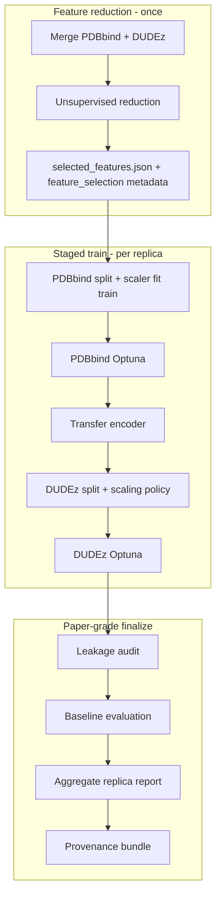

# feat: Paper-grade OCScore staged protocol — leakage guards, splits, scaling, baselines, provenance

## Summary

Harden the staged OCScore ML protocol so paper-grade validation is **explicit, auditable, and fail-closed** where validity cannot be guaranteed. The current pipeline is strong on DUDEz receptor-heldout splits, PDBbind train-only scaling, ranking-vs-calibration separation, and replica mean/std aggregation — but global pre-split feature reduction, unscaled DUDEz transfer, PDBbind affinity-only splits, missing presets, thin baseline coverage, and incomplete provenance artifacts undermine defensible publication claims. This plan adds metadata, strict guards, one PDBbind generalization split, DUDEz scaling policy, expanded baselines, leakage audit, and artifact bundles **without breaking smoke/development defaults**.

---

## Problem Frame

Reviewers correctly treat staged OCScore as a two-phase pipeline (feature reduction → replicated PDBbind Optuna → transfer → DUDEz Optuna). Several methodological assumptions are **implicit in code** but not **asserted in protocol metadata**, and some paths (global reduction, raw DUDEz features after PDBbind-scaled encoder training) are scientifically fragile. Plan 004 hardened **export-bundle CV** integrity; this plan extends similar discipline to **staged training** and **final reporting**.

---

## Current Coverage Assessment

| # | Concern | Status | What exists today | Gap |
|---|---------|--------|-------------------|-----|
| 1 | Feature reduction leakage | **Partial** | Unsupervised reduction on merged PDBbind+DUDEz **once** before replicas (`Protocol.py` docstring; `reduce` CLI). Frozen `selected_features.json` consumed by train. Block-source metadata in `feature_reduction_protocol.json`. | No `feature_selection_scope` / `selected_features_source`. Cross-block Ridge CV diagnostics run on **full merged data**. No train-only reduction option. Paper mode cannot fail on global precomputed features. |
| 2 | PDBbind generalization splits | **Partial** | `affinity_quantile_stratified` + `random_row` (`PDBbindSplit.py`). Diagnostics log `receptor_overlap` (informational). | No receptor/protein/scaffold/temporal held-out strategies. Overlap is logged, not enforced. |
| 3 | DUDEz scaling / domain shift | **Missing (staged path)** | PDBbind: `StandardScaler` fit on train only (`prepare_pdbbind_regression_data`). DUDEz: **no scaler** (`prepare_dudez_screening_data`). Export sets DUDEz `preprocessing.scaler: "none"`. Legacy `Utils/legacy/Data.preprocess_df` could transform DUDEz with PDBbind scaler — **not wired to staged pipeline**. | Transfer applies PDBbind-trained encoder to **raw** DUDEz features without documented/configurable scaling policy. |
| 4 | Replica reporting discipline | **Partial** | Mean/std across replicas + separate best PDBbind (min val RMSE) and best DUDEz (max val primary) in `_aggregate_replica_summaries` (`Protocol.py`). Failed replica counts logged. | No median/min/max/CI in aggregate. Markdown summary emphasizes best replicas; test metrics from best replica can be mistaken for headline science. |
| 5 | Trial budget presets | **Missing** | CLI defaults: 15 trials, 2 replicas, 100 epochs (`CLI/train.py`). Library defaults lower (`n_trials=10`). Fast configs in tests only. | No `smoke` / `development` / `paper` presets. No warning when generating final report with smoke budgets. |
| 6 | Baseline protocol expansion | **Partial** | SF columns, descriptor aggregates, SF consensus in CV and example 17 (`DescriptorAggregateBaselines.py`, `ModelCrossValidation.py`). | No staged-protocol LR/RF/XGBoost on SF columns. No transfer ablations (frozen/partial/full fine-tune, no-DAE, no-projection). No shuffled-label control. No unified per-fold rank table vs OCScore in staged runs. |
| 7 | Calibration claim discipline | **Partial** | Optuna objectives are task-separated (RMSE vs ranking). Post-hoc Platt/isotonic on validation logits (`Calibration.py`). `report_only_metrics` includes calibration when enabled. | Final markdown/JSON does not clearly label **primary claim = ranking** vs diagnostic calibration. Calibration metrics can appear without explicit validation mode flag. |
| 8 | Split/provenance/reproducibility artifacts | **Partial** | `protocol_log.json`, `replicas_protocol.json`, export `split_indices.npz`, reduction outputs, partial reproducibility manifest. | No standardized `split_assignments.json`, `feature_selection.json`, `scaling.json`, `data_provenance.json`, `environment.json`, `command.json`, `final_report.json` bundle for paper runs. |
| 9 | Leakage audit | **Partial** | CV helpers: `validate_fold_split`, `diagnose_entity_overlap` (`ModelCrossValidation.py`, plan 004). PDBbind/DUDEz split diagnostics. | No reusable audit for **staged protocol** (reduction scope, DUDEz heldout verification, scaler scope, entity overlap on train splits). |
| 10 | Documentation | **Partial** | `examples/README.md`, completed plans 003/004/007, protected tests. Obsidian ADRs referenced in plans (local, gitignored). | No single accessible doc for smoke vs paper modes, leakage risks, scaling policy, baseline strategy, replica reporting policy. |

---

## Requirements

- **R1.** Protocol metadata records feature-selection scope: when reduction ran, dataset/split it was fit on, and whether features are `precomputed_global` vs `train_only` (per outer split or global train partition).
- **R2.** Paper-grade mode requires explicit feature-selection scope; global precomputed features without override fail or emit blocking warnings in strict mode.
- **R3.** PDBbind retains `affinity_quantile_stratified` as default for smoke/development; paper preset uses at least one **hard generalization** split (start with `receptor_heldout`).
- **R4.** Split diagnostics report receptor overlap, affinity distribution per split, and actionable errors when required columns are missing.
- **R5.** DUDEz scaling is explicit via `DUDEzScalingConfig` with strategies `pdbbind_scaler`, `dudez_train_scaler`, `none_prestandardized`; strict mode forbids silent raw features when transfer expects scaled inputs.
- **R6.** Replica final report distinguishes **deployment best replica** from **all-replica aggregate** (mean, std, median, min, max, n success/fail; optional CI if cheap).
- **R7.** Named presets `smoke`, `development`, `paper` set trial/replica budgets and strict flags; paper preset logs budgets; final-report generation warns/fails on smoke budgets unless overridden.
- **R8.** Baseline evaluation module runs learned SF baselines (logistic, RF, optional XGB/LGBM) and OCScore ablations on **same folds**, train-only fitting, same screening metrics; shuffled-label negative control included.
- **R9.** Reports separate ranking primary claims from calibration diagnostics; calibration claims require explicit calibration validation mode.
- **R10.** Paper-grade runs write a provenance artifact bundle and run leakage audit; missing required fields fail or warn in strict mode.
- **R11.** Documentation (repo docs + Obsidian note if present locally) explains modes, risks, and artifact layout.

---

## Key Technical Decisions

| ID | Decision | Rationale |
|----|----------|-----------|
| KTD1 | **Phase 1 ships guards + metadata**, not full nested per-replica feature reduction | User allows deferral; nested reduction inside each replica’s PDBbind outer split is a large refactor touching `reduce`, `train`, and export. Strict paper mode **requires** `train_only` or explicit `precomputed_global` acknowledgment. |
| KTD2 | First PDBbind hard split: **`receptor_heldout`** (group by `receptor` / `Protein` if present) | Column exists in reduced data and staged non-feature columns; simplest robust generalization test. `temporal_release_year` added when `release_year` column present; scaffold/family deferred until columns verified in real archives. |
| KTD3 | DUDEz default for paper + transfer: **`pdbbind_scaler`** (reuse PDBbind train-fitted scaler on DUDEz features) | Matches semantic identity of descriptor columns and legacy `preprocess_df` intent; fixes domain-shift bug vs silent raw features. `none_prestandardized` remains opt-in with logged proof. |
| KTD4 | Presets as **`ProtocolPreset` dataclass** resolved in `CLI/train.py` and passed into `ReplicatedProtocolConfig` | Minimal surface: `--preset paper` overrides trials/replicas/strict flags; explicit CLI flags still win. |
| KTD5 | Baselines as **`PaperBaselines` evaluation stage** after staged protocol (not inside Optuna objective) | Keeps Optuna unchanged; baselines reuse split indices from replica export bundles. Same pattern as example 17 + CV. |
| KTD6 | Leakage audit: new **`Utils/LeakageAudit.py`**, called from paper preset finalization | Reuses `validate_fold_split` / `diagnose_entity_overlap` patterns from plan 004; extends to staged splits and reduction metadata. |
| KTD7 | Artifacts written by **`write_paper_provenance_bundle()`** in `Protocol.py` / `CLI/train.py` | Single writer; filenames match user list; `protocol_log.json` remains canonical superset with references. |
| KTD8 | Smoke/development behavior unchanged unless `--preset paper` or `--paper-grade` | User requirement: do not silently change scientific assumptions. |

---

## High-Level Technical Design

### Paper-grade gate matrix

| Check | Smoke | Development | Paper (strict) |
|-------|-------|-------------|----------------|
| Feature scope | `precomputed_global` OK | logged | `train_only` OR explicit override |
| PDBbind split | affinity stratified | configurable | `receptor_heldout` default |
| DUDEz scaling | any / default | logged | `pdbbind_scaler` or explicit `none_prestandardized` |
| Trial budget | low | medium | ≥50 trials, ≥3 replicas (configurable) |
| Leakage audit | skipped | warn-only | required, fail on critical |
| Baselines | optional | SF only | full learned + ablations + shuffle control |
| Final report | best replica OK | aggregate + best | aggregate headline; best for export only |

---

## Scope Boundaries

### In scope

- Metadata, guards, presets, scaling config, PDBbind `receptor_heldout`, replica aggregate reporting, baseline evaluation module, leakage audit, provenance bundle, tests, docs

### Out of scope

- Refactoring unrelated workspace projects
- Full nested feature reduction inside every outer CV fold (deferred; guard-only in v1)
- PDBbind `protein_family_heldout` / `ligand_scaffold_heldout` until column availability is confirmed on production archives
- Changing DUDEz default split strategy (already `receptor_heldout_complete`)
- Rewriting legacy XGBoost/NN ablation code paths under `Optimization/legacy/`

### Deferred to Follow-Up Work

- Per-replica train-only feature reduction (true nested selection)
- `temporal_release_year` split when `release_year` coverage validated on full PDBbind export
- Bootstrap CIs for replica aggregates
- CI job wiring `-m "not legacy"` with paper preset smoke
- Per-target baseline heatmaps in staged protocol (reuse `CrossValidationPlots` patterns)

---

## Implementation Units

### U1. Feature-selection scope metadata and strict guards

**Goal:** Make feature-selection provenance explicit and enforce paper-grade scope rules.

**Requirements:** R1, R2

**Dependencies:** None

**Files:**
- Create: `OCDocker/OCScore/Utils/FeatureSelectionMetadata.py`
- Modify: `OCDocker/OCScore/Utils/FeatureReduction.py`, `OCDocker/OCScore/CLI/reduce.py`, `OCDocker/OCScore/CLI/train.py`, `OCDocker/OCScore/Optimization/Protocol.py`, `OCDocker/OCScore/Optimization/StagedOptuna.py`
- Test: `tests/ocscore/test_feature_selection_metadata.py`

**Approach:**
- Add dataclass `FeatureSelectionScope` with fields: `scope` (`precomputed_global` | `train_only`), `fit_dataset`, `fit_split`, `fit_row_indices` (optional), `reduction_archive`, `uses_supervised_target` (bool, default False).
- `run_feature_reduction_protocol` writes `feature_selection.json` alongside `selected_features.json`.
- Train CLI reads scope; paper preset validates: strict → reject `precomputed_global` unless `--allow-precomputed-features`.
- `protocol_log.json` embeds scope under `feature_selection`.

**Execution note:** Characterization-first — add tests for current global behavior before tightening guards.

**Patterns to follow:** `PDBbindSplitResult.diagnostics`, plan 004 validation helpers

**Test scenarios:**
- Happy path: reduce CLI writes `feature_selection.json` with `scope=precomputed_global`, `fit_dataset=merged_pdbbind_dudez`.
- Error path: paper preset + `precomputed_global` without override → `ValueError`.
- Happy path: explicit `--allow-precomputed-features` passes with warning logged.
- Integration: `protocol_log.json` contains matching `feature_selection` block after replicated run.

**Verification:** Tests pass; paper mode fails closed on undisclosed global selection.

---

### U2. Protocol presets (`smoke`, `development`, `paper`)

**Goal:** Named budgets and strict flags; log preset in protocol output.

**Requirements:** R7

**Dependencies:** U1 (paper strict flags)

**Files:**
- Create: `OCDocker/OCScore/Optimization/ProtocolPresets.py`
- Modify: `OCDocker/OCScore/CLI/train.py`, `OCDocker/OCScore/Optimization/Protocol.py`
- Test: `tests/ocscore/test_protocol_presets.py`

**Approach:**
- `ProtocolPreset` enum + `resolve_preset(name) -> PresetConfig` with trials, replicas, epochs, `paper_grade`, split/scaling defaults.
- CLI: `--preset {smoke,development,paper}`; explicit flags override preset fields.
- Write `preset` and `budget` into `replicas_protocol.json` and `final_report.json`.

**Test scenarios:**
- Happy path: `smoke` resolves to low trials/replicas; completes quickly in existing staged smoke test.
- Happy path: `paper` records trials ≥50, replicas ≥3 in protocol JSON.
- Error path: `--preset paper --generate-final-report` with manually lowered trials fails unless `--allow-insufficient-budget`.

**Verification:** Preset resolution tested; smoke example runtime unchanged.

---

### U3. Replica aggregate reporting for scientific headline

**Goal:** Final report leads with all-replica statistics; best replica labeled for export only.

**Requirements:** R6

**Dependencies:** U2

**Files:**
- Modify: `OCDocker/OCScore/Optimization/Protocol.py`, `OCDocker/OCScore/CLI/train.py`
- Test: extend `tests/ocscore/test_ocscore_replicated_protocol.py`

**Approach:**
- Extend `_aggregate_replica_summaries` with median, min, max per metric; optional normal-approx 95% CI when n≥3.
- Add `reporting_policy` block: `headline=aggregate`, `export_selection=best_per_task`.
- Rewrite `_write_replicated_summary_markdown` sections: **Scientific summary (all replicas)** before **Export candidates**.

**Test scenarios:**
- Happy path: 3 successful replicas → aggregate includes mean, std, median for test BEDROC and test RMSE.
- Happy path: best PDBbind/DUDEz replicas present but not sole test metrics in markdown headline.
- Edge case: 1 failed replica → `n_failed_replicas=1` in aggregate and final report.

**Verification:** Replicated protocol tests assert aggregate fields and markdown section order.

---

### U4. PDBbind hard generalization split (`receptor_heldout`)

**Goal:** Add receptor-disjoint PDBbind split; keep affinity stratified as default for smoke.

**Requirements:** R3, R4

**Dependencies:** None

**Files:**
- Modify: `OCDocker/OCScore/Utils/PDBbindSplit.py`, `OCDocker/OCScore/Optimization/StagedOptuna.py`, `OCDocker/OCScore/Optimization/ProtocolPresets.py`
- Test: extend `tests/ocscore/test_pdbbind_split.py`

**Approach:**
- Add strategy `receptor_heldout`: assign whole receptors to train/val/test (mirror DUDEz complete holdout pattern); affinity diagnostics per split remain.
- Resolve receptor column: `receptor` then `Protein`; missing column → actionable `ValueError` listing available columns.
- `_validate_receptor_disjoint` raises in strict/paper mode when overlap > 0.
- Paper preset sets PDBbind `split_config.strategy=receptor_heldout`.

**Test scenarios:**
- Happy path: synthetic dataframe → zero receptor overlap across splits.
- Happy path: `affinity_quantile_stratified` still default when no preset.
- Error path: `receptor_heldout` without receptor column → clear error message.
- Edge case: single-receptor dataset fails with guidance to use row split.

**Verification:** Split tests green; staged default unchanged without paper preset.

---

### U5. DUDEz scaling configuration

**Goal:** Explicit, logged DUDEz normalization aligned with PDBbind transfer.

**Requirements:** R5

**Dependencies:** U2

**Files:**
- Create: `OCDocker/OCScore/Utils/DUDEzScaling.py`
- Modify: `OCDocker/OCScore/Optimization/StagedOptuna.py`, `OCDocker/OCScore/Optimization/ModelExport.py`, `OCDocker/OCScore/CLI/train.py`
- Test: `tests/ocscore/test_dudez_scaling.py`

**Approach:**
- `DUDEzScalingConfig(strategy, strict=True)` with strategies per KTD3.
- `prepare_dudez_screening_data` accepts optional PDBbind scaler or fits train-only scaler per strategy; returns `scaling_metadata`.
- Paper + transfer default: apply PDBbind train scaler to DUDEz splits; log feature order used; mismatch → `ValueError`.
- Export bundle: record scaling strategy in `retrain_config.json`; optional `dudez_scaler.joblib` when train-fitted.

**Test scenarios:**
- Error path: transfer mode + raw features + strict → fails unless `none_prestandardized`.
- Happy path: `pdbbind_scaler` transforms val/test with train-fitted PDBbind scaler only.
- Happy path: `dudez_train_scaler` fits on DUDEz train rows only.
- Error path: feature name/order mismatch between scaler and dataframe.

**Verification:** Scaling tests pass; existing DUDEz split tests still pass with default smoke config (document behavior change for paper preset only).

---

### U6. Calibration vs ranking report discipline

**Goal:** Reports cannot imply calibrated probabilities unless calibration validation is enabled.

**Requirements:** R9

**Dependencies:** U2, U3

**Files:**
- Modify: `OCDocker/OCScore/Analysis/Metrics/Calibration.py`, `OCDocker/OCScore/CLI/train.py`, `OCDocker/OCScore/Optimization/StagedOptuna.py`
- Test: extend `tests/ocscore/test_ocscore_calibration_metrics.py`

**Approach:**
- Add `CalibrationReportMode` (`ranking_only` | `calibration_validated`).
- `final_report.json` and markdown include `primary_claim: ranking_screening` and calibration subsection gated on mode.
- When calibration metrics computed post-hoc, prefix with `diagnostic_` unless mode validated.

**Test scenarios:**
- Happy path: ranking-only report omits calibrated probability claims.
- Happy path: calibration mode includes Brier, log loss, ECE, reliability bin metadata.
- Error path: paper final report with calibration metrics but `ranking_only` → warning or fail per strict flag.

**Verification:** Calibration tests updated; staged protocol test confirms objective still ranking-only.

---

### U7. Leakage audit utility

**Goal:** Reusable audit for staged paper runs producing JSON/CSV report.

**Requirements:** R10 (partial)

**Dependencies:** U1, U4, U5

**Files:**
- Create: `OCDocker/OCScore/Utils/LeakageAudit.py`
- Modify: `OCDocker/OCScore/CLI/train.py`
- Test: `tests/ocscore/test_leakage_audit.py`

**Approach:**
- `run_leakage_audit(context, *, strict)` checks: feature scope, PDBbind receptor overlap, DUDEz receptor overlap, entity overlap (name/ligand/SMILES if columns exist), scaler fit scope, fragmented receptors, zero-ligand/decoy receptors in val/test.
- Output: `leakage_audit.json` + optional `leakage_audit.csv`.
- Paper preset calls audit before `final_report.json`; critical findings fail in strict mode.

**Patterns to follow:** `ModelCrossValidation.validate_fold_split`, `diagnose_entity_overlap`

**Test scenarios:**
- Happy path: valid DUDEz heldout + train-only scaler → audit passes.
- Error path: deliberate receptor overlap in PDBbind → detected; strict fails.
- Happy path: duplicate ligand names across train/val → reported in diagnostics.
- Error path: fragmented receptor (same receptor in train and test) on DUDEz → strict fails.

**Verification:** Audit tests cover PDBbind and DUDEz cases.

---

### U8. Paper provenance artifact bundle

**Goal:** Standard artifact set for every paper-grade run.

**Requirements:** R10

**Dependencies:** U1, U2, U5, U7

**Files:**
- Create: `OCDocker/OCScore/Utils/ProtocolProvenance.py`
- Modify: `OCDocker/OCScore/CLI/train.py`, `OCDocker/OCScore/Optimization/Protocol.py`
- Test: `tests/ocscore/test_protocol_provenance.py`

**Approach:**
- `write_paper_provenance_bundle(output_dir, ...)` emits:
  - `split_assignments.json` (PDBbind + DUDEz indices, receptor lists per split)
  - `feature_selection.json` (from U1)
  - `scaling.json`
  - `data_provenance.json` (PDBbind/DUDEz versions, filters, missing/duplicate handling from metadata)
  - `environment.json` (Python, torch, CUDA, package versions)
  - `command.json` (argv, preset, timestamps)
  - `final_report.json` (aggregate + best replica + audit summary)
- `protocol_log.json` gains `artifact_paths` map.
- Strict mode validates required keys present.

**Test scenarios:**
- Happy path: paper preset run (mocked/stubbed protocol) writes all files.
- Error path: missing `feature_selection.json` content → strict validation fails.
- Happy path: `split_assignments.json` lists disjoint receptor sets for paper PDBbind split.

**Verification:** Provenance tests assert file presence and schema keys.

---

### U9. Paper baseline and ablation evaluation

**Goal:** Strict baselines on same folds as OCScore with train-only fitting.

**Requirements:** R8

**Dependencies:** U4, U5, U8

**Files:**
- Create: `OCDocker/OCScore/Analysis/PaperBaselines.py`
- Modify: `OCDocker/OCScore/CLI/train.py`, `OCDocker/OCScore/Optimization/ProtocolPresets.py`
- Test: `tests/ocscore/test_paper_baselines.py`

**Approach:**
- Evaluate after each replica (or on best replica + aggregate policy — **KTD5: all successful replicas for aggregate baselines**):
  - Individual SF columns (existing)
  - Logistic regression, RandomForest on SF columns (sklearn)
  - XGBoost/LightGBM if import available; skip with logged reason if not
  - OCScore ablations via export flags: scratch DUDEz, frozen transfer, partial/full fine-tune, no decoder, no projection
  - Shuffled-label control on train labels only
- Same split indices and metrics as OCScore (`BEDROC`, `ROC-AUC`, `PR-AUC`, `EF1%`, `EF5%`, `NDCG@1%`, `NDCG@5%`).
- Output: `baselines_per_fold.csv`, `baselines_summary.csv`, `baselines_rank_table.csv`.

**Execution note:** Test-first for shuffle control and train-only fitting guards.

**Test scenarios:**
- Happy path: LR baseline uses same `train_indices` as OCScore; val/test metrics finite.
- Error path: baseline fit accidentally includes val rows → test fails.
- Happy path: shuffled-label control → ROC-AUC ≈ 0.5 ( tolerance band ).
- Edge case: XGBoost not installed → baseline skipped, recorded in summary.

**Verification:** Baseline tests pass without optional deps required in CI.

---

### U10. Documentation (repo + Obsidian)

**Goal:** Accessible documentation of modes, risks, and artifacts.

**Requirements:** R11

**Dependencies:** U1–U9 (document final behavior)

**Files:**
- Modify: `examples/README.md`, `docs/source/` OCScore protocol page (if exists), `CONTRIBUTING.md` pointer
- Create: `docs/ocscore-paper-grade-protocol.md`
- Local Obsidian (if user maintains): `obsidian/Architecture/OCScore Paper-Grade Protocol.md`

**Approach:**
- Single user-facing doc with tables for presets, split strategies, scaling strategies, artifact layout, reporting policy, calibration limits.
- Cross-link plan 004 CV integrity for export-bundle path.

**Test expectation:** none — documentation only; link check in CI optional.

**Verification:** Doc renders; examples README points to paper-grade doc.

---

## System-Wide Impact

- **CLI:** New `--preset`, `--paper-grade`, scaling and feature-scope flags on `ocdocker ocscore train`
- **Export/inference:** `retrain_config.json` gains scaling metadata; inference must respect DUDEz scaler when present
- **Tests:** New modules in `tests/ocscore/`; protect replicated protocol suite
- **CI:** Smoke preset keeps fast paths; paper preset tested with mocks/stubs

---

## Risks and Dependencies

| Risk | Mitigation |
|------|------------|
| Nested feature reduction deferred but reviewers want it | Strict guard + documented limitation in final report; follow-up plan |
| DUDEz scaling change alters historical metrics | Default behavior unchanged except `paper` preset; log strategy |
| Baseline suite runtime | Paper preset only; optional `--skip-baselines` for development |
| Missing scaffold/family columns | Diagnostics + defer strategies; do not silently approximate |
| Obsidian gitignored | Primary doc in `docs/ocscore-paper-grade-protocol.md` |

---

## Sources and Research

- Code: `StagedOptuna.py`, `Protocol.py`, `FeatureReduction.py`, `PDBbindSplit.py`, `DUDEzSplit.py`, `ModelCrossValidation.py`, `Calibration.py`, `DescriptorAggregateBaselines.py`
- Completed plans: 003 (inference/frozen features), 004 (CV integrity), 007 (CLI train)
- Tests: `test_ocscore_replicated_protocol.py`, `test_pdbbind_split.py`, `test_dudez_split.py`, `test_model_cross_validation.py`

---

## Remaining Limitations (honest)

After this plan ships:

1. **Global unsupervised feature reduction** before modeling may still inflate optimism unless users adopt future nested reduction or external train-only feature lists.
2. **Scaffold/family/temporal PDBbind splits** depend on column availability not yet validated on all archives.
3. **Baselines** cover SF-column learners, not full end-to-end docking reruns.
4. **Replica CIs** may use normal approximation unless bootstrap follow-up is done.
5. **Calibration** remains post-hoc diagnostic unless a dedicated calibration study mode is added later.
