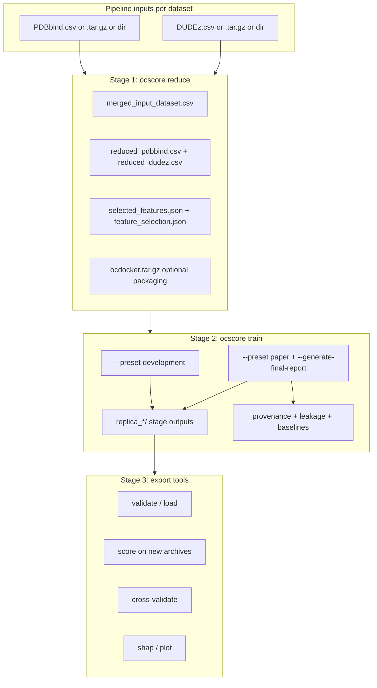

# feat: OCScore end-to-end replication documentation

## Summary

Add a **root-level replication guide** and **Sphinx integration** so anyone can reproduce the full staged OCScore protocol starting from ocdb2-style pipeline outputs (`PDBbind.csv` / `DUDEz.csv` or their `.tar.gz` archives). Extend the pipeline input loader so those filenames are first-class inputs (not only `pipeline_results.csv`). Document both **development** (fast iteration) and **paper-grade** (publication) paths through reduce → train → export/score.

---

## Problem Frame

Plan 009 shipped paper-grade protocol behavior (presets, provenance, baselines, leakage audit), and plan 007 wired `ocdocker ocscore reduce|train|score`. Documentation is still fragmented across `examples/README.md`, `docs/ocscore-paper-grade-protocol.md`, `docs/source/usage.rst`, and example scripts 14–16. None of it is a single, copy-paste replication manual starting from the user's actual ocdb2 artifact layout.

Additionally, `load_pipeline_results_from_archive` in `OCDocker/OCScore/Utils/IO.py` only resolves `pipeline_results.csv` inside directories or tar archives. The user's batch pipeline writes **`PDBbind.csv`** and **`DUDEz.csv`** (or tarballs containing them). Without code support, replication docs would require error-prone rename steps — contradicting the goal of easy replication.

---

## Requirements

- **R1.** A canonical replication guide lives at the **repository root** as `OCSCORE_REPLICATION.md`, readable on GitHub without building docs.
- **R2.** The same guide is included in **Sphinx** (`docs/source/`) and linked from `index.rst` / `usage.rst`.
- **R3.** The guide covers **100% of the staged OCScore protocol** from pipeline CSV inputs through: feature reduction → staged Optuna training → replica outputs → export tools (`validate`, `load`, `retrain`, `cross-validate`, `plot`, `shap`, `score`) → paper-grade artifacts when applicable.
- **R4.** The guide documents **two replication paths**: development preset (quickstart) and paper preset (publication checklist), with clear when-to-use guidance.
- **R5.** Pipeline inputs accept **bare `.csv` files**, **directories**, and **`.tar.gz` archives** for PDBbind and DUDEz using canonical names: `PDBbind.csv`, `DUDEz.csv`, and legacy `pipeline_results.csv`.
- **R6.** Required input columns and validation errors are documented (PDBbind: `experimental`; DUDEz: `kind`; shared descriptor columns).
- **R7.** Every major output artifact (reduction, train, replica, provenance, baselines) has a row in an **artifact catalog** with purpose and downstream use.
- **R8.** `README.md` links to the replication guide prominently under Documentation.
- **R9.** Loader and CLI behavior remain backward compatible for existing `pipeline_results.csv` archives.
- **R10.** Tests cover new input resolution paths without requiring optional ML deps in unrelated suites.

---

## Key Technical Decisions

| ID | Decision | Rationale |
|----|----------|-----------|
| KTD1 | **Single canonical doc at repo root** (`OCSCORE_REPLICATION.md`); Sphinx includes it via MyST | User asked for root bundle; `myst_parser` is already enabled in `docs/source/conf.py`. Avoid maintaining two divergent copies. |
| KTD2 | **Extend** `load_pipeline_results_from_archive` (alias or rename to `load_pipeline_results`) rather than a parallel loader | All callers (`reduce`, `score`, export tools) share one resolution policy; plan 003 established this module as the archive contract. |
| KTD3 | **Resolution order** for directories/tars: `pipeline_results.csv` → `PDBbind.csv` / `DUDEz.csv` (case-sensitive match first, then case-insensitive fallback) → error listing candidates | Preserves legacy behavior; supports ocdb2 naming; fails clearly when ambiguous. |
| KTD4 | **Bare `.csv` path**: load file directly regardless of basename | User explicitly passes `.../PDBbind.csv`; no container lookup needed. |
| KTD5 | **Do not document upstream docking** in this guide beyond one paragraph defining what pipeline CSVs are | User scope starts at ocdb2 CSV outputs, not receptor/ligand preparation. Link to `manual.rst` / `pipeline` CLI for docking context. |
| KTD6 | **Paper-grade deep dive** stays in `docs/ocscore-paper-grade-protocol.md`; replication guide summarizes and cross-links | Avoid duplicating preset tables; keep one authoritative paper-grade reference (plan 009 U10). |
| KTD7 | Sphinx entry via `docs/source/ocscore_replication.md` using MyST `{include}` of root file | Root file remains canonical; Sphinx build picks up changes automatically. |
| KTD8 | CLI flag names stay `--pdbbind-archive` / `--dudez-archive` (semantically "input path") | Avoid breaking CLI; update help text to list supported shapes (csv, dir, tar.gz). |

---

## High-Level Technical Design

### End-to-end replication flow

### Input resolution (loader)

| Input shape | Behavior |
|-------------|----------|
| Path ends with `.csv` | `pd.read_csv(path)` |
| Directory | First existing file among canonical basenames (see KTD3) |
| `.tar.gz` / `.tar` | Single matching member; multiple matches require `member_name` (existing behavior) |

---

## Scope Boundaries

### In scope

- Root replication guide + Sphinx wiring + README/usage cross-links
- Loader extension and CLI help updates for PDBbind/DUDEz naming
- Artifact catalog, command recipes, troubleshooting, reproducibility checklist
- Development and paper-grade train paths
- Export/score subcommands documented as post-train steps

### Deferred to Follow-Up Work

- Full ocdb2 batch pipeline runbook (receptor lists, SLURM, database ingest) — link only
- `ocdocker ocscore compare` (example 17) CLI surfacing
- Nested train-only feature reduction documentation beyond current limitation callout
- Automated nightly replication CI against user's `/data/hd4tb/...` paths (use placeholder paths in docs)

### Outside this product's identity

- Re-running molecular docking from PDB/mmCIF in this guide (see main OCDocker manual)

---

## Implementation Units

### U1. Extend pipeline input loader for ocdb2 CSV names

**Goal:** Accept `PDBbind.csv`, `DUDEz.csv`, bare CSV paths, and legacy `pipeline_results.csv` in directories and tar archives.

**Requirements:** R5, R9, R10

**Files:**
- Modify: `OCDocker/OCScore/Utils/IO.py`
- Test: `tests/ocscore/test_pipeline_archive_io.py`

**Approach:**
- Add `PIPELINE_CSV_BASENAMES` tuple: `pipeline_results.csv`, `PDBbind.csv`, `DUDEz.csv` (document lowercase fallback in implementation if needed for portability).
- At start of loader: if `path.suffix.lower() == ".csv"` and `path.is_file()`, read directly.
- For directories/tars: collect members/files matching any canonical basename; apply existing single-vs-multi member policy.
- Keep public name `load_pipeline_results_from_archive` for backward compatibility; optional alias `load_pipeline_results = load_pipeline_results_from_archive` in `__all__`.

**Test scenarios:**
- Happy path: bare `PDBbind.csv` file loads
- Happy path: tar.gz containing only `DUDEz.csv`
- Happy path: directory with `PDBbind.csv` (no `pipeline_results.csv`)
- Happy path: existing `pipeline_results.csv` paths still work (regression)
- Error path: directory with zero canonical CSVs → clear `FileNotFoundError`
- Error path: tar with two canonical CSVs without `member_name` → `ValueError`

**Verification:** Extended tests pass; no behavior change for existing archives in test suite.

---

### U2. Update CLI help and error messages

**Goal:** `--pdbbind-archive` / `--dudez-archive` and `--raw-archive` help text reflect supported input shapes and filenames.

**Requirements:** R5, R9

**Dependencies:** U1

**Files:**
- Modify: `OCDocker/OCScore/CLI/reduce.py`
- Modify: `OCDocker/OCScore/CLI/export_tools.py` (score / raw-archive help)
- Modify: `examples/README.md` (input bullet for example 14)

**Approach:**
- Replace "containing pipeline_results.csv" with "CSV file, directory, or tar.gz containing pipeline_results.csv, PDBbind.csv, or DUDEz.csv".
- Ensure score subcommand documents same loader contract.

**Test scenarios:**
- Happy path: `ocdocker ocscore reduce --help` mentions PDBbind.csv / DUDEz.csv
- Test expectation: none — help text only

**Verification:** Help strings updated; parser tests unchanged.

---

### U3. Author root replication guide

**Goal:** Single comprehensive `OCSCORE_REPLICATION.md` at repo root covering the full protocol.

**Requirements:** R1, R3, R4, R6, R7

**Dependencies:** U1 (document actual supported inputs)

**Files:**
- Create: `OCSCORE_REPLICATION.md`

**Approach — document sections (minimum):**

1. **Purpose & audience** — reproduce published OCScore staged results
2. **Prerequisites** — conda env, `pip install "ocdocker[ml]"`, hardware notes
3. **Input artifacts** — what PDBbind/DUDEz pipeline CSVs contain; required columns; supported path shapes (use placeholder paths like `data/ocdb2/PDBbind/PDBbind.csv`, not machine-specific absolutes)
4. **Quickstart (development)** — full command block: `reduce` → `train --preset development`
5. **Publication path (paper-grade)** — `train --preset paper --generate-final-report --allow-precomputed-features` + checklist
6. **Stage 1 outputs** — reduction directory layout
7. **Stage 2 outputs** — replicas, aggregate summaries, checkpoints
8. **Paper artifacts** — provenance JSON, leakage audit, baselines CSVs (link `docs/ocscore-paper-grade-protocol.md`)
9. **Stage 3 export tools** — score new data, CV, SHAP with example commands pointing at `replica_*/.../best_model`
10. **Artifact catalog** — table: filename → stage → description
11. **Reproducibility checklist** — seeds, `environment.json`, archiving `ocdocker.tar.gz`
12. **Troubleshooting** — common loader/column/preset errors
13. **Known limitations** — global feature reduction scope, deferred ablations

**Patterns to follow:** `docs/ocscore-paper-grade-protocol.md` (tone, tables); `docs/source/usage.rst` (command blocks); plan 007 staged workflow diagram

**Test scenarios:**
- Test expectation: none — documentation; manual review that every `ocdocker ocscore` subcommand used in replication appears with purpose

**Verification:** Guide is self-contained; a reader never needs example script source to run replication.

---

### U4. Wire guide into Sphinx

**Goal:** Replication guide appears in built HTML docs.

**Requirements:** R2

**Dependencies:** U3

**Files:**
- Create: `docs/source/ocscore_replication.md` (MyST wrapper `{include}` ../../OCSCORE_REPLICATION.md)
- Modify: `docs/source/index.rst` (toctree entry near usage/manual)
- Modify: `docs/source/examples.rst` or `docs/source/usage.rst` (cross-link)

**Approach:**
- Add `ocscore_replication` to `index.rst` toctree (after `usage` or under a new "Guides" caption if cleaner).
- Wrapper file only includes root markdown — no duplicate body.
- Confirm `myst_parser` parses included content (enable `myst_enable_extensions` for include if required).

**Test scenarios:**
- Happy path: `make -C docs html` succeeds without include errors
- Test expectation: none for unit tests; optional CI doc build step noted in U6

**Verification:** Built docs contain replication guide page with rendered commands and tables.

---

### U5. Root and navigation cross-links

**Goal:** Discoverability from README and existing docs.

**Requirements:** R8

**Dependencies:** U3, U4

**Files:**
- Modify: `README.md`
- Modify: `docs/source/usage.rst`
- Modify: `docs/ocscore-paper-grade-protocol.md` (link up to replication guide)
- Modify: `CONTRIBUTING.md` (one-line pointer if contributors touch OCScore CLI)

**Approach:**
- README Documentation section: add **OCScore replication** link to `OCSCORE_REPLICATION.md` as primary ML workflow doc.
- `usage.rst`: replace terse ocscore block with "see OCScore Replication Guide" plus minimal reduce/train/score one-liners.
- Paper-grade doc: add "Start here: OCSCORE_REPLICATION.md" at top.

**Test scenarios:**
- Test expectation: none — link updates

**Verification:** All four files link to root guide; no broken relative paths.

---

### U6. Verification and doc-quality gate

**Goal:** Prevent loader/doc drift.

**Requirements:** R10

**Dependencies:** U1–U5

**Files:**
- Modify: `tests/ocscore/test_pipeline_archive_io.py` (if not complete in U1)
- Optional: `.github/workflows/` doc build job (only if a docs workflow already exists — extend, do not create heavy new CI)

**Approach:**
- Run targeted pytest for `test_pipeline_archive_io.py`.
- Run `make -C docs html` locally before shipping.
- Optional: grep check that `OCSCORE_REPLICATION.md` mentions every export subcommand (`validate`, `load`, `retrain`, `cross-validate`, `plot`, `shap`, `score`).

**Test scenarios:**
- Happy path: full loader test module green
- Happy path: sphinx build completes

**Verification:** Tests pass in `ocdocker` conda env; docs build succeeds.

---

## System-Wide Impact

- **Users:** Single entry point for replication; ocdb2 CSV names work without renaming.
- **CLI contract:** Input paths widen; flags unchanged.
- **Docs:** New toctree page; README prominence.
- **CI:** Minimal — loader unit tests; optional docs build.

---

## Risks and Dependencies

| Risk | Mitigation |
|------|------------|
| MyST `{include}` from repo root fails in some Sphinx versions | Fallback: duplicate via `literalinclude` + note, or copy-on-build Makefile target |
| Case sensitivity (`pdbbind.csv` vs `PDBbind.csv`) on Linux | Document exact names; implement case-insensitive directory scan as fallback |
| Guide becomes stale as CLI flags evolve | Artifact catalog references stable filenames; link to `--help` for flags |
| 100% claim vs deferred compare/ablations | Scope Boundaries + honest limitations section |

---

## Sources and Research

- `OCDocker/OCScore/Utils/IO.py` — current loader (directory/tar/`pipeline_results.csv` only)
- `tests/ocscore/test_pipeline_archive_io.py` — loader contract tests
- Plan 009 completed — paper presets, provenance, baselines
- Plan 007 completed — `ocdocker ocscore` subcommands
- `docs/source/conf.py` — `myst_parser` enabled
- User confirmation: extend loader; document both development and paper paths

---

## Remaining Limitations (honest)

After this plan ships:

1. Replication guide starts at **pipeline CSV outputs**, not docking/rescoring batch generation.
2. **Global feature reduction** optimism risk remains (documented, not fixed).
3. **OCScore ablation baselines** from plan 009 are still deferred.
4. Machine-specific paths in user workspace are **not** baked into docs — placeholders only.
