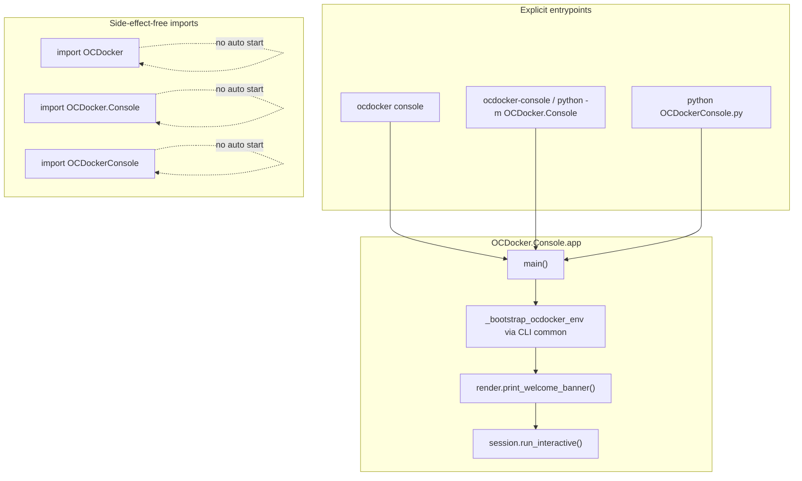

# refactor: Side-effect-free console separated from modern CLI

## Summary

Remove the wildcard import and import-time side effects from `OCDockerConsole.py`, introduce a minimal `OCDocker.Console` package with an explicit entrypoint, and rewire `ocdocker console` to use it. Preserve a truly interactive REPL for exploration while keeping library imports silent and the modern CLI as the primary scripted interface.

## Problem Frame

Two publication-quality issues block clean packaging and developer experience:

1. **`OCDockerConsole.py` uses `from OCDocker.Initialise import *`** — violates explicit-import policy and pulls in the entire Initialise surface (including auto-bootstrap side effects).
2. **Console behavior runs at import time** — module-level banner `print()`, legacy bootstrap paths, and Initialise auto-bootstrap when the wildcard import loads.

Meanwhile **`ocdocker console` already exists** (`OCDocker/CLI/console.py`) but imports `OCDockerConsole`, inheriting the same import-time banner and wildcard dependency chain.

**Pre-implementation audit — names used from `OCDocker.Initialise` in `OCDockerConsole.py`:**

| Symbol | Usage |
|--------|--------|
| `clrs` | Welcome banner ANSI colors |
| `bootstrap` | `if __name__ == "__main__"` legacy direct execution |
| `argument_parsing` | Legacy direct execution |
| `config_file`, `multiprocess`, `update`, `output_level`, `overwrite`, `db_url`, `optdb_url` | Read via `globals()` inside `print_args()` after bootstrap |

No other Initialise names are referenced directly in `OCDockerConsole.py`. Heavy docking imports (`ocl`, `ocr`, `ocvina`, etc.) are already explicit.

**Current side effects on `import OCDockerConsole`:**

- Wildcard import loads `OCDocker.Initialise`, which may **auto-bootstrap** (config parse, DB engine) unless `OCDOCKER_NO_AUTO_BOOTSTRAP=1` or pytest/doc guards apply.
- Unconditional **`print(message)`** welcome banner (lines 324–324).
- Module-level assignment of `multiprocess`, `update`, CPU helper locals in the non-`__main__` branch (lines 330–335).

---

## Requirements

- R1. No wildcard imports remain in `OCDockerConsole.py` or the new console package.
- R2. `import OCDocker`, `import OCDocker.Console`, and `import OCDockerConsole` produce **no stdout/stderr banner** and do not start an interactive loop.
- R3. Interactive console starts **only** via explicit entrypoints: `ocdocker console`, optional `ocdocker-console`, `python -m OCDocker.Console`, or legacy `python OCDockerConsole.py`.
- R4. Preserve existing console capabilities at minimum: preloaded namespace (docking modules, toolbox aliases), `print_args()`, tab-completion/history behavior where feasible without new dependencies.
- R5. Minimal built-in console commands **`help`** and **`exit`** (or `quit`) in the interactive loop.
- R6. Console actions must not duplicate scientific/docking logic — reuse library modules and CLI bootstrap patterns (`OCDocker.CLI.common._bootstrap_ocdocker_env`).
- R7. Modern CLI (`ocdocker vs`, `pipeline`, `ocscore`, etc.) continues to work unchanged.
- R8. Documentation explains CLI vs console vs legacy wrapper; tests cover import safety and entrypoint behavior.

---

## Key Technical Decisions

- KTD1: **New package `OCDocker/Console/`** — minimal files only: `__init__.py`, `app.py`, `session.py`, `render.py`, `commands.py`, optional `__main__.py`. Move `print_args()` and `clean_test_files()` from root `OCDockerConsole.py` into `session.py` (or `helpers.py` if `session.py` grows too large — prefer single helpers module only if needed).
- KTD2: **Explicit Initialise imports only** — `from OCDocker.Initialise import bootstrap, argument_parsing, clrs` where needed; never star-import. Namespace builder imports `OCDocker.Initialise as ocinit` **after** CLI bootstrap (mirror `OCDocker/CLI/script.py`), not via wildcard.
- KTD3: **`ocdocker console` remains primary entry** — refactor `OCDocker/CLI/console.py` to call `OCDocker.Console.app.main()` instead of importing `OCDockerConsole`. Keep `OCDockerConsole.py` as a **thin compatibility wrapper** delegating to `main()`.
- KTD4: **Optional `ocdocker-console` script** — add `[project.scripts] ocdocker-console = "OCDocker.Console.app:main"` for backward compatibility; low cost, matches user request.
- KTD5: **REPL strategy** — default to a simple **`input()` command loop** with `help` / `exit` plus Python execution for other lines (using `code.InteractiveConsole` or equivalent). If IPython is importable (from `[analysis]` extra), offer it as best-effort upgrade inside `session.run_interactive()` — do **not** add `prompt_toolkit`. Avoid double banners (remove import-time print; render banner once in `main()`).
- KTD6: **`print_args()` refactor** — stop relying on `globals()` from wildcard import; accept optional namespace dict or read from `OCDocker.Initialise` module attributes + `get_config()` (current logic already prefers `get_config()` for most fields).
- KTD7: **Out of scope for this plan** — full wizard commands (`prepare-receptor`, `run-docking`, etc.), refactoring `OCDocker/CLI/script.py` Initialise dump, changing Initialise auto-bootstrap defaults globally, implementing missing `debug_all` / `debug_modules` referenced in stale Sphinx docs.

---

## Scope Boundaries

### In scope

- New `OCDocker/Console/` package and thin legacy wrapper.
- Rewire `OCDocker/CLI/console.py`.
- Optional `ocdocker-console` entry point.
- Tests for import safety and minimal console commands.
- README, MANUAL, Sphinx (`OCDockerConsole.rst`, `usage.rst`, `development.rst` cross-link).

### Deferred to Follow-Up Work

- Rich command wizard implementing the full command list from the user prompt (`load-config`, `prepare-receptor`, …).
- Refactor `script.py` to use `OCDocker.Console.session.build_namespace()` (DRY).
- Remove or relocate root-level `OCDockerConsole.py` from Sphinx automodule (keep wrapper, document as compatibility).
- Fixing `debug_all` / `debug_modules` doc references (separate docs cleanup).

### Non-goals

- Docking engine, OCScore, DB, or protocol changes.
- Whole CLI reorganization.
- New heavy dependencies.

---

## High-Level Technical Design

**Library import path:** package `__init__.py` exports `main` optionally but performs no I/O. Legacy `OCDockerConsole.py` imports only `main` from `OCDocker.Console.app` for `__main__` guard.

---

## Implementation Units

### U1. Add `OCDocker/Console` package skeleton

**Goal:** Create side-effect-free package root and explicit `main()` entry.

**Requirements:** R1, R2, R3

**Files:** `OCDocker/Console/__init__.py`, `OCDocker/Console/app.py`, `OCDocker/Console/__main__.py`

**Approach:**

- `__init__.py`: docstring only; export `main` via lazy attribute or explicit import from `app` — no banner, no Initialise import.
- `app.main(argv=None) -> int`: parse minimal args if needed (or accept pre-parsed namespace from CLI), call `_bootstrap_ocdocker_env`, configure logging (mirror current `cmd_console`), render banner, delegate to `session.run_interactive()`.
- `__main__.py`: `raise SystemExit(main())`.

**Patterns to follow:** `OCDocker/CLI/console.py` bootstrap sequence; `OCDocker/CLI/__init__.py` entry style.

**Test scenarios:**

- Happy path: `main()` callable with monkeypatched stdin returning `exit\n`.
- Import path: `import OCDocker.Console` does not call `main`.

**Verification:** `import OCDocker.Console` silent; `python -m OCDocker.Console --help` or exit via mocked input.

---

### U2. Migrate session utilities from `OCDockerConsole.py`

**Goal:** Move namespace construction and helpers without behavior change.

**Requirements:** R4, R6

**Dependencies:** U1

**Files:** `OCDocker/Console/session.py`, `OCDocker/Console/render.py`

**Approach:**

- `session.build_namespace() -> dict`: replicate explicit imports currently at top of `OCDockerConsole.py` plus `script.py` Initialise exposure pattern (iterate `vars(ocinit)` **after bootstrap**, no star-import in consumer files).
- Move `print_args()` and `clean_test_files()`; refactor `print_args` to use `get_config()` + `vars(ocinit)` instead of bare `globals()`.
- `render.print_welcome_banner()`: move banner text; use `clrs` via explicit import from `OCDocker.Initialise`.

**Execution note:** Characterization-first — capture sample `print_args('paths')` output keys before/after if any test relies on shape.

**Patterns to follow:** `OCDocker/CLI/script.py` namespace loading; existing `print_args` sections.

**Test scenarios:**

- Happy path: namespace contains `ocl`, `ocr`, `ocvina`, `print_args`.
- Edge case: missing optional `oddt` degrades gracefully with warning (match script mode).
- Error path: missing `[docking]` deps surface optional-dependency hint when building namespace (if import fails).

**Verification:** Namespace keys match prior `OCDockerConsole` exports used in docs/examples.

---

### U3. Interactive loop with `help` and `exit`

**Goal:** Minimal command dispatch before/alongside Python execution.

**Requirements:** R5, R4

**Dependencies:** U2

**Files:** `OCDocker/Console/commands.py`, `OCDocker/Console/session.py`

**Approach:**

- `commands.py`: `HELP_TEXT`, `handle_command(line, namespace) -> bool` returning `True` if handled (`help`, `exit`/`quit`).
- `session.run_interactive()`: print one-line launch hint; loop `input("ocdocker> ")` until exit; non-commands passed to `InteractiveConsole.push/runsource` or `exec` in namespace.
- Optional: if `IPython` import succeeds, use `embed()` **only when** stdin is a TTY and user did not pass `--simple` flag (add flag in `register_subparser` if useful — default simple loop to satisfy tests easily).

**Patterns to follow:** Existing readline/history logic from `CLI/console.py` (port into session, do not duplicate in CLI module long-term).

**Test scenarios:**

- Happy path: `help` prints help text; `exit` returns 0.
- Edge case: EOF (Ctrl-D) exits cleanly.
- Integration: `main()` with patched stdin sequence `help\nexit\n` produces help output once.

**Verification:** Automated tests without real TTY using `monkeypatch` on `builtins.input`.

---

### U4. Thin legacy wrapper and CLI rewire

**Goal:** Remove wildcard import and import-time side effects from root module; connect modern CLI.

**Requirements:** R1, R2, R3, R7

**Dependencies:** U1, U2, U3

**Files:** `OCDockerConsole.py`, `OCDocker/CLI/console.py`, `pyproject.toml`

**Approach:**

- Replace `OCDockerConsole.py` body with:
  - Re-exports of moved helpers (`print_args`, `clean_test_files`) from `OCDocker.Console.session` for backward compat.
  - `if __name__ == "__main__": SystemExit(main())`.
  - Remove top-level `print(message)`, wildcard import, and module-level bootstrap branch.
- Simplify `cmd_console` to bootstrap globals + `return main()` (or pass args namespace).
- Add optional script entry: `ocdocker-console = "OCDocker.Console.app:main"`.

**Test scenarios:**

- Happy path: `ocdocker --help` still lists `console`.
- Regression: `ocdocker console --help` works.
- Static: grep confirms no `import *` in `OCDockerConsole.py`.

**Verification:** CLI parser tests; no wildcard in repo grep for `OCDockerConsole.py`.

---

### U5. Tests for import safety and console behavior

**Goal:** Lock publication-quality guarantees in CI.

**Requirements:** R2, R5, R8

**Dependencies:** U4

**Files:** `tests/cli/test_console_import_safety.py` (new)

**Approach:**

Cover required cases from user prompt:

1. Assert `OCDockerConsole.py` source has no `from OCDocker.Initialise import *` (AST or regex).
2. `import OCDockerConsole` with `capsys` — no stdout/stderr (set `OCDOCKER_NO_AUTO_BOOTSTRAP=1` if importing Initialise transitively still bootstraps in edge cases).
3. `import OCDocker.Console` silent.
4. `OCDocker.Console.app.main()` with mocked stdin/stdout exits 0 on `exit`.
5. `help` command output contains expected keywords.
6. `ocdocker --help` smoke (existing or new lightweight test).

**Patterns to follow:** `tests/core/test_initialise_import_behavior.py`; `tests/cli/test_cli_core_branches.py` CLI invocation style.

**Verification:** `pytest tests/cli/test_console_import_safety.py -q` green.

---

### U6. Documentation updates

**Goal:** Document CLI vs console vs legacy wrapper and import safety.

**Requirements:** R8

**Dependencies:** U4

**Files:** `README.md`, `MANUAL.md`, `docs/source/usage.rst`, `docs/source/OCDockerConsole.rst`, `docs/source/development.rst`, `docs/source/changelog.rst`

**Approach:**

- State: **modern CLI** = primary scripted interface; **interactive console** = optional REPL via `ocdocker console`.
- Document entrypoints: `ocdocker console`, `ocdocker-console`, `python -m OCDocker.Console`.
- Mark `OCDockerConsole.py` as compatibility-only (re-exports + `__main__` delegate).
- Note imports are side-effect-free; remove/fix stale `debug_all` / `debug_modules` references in `OCDockerConsole.rst` or mark as not implemented.
- Changelog entry under Unreleased.

**Test expectation:** none — docs only.

**Verification:** `make -C docs html` succeeds.

---

## Risks and Mitigations

| Risk | Mitigation |
|------|------------|
| Initialise auto-bootstrap on transitive import | Console namespace loads Initialise only after explicit bootstrap; tests set `OCDOCKER_NO_AUTO_BOOTSTRAP=1` where needed |
| Breaking users who `import OCDockerConsole` for side-effect preload | Re-export same symbols (`ocl`, `ocr`, …) at module level **lazily** via `__getattr__` only if required — prefer documenting that consumers should call `build_namespace()` or use console entry; assess during U4 (minimal: explicit re-export list matching current public names) |
| IPython absent in minimal install | Simple input loop always works; IPython path optional |
| Sphinx automodule on `OCDockerConsole` | Update RST to point at `OCDocker.Console` modules |

---

## Remaining Legacy Limitations (honest)

After this work:

- Full guided wizard commands (`prepare-receptor`, `run-docking`, …) are **not** implemented — only `help` / `exit` plus free-form Python in the REPL.
- `OCDocker/CLI/script.py` still uses its own Initialise namespace copy (duplicate of console loader).
- `Initialise` module itself still auto-bootstraps on direct import unless env vars disable it — only console **wrapper** imports become side-effect-free.
- Optional docking/ODDT imports in the REPL still require `[docking]` / vendored `oddt` respectively.
- `debug_all` / `debug_modules` remain undocumented stubs unless added later.

---

## Acceptance Checklist

- [ ] No wildcard import in `OCDockerConsole.py`
- [ ] Silent import of `OCDockerConsole` and `OCDocker.Console`
- [ ] Banner and loop start only from explicit entrypoints
- [ ] `help` and `exit` work in console loop
- [ ] `ocdocker console` and `ocdocker --help` work
- [ ] Optional `ocdocker-console` entry registered
- [ ] Tests added and passing
- [ ] Docs updated

---

## Sources and Research

- Audit: `OCDockerConsole.py`, `OCDocker/CLI/console.py`, `OCDocker/CLI/script.py`, `OCDocker/Initialise.py` (auto-bootstrap block)
- Existing tests: `tests/core/test_initialise_import_behavior.py`
- User prompt: console separation requirements (2026-05-29)
- Prior plan: `docs/plans/2026-05-29-011-refactor-formatting-cleanup-plan.md` (formatted `OCDockerConsole.py` but did not fix architecture)
