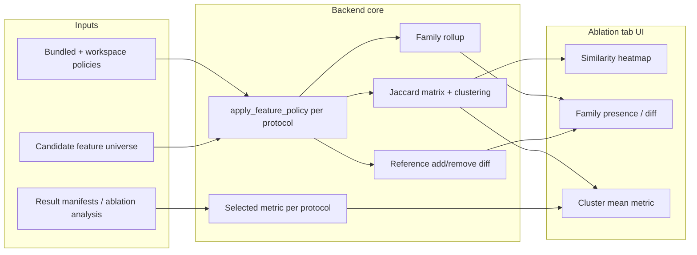

## Summary

Add a Workbench **Ablation** panel that resolves each protocol to its **expanded feature set** (patterns expanded with the same semantics as training), computes pairwise similarity, and visualizes **which features and feature families were added or removed** relative to a reference protocol — linked to **user-selected outcome metrics** and **feature-similarity clusters** whose mean performance helps interpret results.

---

## Problem Frame

Ablation studies differ by include/exclude rules and wildcards (`ligand_*`, `no_pmi`, etc.). Outcome tables alone do not show whether two ablations removed the same **family** of descriptors or only differ in YAML wording. Researchers currently infer overlap by reading policy files or the Design tab preview one at a time.

The goal is interpretability: see protocol similarity **after pattern expansion**, visually compare family-level add/remove, and check whether clusters of similar feature sets explain metric patterns.

---

## Requirements

- R1. Resolve every compared protocol against a **shared candidate feature universe** using `apply_feature_policy` from `OCDocker/OCScore/Utils/FeaturePolicy.py` so `include_patterns` / `exclude_patterns` expand via case-sensitive `fnmatch` (same as training and Design preview).
- R2. Compute pairwise **Jaccard similarity** on the resolved **final included feature sets** (`final_candidate_features_before_reduction`).
- R3. Roll features up into **families** for visualization: coarse groups from `discover_candidate_model_features` blocks (`ligand`, `receptor`, `scoring`, `unmatched`) plus **prefix families** derived from the first `_`-delimited token (e.g. `vina_*`, `plants_*` within scoring).
- R4. For each protocol vs a chosen **reference** (default `full_ocscore` when present, else auto-selected non-ablation run), show **added**, **removed**, and **shared** features and families.
- R5. Render a **clustered similarity heatmap** (protocol × protocol, 0–1) with row/column order derived from hierarchical clustering on distance `1 − Jaccard`.
- R6. Overlay **cluster-level outcome summaries** for a **user-selected metric** (reuse Comparison metric selector options); changing the metric updates performance summaries without re-clustering.
- R7. Integrate in the existing **Ablation** tab (`panel-ablation`), below or beside the comparison table/charts — not a separate app surface.
- R8. Candidate feature universe resolution order: workspace replica `feature_policy_metadata.json` (`candidate_features_before_policy`) when available, else `raw_prepare` columns via the same path as `discover_ablation_input_features` in `OCDocker/Workbench/AblationDesign.py`.
- R9. Compared protocols: bundled policies from `OCDocker/OCScore/Protocols/Ablations/` plus workspace user policies discovered by `discover_feature_policies`, **intersected with ablation runs present in the workspace** unless the user toggles “show all bundled policies” (catalog-only preview with no metrics).
- R10. Graceful degradation when no candidate list exists: show policy names and rule summary with a clear message; no fake similarity scores.

---

## Key Technical Decisions

### KTD1. Expanded feature sets are the similarity ground truth

Similarity is computed on resolved included features, not raw YAML rules. Two policies that phrase selection differently but yield the same expanded set score as identical. This matches the user’s requirement that `ligand_*` “comprises all `ligand_…` features.”

### KTD2. Family view is a rollup layer on expanded features, not a substitute

Families summarize the expanded set for readability. Jaccard similarity remains feature-level; family panels show presence/absence and add/remove vs reference. A family is “present” when **any** of its member features is in the expanded set.

### KTD3. Outcomes come from existing ablation analysis

Reuse `build_ablation_analysis` in `OCDocker/Workbench/Ablation.py` for per-protocol metric values. Cluster summaries aggregate the selected metric across protocols assigned to each feature-similarity cluster (mean; show count and missing-data flags).

### KTD4. Clustering is feature-only; metric is an overlay

Hierarchical clustering uses `1 − Jaccard` distance only. The metric dropdown re-renders cluster performance bars/labels without recomputing clusters — consistent with brainstorm decision.

### KTD5. Single backend payload drives all views

One API response carries: candidate source metadata, per-protocol expanded sets (counts + family rollups), pairwise matrix, cluster assignments, reference diff, and metric values keyed by policy/run. Frontend derives heatmap, family matrix, and cluster overlay from one fetch.

### KTD6. No new heavy dependencies for clustering

For ~22 bundled policies, implement ordering with `scipy.cluster.hierarchy` when `scipy` is importable (already in optional analysis/train extras); otherwise fall back to average-linkage ordering via pure Python on the precomputed distance matrix.

---

## High-Level Technical Design



**Data contract (directional):**

```
AblationProtocolSimilarityAnalysis
  candidate_source: str | null
  reference_policy: str
  protocols[]: { name, expanded_features[], families{ id, present, count }, metric_value?, run_id? }
  similarity_matrix: float[][]
  cluster_labels: int[]
  cluster_summaries[]: { cluster_id, policy_names[], mean_metric, n_with_metric }
  reference_diffs[]: { protocol, added_features[], removed_features[], added_families[], removed_families[] }
```

---

## Implementation Units

### U1. Protocol resolution and similarity core

**Goal:** Pure Python module that resolves policies to expanded sets, builds family rollups, Jaccard matrix, clusters, and reference diffs.

**Requirements:** R1, R2, R3, R4, R8, R10

**Dependencies:** None

**Files:**
- `OCDocker/Workbench/AblationProtocolSimilarity.py` (new)
- `tests/workbench/test_ablation_protocol_similarity.py` (new)

**Approach:**
- Add helpers to load candidate features (mirror `_discover_candidate_features` and `discover_ablation_input_features` call chain from `AblationDesign.py`).
- Load policies via `discover_feature_policies` with workspace ablation dirs when present.
- For each policy, call `apply_feature_policy`; store `final_candidate_features_before_reduction`.
- Build family map from `discover_candidate_model_features` blocks plus prefix families for scoring columns.
- Compute symmetric Jaccard matrix; run hierarchical clustering for order labels.
- Build reference diff vs `full_ocscore` or explicit reference policy name.
- Export typed payload fragments consumed by pydantic models in U2.

**Patterns to follow:**
- `OCDocker/OCScore/Utils/FeaturePolicy.py` — `apply_feature_policy`, `_match_patterns`
- `tests/ocscore/test_feature_policy.py` — bundled policy fixtures (`ligand_only`, `no_pmi`, `ligand_plus_scoring_function`)

**Test scenarios:**
- `ligand_only` and a policy that lists individual `ligand_*` columns yield Jaccard 1.0 when expansion matches.
- `no_pmi` vs `full_ocscore`: PMI features in removed set; Jaccard < 1.
- `ligand_plus_scoring_function` vs `ligand_only`: added families include scoring prefixes present in expansion.
- Empty candidate list returns `preview_available: false` shape without raising.
- Family rollup: `ligand_*` expansion marks `ligand` family present with correct member count.
- Clustering produces stable labels for a fixed fixture matrix (snapshot cluster count, not dendrogram art).

**Verification:** Unit tests pass; manual spot-check that `ligand_only.yml` expansion matches Design preview counts for a fixture CSV.

---

### U2. Analysis orchestration and API models

**Goal:** Combine similarity core with workspace run discovery and outcome metrics; expose via Workbench HTTP API.

**Requirements:** R5, R6, R9, R10

**Dependencies:** U1

**Files:**
- `OCDocker/Workbench/AblationProtocolSimilarity.py` (extend)
- `OCDocker/Workbench/Models.py` (new pydantic models)
- `OCDocker/Workbench/Server.py` (GET route)
- `OCDocker/Workbench/__init__.py` (exports)
- `tests/workbench/test_ablation_protocol_similarity.py` (extend)
- `tests/workbench/test_server.py` (API smoke)

**Approach:**
- Add `build_ablation_protocol_similarity_analysis(root, *, reference_policy, metric, include_catalog_only=False)` that:
  - Calls U1 core.
  - Uses `_load_ablation_rows` / policy names from `Ablation.py` to attach run ids and filter protocols.
  - Pulls metric values via existing comparison/ablation metric flattening (same keys as Comparison tab).
  - Computes cluster mean for selected metric.
- Register `GET /api/ablation-protocol-similarity?metric=...&reference=...` on served Workbench root (query params mirror Comparison patterns).

**Patterns to follow:**
- `OCDocker/Workbench/Ablation.py` — `build_ablation_analysis`
- `OCDocker/Workbench/Server.py` — `/api/ablation-design` handlers

**Test scenarios:**
- Synthetic workspace with two ablation manifests returns both protocols in analysis with metric values populated.
- Unknown metric returns structured issue, not 500.
- Policy with no run omitted when `include_catalog_only=false`; included when `true` with `metric_value: null`.
- API JSON schema round-trips through pydantic models.

**Verification:** Server test hits endpoint against fixture workspace; payload validates.

---

### U3. Ablation tab UI — heatmap, family diff, cluster overlay

**Goal:** Visual comparison of protocol similarity, family add/remove, and cluster-linked outcomes.

**Requirements:** R4, R5, R6, R7

**Dependencies:** U2

**Files:**
- `OCDocker/Workbench/static/index.html` (new zone in `panel-ablation`)
- `OCDocker/Workbench/static/app.js` (fetch, render, metric binding)
- `OCDocker/Workbench/static/app.css` (layout)
- `tests/workbench/test_web.py` (JS contract / DOM smoke)

**Approach:**
- Add collapsible zone **Protocol similarity** under comparison charts with:
  - Metric `<select>` wired to same option source as `#decision-metric-select` (or shared helper).
  - Reference policy selector (default from payload).
  - Plotly heatmap from `similarity_matrix` with cluster-ordered labels (reuse rank/CV heatmap host patterns).
  - **Family presence grid**: rows = families, columns = protocols, cells = present/absent/partial count; highlight vs reference add/remove.
  - **Cluster summary strip**: one bar/row per cluster showing mean selected metric and member protocol names.
- Toggle “Include policies without runs” maps to `include_catalog_only`.
- Fetch on workspace load and when metric/reference/toggle changes (debounced).

**Patterns to follow:**
- `buildRankPlotlySpec` / comparison chart mounting in `app.js`
- `ablationDesignGroupPatterns` family naming for consistent labels

**Test scenarios:**
- DOM contains heatmap host and family grid after mocked fetch.
- Changing metric refetches or re-renders cluster summary without clearing heatmap order.
- Empty candidate message rendered when `preview_available: false`.

**Verification:** `test_web.py` passes; manual check on a workspace with multiple ablations shows `no_pmi` PMI family removed vs `full_ocscore`.

---

### U4. Documentation and CLI parity (optional thin)

**Goal:** Document the view and optionally expose analysis via CLI for offline inspection.

**Requirements:** R7 (discoverability)

**Dependencies:** U2

**Files:**
- `docs/source/workbench_served_root.md` (short section)
- `OCDocker/CLI/workbench.py` (optional `protocol-similarity` subcommand mirroring API)

**Approach:** One paragraph in workbench docs describing expansion semantics and the Ablation tab zone. CLI subcommand prints JSON if trivial to wire; otherwise defer to follow-up.

**Test scenarios:**
- Test expectation: none — documentation-only unless CLI added; if CLI added, one smoke test for JSON output.

**Verification:** Doc section exists; CLI smoke if implemented.

---

## Scope Boundaries

### In scope

- Feature-expanded similarity, family rollups, reference diffs, clustered heatmap, cluster metric overlay, Ablation tab integration.

### Deferred for later

- Pairwise click-through cell diff panel (Design tab already diffs single policies).
- Second heatmap of **performance correlation** between protocols (Spearman on per-target ranks).
- Static publication export preset (PNG/SVG) beyond existing Plotly export patterns.
- SHAP or importance-based similarity (feature **selection** only, not learned weights).

### Outside this product's identity

- Changing training-time feature policy semantics.
- Auto-suggesting new ablation policies from similarity alone.

---

## Risks and Dependencies

| Risk | Mitigation |
|------|------------|
| Candidate universe differs between workspace and training run | Prefer replica metadata; show `candidate_source` in UI; warn when falling back to `raw_prepare` |
| Policy on disk differs from policy used at train time | Match by policy name + show source path from run manifest; optional hash check later |
| Many protocols × large feature set matrix DOM weight | Cap detailed feature diff to reference comparison + family grid; full feature lists in expandable detail |
| `scipy` absent in minimal install | Pure-Python cluster ordering fallback |

**Prerequisites:** Served Workbench root with OCScore layout; optional `raw_prepare` or replica metadata for expansion.

---

## Open Questions

- **Blocking:** None — reference default (`full_ocscore`) and workspace-intersected protocol set are assumed; catalog-only toggle covers design-time browsing.
- **Deferred:** Whether prefix-family granularity should be user-configurable (default: auto from column names).

---

## Sources and Research

- Local: `FeaturePolicy.py`, `AblationDesign.py`, `Ablation.py`, Design tab fnmatch helpers in `app.js`
- Brainstorm dialogue: feature expansion mandatory; cluster + metric overlay; visual family add/remove for outcome interpretation
- No external research required — patterns are established in-repo
