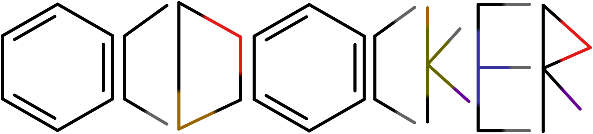

|

Welcome to OCDocker's documentation!
====================================

.. code-block:: text

   +-+-+-+-+-+-+-+-+-+-+-+-+-+-+-+-+-+-+-+-+-+-+-+-+-+-+-+-+-+-+-+-+-+-+-+-+-+-+-+-+-+-+-+-+-+-+-+-+-+
   +-+-+-+-+-+-+-+-+-+-+-+-+-+-+-+-+-+- ┏━┓┏━╸╺┳━┓┏━┓┏━╸╻┏ ┏━╸┏━┓ -+-+-+-+-+-+-+-+-+-+-+-+-+-+-+-+-+-+
   +-+-+-+-+-+-+-+-+-+-+-+-+-+-+-+-+-+- ┃ ┃┃   ┃ ┃┃ ┃┃  ┣┻┓┣╸ ┣┳┛ -+-+-+-+-+-+-+-+-+-+-+-+-+-+-+-+-+-+
   +-+-+-+-+-+-+-+-+-+-+-+-+-+-+-+-+-+- ┗━┛┗━╸╺┻━┛┗━┛┗━╸╹ ╹┗━╸╹┗╸ -+-+-+-+-+-+-+-+-+-+-+-+-+-+-+-+-+-+
   +-+-+-+-+-+-+-+-+-+-+-+-+-+-+-+-+-+-+-+-+-+-+-+-+-+-+-+-+-+-+-+-+-+-+-+-+-+-+-+-+-+-+-+-+-+-+-+-+-+

              Copyright (C) 2026  Rossi, A.D.; Monachesi, M.C.E.; Spelta, G.I.; Torres, P.H.M.

                          [Universidade Federal do Rio de Janeiro - UFRJ]

                  This program comes with ABSOLUTELY NO WARRANTY

             Please cite:
                 -

   +-+-+-+-+-+-+-+-+-+-+-+-+-+-+-+-+-+-+-+-+-+-+-+-+-+-+-+-+-+-+-+-+-+-+-+-+-+-+-+-+-+-+-+-+-+-+-+-+-+

Welcome to the official documentation for OCDocker. This documentation provides a detailed description of all modules, classes, and functions included in the project.

.. toctree::
   :maxdepth: 2
   :caption: Contents:

   introduction
   installation
   optional_dependencies
   modules
   examples
   OCDocker
   OCDocker.DB
   OCDocker.Docking
   OCDocker.OCScore
   OCDocker.Processing
   OCDocker.Processing.Postprocessing
   OCDocker.Processing.Preprocessing
   OCDocker.Toolbox
   manual
   usage
   development
   ocscore_replication
   error_handling
   changelog
   COLLABORATORS

Indices and tables
==================

* :ref:`genindex`
* :ref:`modindex`
* :ref:`search`
